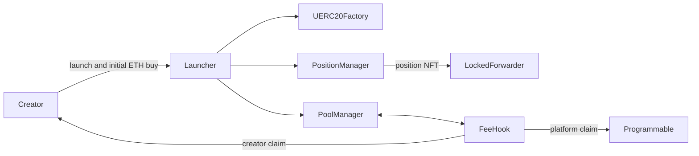

# Classic architecture

## Scope

This document covers the current Classic deployment. Classic is a non-upgradeable launch path for fixed-supply UERC20
tokens paired with ETH on Uniswap v4. Its Uniswap and OpenZeppelin dependencies are pinned in
[`scripts/bootstrap-deps.sh`](scripts/bootstrap-deps.sh).

## Launch

`MemeLaunchV1` checks the metadata, creates a one-billion-token UERC20, registers the pool with
`EthCreatorFeeHookV2`, initializes it and deposits the supply into one one-sided position. The creator includes an
initial buy of at least `0.0006 ETH`. There is no separate ETH liquidity deposit.

`MemeLaunchV1` keeps its original contract name because this repository mirrors the deployed source. The public
model is Classic.

## Position custody

The position NFT is sent to an official Uniswap `PositionFeesForwarder` created through
`LockedPositionFeeForwarderFactoryV1`.

- operator: zero address
- timelock block: `type(uint256).max`
- liquidity removal path: unavailable through the configured forwarder
- LP fee: zero

The forwarder can collect position fees without decreasing liquidity. The Classic pool uses a zero LP fee, so creator
economics come from the hook rather than from withdrawing or selling launch liquidity.

## Swap accounting

`EthCreatorFeeHookV2` is shared across registered Classic pools. It accepts only native ETH as `currency0`, a token as
`currency1`, zero LP fee and tick spacing `200`.

The hook uses Uniswap v4 return deltas to account for a symmetric fee on the ETH side of buys and sells. Fees accrue as
native-currency ERC-6909 claims inside `PoolManager`. Anyone can trigger a claim, but the recipient is fixed:

- creator fees go to the creator recorded at pool registration;
- platform fees go to the immutable platform recipient.

Only those immutable recipients can redirect their own claim to another address.

## External dependencies

The contracts depend on:

- Uniswap v4 core and periphery
- Uniswap liquidity launcher
- Uniswap UERC20 factory
- OpenZeppelin Contracts and Uniswap hooks

Every dependency is checked out at an exact commit.
