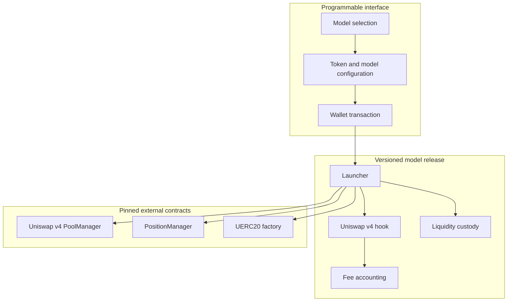
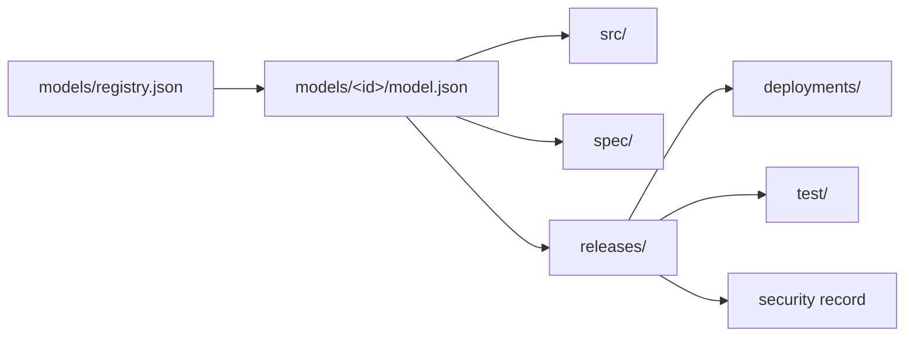

# Architecture

Programmable is a registry of independent Uniswap v4 launch models. Each model owns its pool rules, hook permissions,
fee accounting, liquidity custody, tests and release history.

## System boundary

The interface is not the source of contract behavior. It selects a published model release and prepares a transaction
for that release. A frontend update cannot change contracts that have already been deployed.

## Records

| Layer | Responsibility |
| --- | --- |
| Registry | Name, lifecycle status and canonical document for every model |
| Model manifest | Current release, network, contract identities and review state |
| Specification | Fixed compiler, dependency and economic parameters |
| Release manifest | Evidence bound to one model version |
| Deployment record | Addresses, transactions, runtime hashes and explorer verification |
| Security record | Permissions, invariants, trust assumptions and known limitations |

README files explain these records. They do not override the JSON manifests.

## Contract versioning

Published contracts are immutable. A material change to source, accounting, permissions, custody, parameters or
beneficiaries creates a new technical release. Multiple releases may exist for one public model name.

Deployed Solidity files keep their original contract names and paths. This preserves a direct match between the
repository, verified explorer source and Ethereum bytecode.

## Dependency boundary

Shared upstream dependencies are checked out at exact commits by
[`scripts/bootstrap-deps.sh`](scripts/bootstrap-deps.sh). Compiler and EVM settings are fixed in
[`foundry.toml`](foundry.toml) and repeated in each available release manifest.

External Uniswap and UERC20 contracts remain separate trust assumptions. Repository tests do not make those systems
part of Programmable's administrative control.

## Release and operations

The lifecycle gate is defined in [`RELEASING.md`](RELEASING.md). Automated evidence and incident handling are documented
in [`docs/OPERATIONS.md`](docs/OPERATIONS.md).
