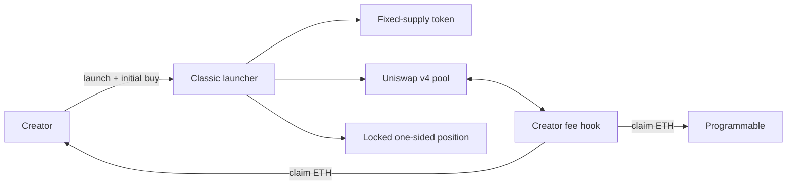

<p align="center">
  
</p>

<h1 align="center">Programmable</h1>

<p align="center">Open source launch models for Uniswap v4 on Ethereum.</p>

<p align="center">
  <a href="https://programmable.family">Launch</a> ·
  <a href="MODELS.md">Models</a> ·
  <a href="deployments/ethereum.json">Ethereum deployment</a> ·
  <a href="SECURITY.md">Security</a>
</p>

<p align="center">
  <a href="https://github.com/0xprogrammable/programmable/actions/workflows/verify.yml">
    
  </a>
</p>

Programmable packages Uniswap v4 pool behavior into launch flows that creators can use without writing or deploying
contracts. Each release includes its exact contract sources, tests, security assumptions and Ethereum deployment
evidence.

## Launch models

| Model | Purpose | Status |
| --- | --- | --- |
| Classic | Fixed supply, locked one-sided liquidity and creator fees paid in ETH | Available |
| Adaptive | An immutable swap-fee curve linked to the token's onchain value | In development |

A model is marked `Available` once its source, tests, security documentation and deployment record are public. The
complete catalog is in [`MODELS.md`](MODELS.md).

## Classic

Classic creates the token, initializes its ETH pool, locks the launch position and completes the creator's initial buy
in one transaction.



Classic is the current immutable Ethereum release.

| Property | Current release |
| --- | --- |
| Supply | 1 billion fixed-supply UERC20 |
| Pair | Native ETH |
| Launch liquidity | Complete token supply in a locked one-sided position |
| Swap fee | `1.00%`: `0.90%` creator and `0.10%` Programmable |
| Token transfer tax | None |
| Uniswap v4 LP fee | Zero |

The deployed hook accepts total swap fees from `1%` to `10%` in one-point increments. The current interface exposes
only `1%`.

## Ethereum deployment

| Contract | Address |
| --- | --- |
| Classic launcher | [`0xD240…E6bAd`](https://etherscan.io/address/0xD240D06f8586eB799f20056054e5b527405E6bAd#code) |
| Creator fee hook | [`0x025a…b20CC`](https://etherscan.io/address/0x025a386eAa79f6067d29848FD05ccC71bEAb20CC#code) |
| Hook factory | [`0xD405…5fd67`](https://etherscan.io/address/0xD405D8d88D7E4Dae4e1dAdce9A458234D9A5fd67#code) |
| Position forwarder factory | [`0x291a…4dB507`](https://etherscan.io/address/0x291a9ff1059d225d02B1659430804486404dB507#code) |

Transactions and runtime code hashes are recorded in
[`deployments/ethereum.json`](deployments/ethereum.json).

## Repository

```text
src/                 Exact sources for the current available deployment
test/                Unit, integration, fuzz, invariant and regression tests
deployments/         Public Ethereum deployment evidence
spec/                Machine-readable product and contract parameters
scripts/             Reproducible dependency bootstrap
MODELS.md             Launch model catalog and status
ARCHITECTURE.md       Architecture of the current available model
SECURITY.md           Security status, trust model and disclosure
```

The dependency script checks out every upstream repository at a fixed commit:

```bash
./scripts/bootstrap-deps.sh
forge fmt --check
forge build
FOUNDRY_PROFILE=ci forge test
```

The contracts use Solidity `0.8.26`, Cancun opcodes, optimizer runs set to `1,000`, and disabled CBOR metadata. The
complete compiler configuration is in [`foundry.toml`](foundry.toml).

## Security

Classic has unit, integration, fuzz, invariant and regression coverage. It has not received an independent
smart-contract audit or public security contest. Read [`SECURITY.md`](SECURITY.md) before integrating.

Security vulnerabilities should be reported through
[GitHub private vulnerability reporting](https://github.com/0xprogrammable/programmable/security/advisories/new).

## License

Contract source is available under the [MIT License](LICENSE). The Programmable name, mark and artwork are excluded;
see [`assets/README.md`](assets/README.md).
