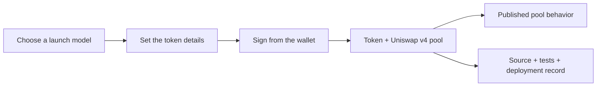

<p align="center">
  <picture>
    <source
      media="(prefers-reduced-motion: reduce)"
      srcset="assets/programmable-repository-cover.jpg"
    />
    
  </picture>
</p>

<h1 align="center">Programmable</h1>

<p align="center"><strong>Launch tokens that work the way you imagine.</strong></p>

<p align="center">
  Open launch-model infrastructure for Uniswap v4 on Ethereum.
</p>

<p align="center">
  <a href="https://programmable.family"><strong>Launch a token</strong></a> ·
  <a href="MODELS.md">Model library</a> ·
  <a href="BUILDER_PROGRAM.md">Build a model</a> ·
  <a href="deployments/ethereum.json">Ethereum contracts</a> ·
  <a href="SECURITY.md">Security</a> ·
  <a href="https://x.com/0xProgrammable">X</a>
</p>

<p align="center">
  <a href="https://github.com/0xprogrammable/programmable/actions/workflows/verify.yml">
    
  </a>
</p>

Programmable turns versioned Uniswap v4 contracts into simple launch flows. A creator chooses a published model, sets
the token details and launches from a wallet without writing Solidity.

This repository is the public record behind the interface. It contains the exact contracts, tests, fixed parameters,
security assumptions and Ethereum deployment evidence for every model marked **Available**.

> A launch model defines the token, pool shape, fee accounting, liquidity custody and hook behavior as one versioned
> release. It is more than a frontend preset.

## From an idea to a v4 pool



The interface handles the setup. The selected model determines what happens onchain. Published releases stay
independently inspectable even as the model library grows.

## Launch models

### Classic

<p>
  <a href="models/classic/README.md">
    
  </a>
</p>

**Available on Ethereum.** Classic creates a fixed-supply token, initializes its native ETH pool, locks the complete
launch position and executes the creator's initial buy in one transaction.

| Property | Current release |
| --- | --- |
| Token supply | 1 billion fixed-supply UERC20 |
| Pool | Native ETH/token on Uniswap v4 |
| Launch liquidity | Complete token supply in a locked, one-sided position |
| Total swap fee | `1.00%` |
| Fee allocation | `0.90%` creator · `0.10%` Programmable |
| Token transfer tax | None |
| Separate ETH liquidity deposit | None |

[Read the complete Classic model documentation](models/classic/README.md)

### Deep

<p>
  <a href="models/deep/README.md">
    
  </a>
</p>

**In development. Not available for launch.** Deep is designed to direct the creator fee share into add-only,
locked liquidity in the launch pool until an immutable target is reached. Later fees would then follow the beneficiary
allocation fixed at launch.

Deep has no deployed contracts. TWAP bounds, atomic launch binding, accounting invariants and a complete mainnet-fork
lifecycle remain release gates.

[Read the Deep design and unresolved release gates](models/deep/README.md)

The [model library](MODELS.md) is the canonical status page. A model is presented as available only after its exact
release evidence is public.

## Evidence before availability

Every available model has a complete release record:

- **Contract source:** exact launcher, hook and custody behavior in [`src/`](src/).
- **Tests:** unit, integration, fuzz, invariant and regression coverage in [`test/`](test/).
- **Fixed parameters:** compiler, dependencies and launch settings in
  [`spec/classic-v2.json`](spec/classic-v2.json).
- **Ethereum deployment:** addresses, transactions and runtime code hashes in
  [`deployments/ethereum.json`](deployments/ethereum.json).
- **Security status:** permissions, assumptions and known limitations in [`SECURITY.md`](SECURITY.md).

Open source code makes behavior inspectable. It is not a security guarantee.

### Current Ethereum contracts

| Contract | Verified address |
| --- | --- |
| Classic launcher | [`0xD240…E6bAd`](https://etherscan.io/address/0xD240D06f8586eB799f20056054e5b527405E6bAd#code) |
| Creator fee hook | [`0x025a…b20CC`](https://etherscan.io/address/0x025a386eAa79f6067d29848FD05ccC71bEAb20CC#code) |
| Hook factory | [`0xD405…5fd67`](https://etherscan.io/address/0xD405D8d88D7E4Dae4e1dAdce9A458234D9A5fd67#code) |
| Position forwarder factory | [`0x291a…4dB507`](https://etherscan.io/address/0x291a9ff1059d225d02B1659430804486404dB507#code) |

The deployment record includes the corresponding transaction hashes, runtime bytecode hashes and source-verification
status.

## Build the next model

<p>
  <a href="BUILDER_PROGRAM.md">
    
  </a>
</p>

Programmable is not limited to models built by its maintainers. Independent builders can submit complete open-source
Uniswap v4 launch models as pull requests.

1. **Build the complete model.** Include the hook, supporting contracts and full launch path.
2. **Prove its behavior.** Add tests, fixed dependencies, security assumptions and known limitations.
3. **Submit it for review.** A pull request is public and does not guarantee acceptance or deployment.

For an accepted external-builder model with a published total swap fee of `1.00%`, the allocation is:

| Recipient | Share of swap volume |
| --- | ---: |
| Token creator | `0.80%` |
| Hook builder | `0.10%` |
| Programmable | `0.10%` |

The builder share is included in the published fee rather than added on top. It applies only to the exact accepted
model version recorded in the repository.

[Read the Hook Builder Program](BUILDER_PROGRAM.md) ·
[Open the submission checklist](.github/PULL_REQUEST_TEMPLATE.md)

## Security

Classic is the only model currently available. Its live contracts are non-upgradeable and expose no administrator
role, pause function, mint path, blacklist or mutable fee recipient. The locked position forwarder has no operator and
uses the maximum timelock.

Classic has unit, integration, fuzz, invariant and regression coverage. It has not received an independent
smart-contract audit or public security contest.

[Read the security model and known limitations](SECURITY.md)

Report vulnerabilities through
[GitHub private vulnerability reporting](https://github.com/0xprogrammable/programmable/security/advisories/new).
Do not publish an unpatched vulnerability in an issue or pull request.

## Repository map

```text
models/              Behavior, economics, security notes and release status
src/                 Exact Solidity sources
test/                Unit, integration, fuzz, invariant and regression tests
deployments/         Ethereum addresses, transactions and runtime code hashes
spec/                Machine-readable release parameters
scripts/             Reproducible dependency bootstrap
ARCHITECTURE.md       Repository and release structure
BUILDER_PROGRAM.md    External model submission and participation terms
SECURITY.md           Security policy and current contract status
```

Deployed Solidity files retain their original paths and contract names so verified source and immutable bytecode remain
directly traceable to this repository.

## Build and verify

The bootstrap script checks out every upstream dependency at a fixed commit.

```bash
./scripts/bootstrap-deps.sh
forge fmt --check
forge build --sizes
FOUNDRY_PROFILE=ci forge test
```

Compiler settings are recorded in [`foundry.toml`](foundry.toml). Model-specific parameters and dependency revisions
are recorded under [`spec/`](spec/).

## License

Contract source is available under the [MIT License](LICENSE). The Programmable name, mark and artwork are excluded;
see [`assets/README.md`](assets/README.md).
