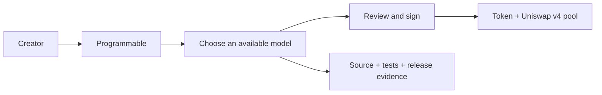
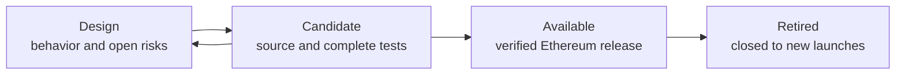

<p align="center">
  <picture>
    <source
      media="(prefers-reduced-motion: reduce)"
      srcset="assets/programmable-repository-cover.jpg"
    />
    
  </picture>
</p>

<h1 align="center">Programmable</h1>

<p align="center"><strong>Launch tokens that work the way you imagine.</strong></p>

<p align="center">
  Open launch-model infrastructure for Uniswap v4 on Ethereum.
</p>

<p align="center">
  <a href="https://programmable.family"><strong>Launch</strong></a> ·
  <a href="MODELS.md">Models</a> ·
  <a href="BUILDER_PROGRAM.md">Build a model</a> ·
  <a href="deployments/ethereum.json">Ethereum</a> ·
  <a href="SECURITY.md">Security</a> ·
  <a href="https://x.com/0xProgrammable">X</a>
</p>

<p align="center">
  <a href="https://github.com/0xprogrammable/programmable/actions/workflows/verify.yml">
    
  </a>
  <a href="https://github.com/0xprogrammable/programmable/actions/workflows/security.yml">
    
  </a>
  <a href="https://github.com/0xprogrammable/programmable/actions/workflows/mainnet-evidence.yml">
    
  </a>
</p>

Programmable turns versioned Uniswap v4 contracts into launch flows that do not require a creator to write Solidity.
Each model defines the token, pool, fee accounting, liquidity custody and hook behavior as one reviewable release.

This repository is the public record behind the interface. A model is marked **Available** only when its exact source,
tests, parameters, Ethereum deployment and security status are published here.

## One interface, independent models



The interface handles setup. The selected model determines the onchain behavior. Adding a new model does not silently
change a model that has already been deployed.

<p align="center">
  <a href="MODELS.md"><strong>Explore the model library →</strong></a>
</p>

## The public record

| Record | What it establishes | Canonical path |
| --- | --- | --- |
| Model registry | Current lifecycle status and documentation | [`models/registry.json`](models/registry.json) |
| Model manifest | Release, network, contracts and review state | [`models/<model>/model.json`](models/) |
| Contract source | Hook, launcher and custody behavior | [`src/`](src/) |
| Test evidence | Unit, integration, fuzz, invariant and regression coverage | [`test/`](test/) |
| Fixed parameters | Compiler, dependencies and model settings | [`spec/`](spec/) |
| Release manifest | Evidence bound to one technical release | [`releases/`](releases/) |
| Ethereum deployment | Addresses, transactions, runtime hashes and explorer status | [`deployments/ethereum.json`](deployments/ethereum.json) |
| Security record | Trust boundaries, known limitations and review status | [`SECURITY.md`](SECURITY.md) |

The registry is machine-checked in CI. Available releases are checked for consistent identifiers, evidence paths,
addresses and runtime hashes. A scheduled workflow compares every published runtime hash with Ethereum.

Open source code makes behavior inspectable. It is not a security guarantee.

## Release lifecycle



Only `available` models appear as production launch options. `design` and `candidate` records are public so incomplete
work cannot be mistaken for a deployed product. The complete gate is documented in [`RELEASING.md`](RELEASING.md).

## Build a launch model

<p>
  <a href="BUILDER_PROGRAM.md">
    
  </a>
</p>

Independent builders can submit complete open-source launch models as pull requests. A submission needs the contracts,
full launch path, tests, security properties, fixed dependencies and a machine-readable model record.

```bash
node scripts/new-model.mjs <model-id> "<Model name>" "<Specific behavior summary>"
```

Submission is public and does not guarantee review, acceptance, deployment, volume or revenue. Accepted external models
receive a version-specific acceptance record before release.

[Read the Hook Builder Program](BUILDER_PROGRAM.md) ·
[Read the contribution guide](CONTRIBUTING.md)

## Security and operations

The live Classic contracts are non-upgradeable and expose no administrator role, pause function, mint path, blacklist
or mutable fee allocation. Classic has not received an independent smart-contract audit or public security contest.

| Area | Record |
| --- | --- |
| Current security status | [`SECURITY.md`](SECURITY.md) |
| Classic trust boundaries and invariants | [`docs/security/CLASSIC_PROPERTIES.md`](docs/security/CLASSIC_PROPERTIES.md) |
| Protocol Revenue Deepener candidate | [`docs/security/PROTOCOL_REVENUE_DEEPENER_V1.md`](docs/security/PROTOCOL_REVENUE_DEEPENER_V1.md) |
| Automated checks and incident process | [`docs/OPERATIONS.md`](docs/OPERATIONS.md) |
| Independent review archive | [`audits/`](audits/) |

Report vulnerabilities through
[GitHub private vulnerability reporting](https://github.com/0xprogrammable/programmable/security/advisories/new).
Do not publish an unpatched vulnerability in an issue or pull request.

## Repository map

```text
models/          Registry, model manifests and model documentation
src/             Exact Solidity source
test/            Unit, integration, fuzz, invariant and regression tests
spec/            Machine-readable release parameters
releases/        Version-bound evidence manifests
deployments/     Ethereum addresses, transactions and runtime hashes
docs/            Security properties and operational records
scripts/         Reproducible verification and model scaffolding
templates/       Required structure for new model submissions
assets/          Programmable repository artwork
```

Deployed Solidity files retain their original paths and contract names so verified source and immutable bytecode remain
traceable to this repository.

## Verify locally

```bash
./scripts/bootstrap-deps.sh
node scripts/verify-model-registry.mjs
node scripts/verify-release-evidence.mjs
forge fmt --check
forge build --sizes
FOUNDRY_PROFILE=ci forge test
forge snapshot --fuzz-seed 0x70726f6772616d6d61626c65 --check .gas-snapshot
./scripts/verify-mainnet-bytecode.sh
```

Compiler settings are in [`foundry.toml`](foundry.toml). Upstream dependencies are checked out at fixed commits by the
bootstrap script.

## License

Contract source is available under the [MIT License](LICENSE). The Programmable name, mark and artwork are excluded;
see [`assets/README.md`](assets/README.md).
