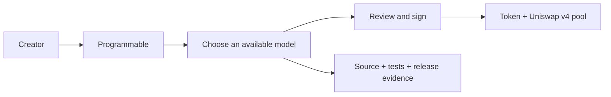

<p align="center">
  <picture>
    <source
      media="(prefers-reduced-motion: reduce)"
      srcset="assets/programmable-repository-cover.jpg"
    />
    
  </picture>
</p>

<h1 align="center">Programmable</h1>

<p align="center"><strong>Launch tokens that work the way you imagine.</strong></p>

<p align="center">
  Open launch-model infrastructure for Uniswap v4 on Ethereum.
</p>

<p align="center">
  <a href="https://programmable.family"><strong>Launch</strong></a> ·
  <a href="MODELS.md">Models</a> ·
  <a href="BUILDER_PROGRAM.md">Build a model</a> ·
  <a href="docs/builder/intake-status.json">Builder intake status</a> ·
  <a href="deployments/ethereum.json">Ethereum</a> ·
  <a href="SECURITY.md">Security</a> ·
  <a href="https://x.com/0xProgrammable">X</a>
</p>

<p align="center">
  <a href="https://github.com/0xprogrammable/programmable/actions/workflows/verify.yml">
    
  </a>
  <a href="https://github.com/0xprogrammable/programmable/actions/workflows/security.yml">
    
  </a>
  <a href="https://github.com/0xprogrammable/programmable/actions/workflows/mainnet-evidence.yml">
    
  </a>
  <a href="https://github.com/0xprogrammable/programmable/actions/workflows/verify-hook-builder.yml">
    
  </a>
</p>

Programmable turns versioned Uniswap v4 contracts into launch flows that do not require a creator to write Solidity.
Each model defines the token, pool, fee accounting, liquidity custody and hook behavior as one reviewable release.

This repository is the public record behind the interface. A model is marked **Available** only when its exact source,
tests, parameters, Ethereum deployment and security status are published here.

## One interface, independent models



The interface handles setup. The selected model determines the onchain behavior. Adding a new model does not silently
change a model that has already been deployed.

<p align="center">
  <a href="MODELS.md"><strong>Explore the model library →</strong></a>
</p>

## The public record

| Record | What it establishes | Canonical path |
| --- | --- | --- |
| Model registry | Current lifecycle status and documentation | [`models/registry.json`](models/registry.json) |
| Model manifest | Release, network, contracts and review state | [`models/<model>/model.json`](models/) |
| Contract source | Hook, launcher and custody behavior | [`src/`](src/) |
| Test evidence | Unit, integration, fuzz, invariant and regression coverage | [`test/`](test/) |
| Fixed parameters | Compiler, dependencies and model settings | [`spec/`](spec/) |
| Release manifest | Evidence bound to one technical release | [`releases/`](releases/) |
| Ethereum deployment | Addresses, transactions, runtime hashes and explorer status | [`deployments/ethereum.json`](deployments/ethereum.json) |
| Security record | Trust boundaries, known limitations and review status | [`SECURITY.md`](SECURITY.md) |

The registry is machine-checked in CI. Available releases are checked for consistent identifiers, evidence paths,
addresses and runtime hashes. A scheduled workflow compares every published runtime hash with Ethereum.

Open source code makes behavior inspectable. It is not a security guarantee.

## Release lifecycle

```mermaid
flowchart LR
    submission["Public proposal or prototype"] --> candidate["Maintainer candidate<br/>exact reviewed commit"]
    candidate --> accepted["Accepted<br/>version and scope fixed"]
    accepted --> integrated["Integrated<br/>product bindings reviewed"]
    integrated --> deployed["Deployed<br/>receipt recorded"]
    deployed --> source["Source verified<br/>exact release"]
    source --> runtime["Runtime matched<br/>exact release"]
    runtime --> lifecycle["Lifecycle verified<br/>onchain checks"]
    lifecycle --> monitoring["Monitoring ready<br/>alerts and ownership"]
    monitoring --> routing["Routing and discovery<br/>reviewed separately"]
    routing --> available["Available<br/>production activation"]
    available --> retired["Retired<br/>closed to new launches"]
    candidate --> submission
```



Builders may submit only a `proposal` or `prototype`. `candidate` is a maintainer-owned release state bound to an exact
reviewed prototype; contributors cannot assign it in their submission. Acceptance, product integration, deployment,
source and runtime verification, lifecycle verification, monitoring, routing and discovery, and production activation
remain separate gates. `available` means those required gates have passed for the exact release. The complete gate is
documented in [`RELEASING.md`](RELEASING.md).

## Public GitHub PR Builder Beta

<p>
  <a href="docs/builder/PUBLIC_GITHUB_PR_BETA.md">
    
  </a>
</p>

Bring an idea or an existing public Uniswap v4 project. The portable
[Programmable v4 Builder skill](skills/programmable-v4-hook-builder/SKILL.md) helps a compatible coding agent build
and repair the project, bind one exact revision and prepare a small public application pull request.

Install it interactively with one command:

```bash
gh skill install 0xprogrammable/programmable
```

To preselect the Builder while keeping the agent setup interactive:

```bash
gh skill install 0xprogrammable/programmable programmable-v4-hook-builder
```

The complete project stays in the builder-controlled public GitHub repository. `package` validates its local review
package. `prepare-pr` then resolves the clean pushed revision and generates exactly six central files under
[`submissions/`](submissions/), binding the immutable GitHub numeric repository id, full commit, full tree and evidence
digest.

```text
doctor -> scaffold -> check -> package -> prepare-pr
```

Use `scaffold` only for a new project. The released tooling defines the exact invocation; this overview does not invent
unsettled flags. An unfamiliar mechanic enters architecture discussion. An objective finding names reproducible
evidence, the applicable rule or trust boundary, practical impact, a repair path and the check to rerun.

When the project changes, push a new commit in the same public repository, rerun `check`, `package` and `prepare-pr`,
and update the same Programmable pull request. GitHub commits, reviews and pull-request state preserve the public trail;
each review conclusion applies only to the exact revision it names.

Legacy model pull requests opened before the beta is activated keep their existing review path. New applications use
the public builder repository plus small `submissions/**` manifest pull request. Existing pull requests are not
retroactively rewritten or assigned a new status.

A beta application or merged review record is not an audit, safety or rug-free claim, product approval, model
acceptance, deployment, launch authorization, provider statement or Uniswap endorsement. The beta does not require a
wallet, private repository, GitHub App installation or connected-service application identity.

[Read the Programmable v4 Builder Program](BUILDER_PROGRAM.md) ·
[Read the Public GitHub PR Builder Beta guide](docs/builder/PUBLIC_GITHUB_PR_BETA.md) ·
[Use the builder skill](docs/builder/AGENT_SKILL.md)

## Security and operations

Each model has its own permissions, accounting paths, dependencies, authorities and operational assumptions. The shared
interface does not make those models equivalent. Read the model record and release evidence before relying on one.
Passing repository checks is not an audit or a security guarantee.

| Area | Record |
| --- | --- |
| Current security status | [`SECURITY.md`](SECURITY.md) |
| Model-specific records | [`models/`](models/) |
| Automated checks and incident process | [`docs/OPERATIONS.md`](docs/OPERATIONS.md) |
| Independent review archive | [`audits/`](audits/) |

Report vulnerabilities through
[GitHub private vulnerability reporting](https://github.com/0xprogrammable/programmable/security/advisories/new).
Do not publish an unpatched vulnerability in an issue or pull request.

## Repository map

```text
models/          Registry, model manifests and model documentation
src/             Exact Solidity source
test/            Unit, integration, fuzz, invariant and regression tests
spec/            Machine-readable release parameters
releases/        Version-bound evidence manifests
deployments/     Ethereum addresses, transactions and runtime hashes
docs/            Security properties and operational records
scripts/         Reproducible verification and model scaffolding
templates/       Required structure for new model submissions
submissions/     Public proposal and prototype intake packages
skills/          Portable agent workflow and deterministic intake validators
assets/          Programmable repository artwork
```

Deployed Solidity files retain their original paths and contract names so verified source and immutable bytecode remain
traceable to this repository.

## Verify locally

```bash
./scripts/bootstrap-deps.sh
node scripts/verify-model-registry.mjs
node scripts/verify-release-evidence.mjs
forge fmt --check
forge build --sizes
FOUNDRY_PROFILE=ci forge test
forge snapshot --fuzz-seed 0x70726f6772616d6d61626c65 --check .gas-snapshot
./scripts/verify-mainnet-bytecode.sh
```

Compiler settings are in [`foundry.toml`](foundry.toml). Upstream dependencies are checked out at fixed commits by the
bootstrap script.

## License

Contract source is available under the [MIT License](LICENSE). The Programmable name, mark and artwork are excluded;
see [`assets/README.md`](assets/README.md).
