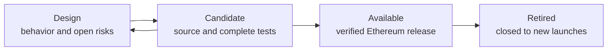

# Release process

Programmable versions each launch model independently. A model changes status only when the evidence required for that
status is public in this repository.

## Statuses

| Status | Meaning |
| --- | --- |
| `design` | The behavior is documented. No production implementation or deployment is claimed. |
| `candidate` | Source, tests and fixed parameters exist. The model is not available for production launches. |
| `available` | The exact source, parameters, deployment, runtime hashes and security status are published. |
| `retired` | Programmable no longer offers new launches through the release. Existing immutable contracts remain inspectable. |

[`models/registry.json`](models/registry.json) is the canonical status record. README files describe the registry; they
do not override it.

## Candidate gate

A candidate must include:

- complete hook, launcher and custody source;
- pinned compiler and dependency revisions;
- unit and integration tests for the complete launch path;
- fuzz and stateful invariant tests for accounting, permissions and failure paths;
- explicit pool shape, hook permissions, fee arithmetic and rounding;
- trust assumptions, ordering risks and operational requirements; and
- a model manifest that passes `node scripts/verify-model-registry.mjs`.

## Available gate

An Ethereum release may be marked `available` only after the candidate gate and all of the following:

1. the contracts are deployed through the reviewed release process;
2. deployment transactions and runtime code hashes are recorded;
3. the deployed source is verified on the named explorers;
4. the release manifest, specification and deployment record identify the same model version;
5. the mainnet bytecode check passes against the published addresses;
6. security review status and known limitations are stated without qualification gaps; and
7. the interface is explicitly configured for that exact release.

Passing CI, a local fork or a testnet deployment does not satisfy this gate.

## GitHub release

Release tags use the model's technical release identifier, such as `classic-v2`. The release page contains:

- a concise behavior summary;
- links to the model, security and deployment records;
- machine-readable release, specification and deployment manifests;
- checksums for downloadable evidence; and
- the independent-review status.

Release immutability is enabled so published tags and assets cannot be replaced.

## Material changes

Deployed contracts are immutable. A material change to code, accounting, custody, permissions, parameters or
beneficiaries creates a new technical release. Documentation-only corrections may update the current branch but do not
change the historical release tag.
