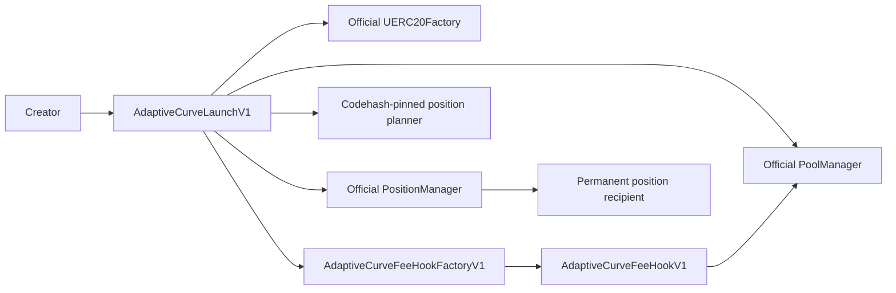

# Adaptive V1 security workflow

Review date: 2026-07-28

This record covers the Adaptive contracts only. It is an internal security
review artifact, not an audit or a mainnet-readiness claim.

## 1. Automated analysis

Slither was run independently against `AdaptiveCurveLaunchV1.sol` and
`AdaptiveCurveFeeHookV1.sol`, excluding imported dependencies. The following
non-security detectors were excluded:

- dependency pragma ranges;
- the compiler-generated runtime-code hash expression;
- an incorrect missing-implementation report for `getHookPermissions`.

No detector findings remained. The machine-readable results are stored in:

- `security/slither-results-adaptive-launch-v1.json`
- `security/slither-results-adaptive-v1.json`

Slither could not generate complete IR for `_consumeSwapContext`, `_absolute`
and `AdaptiveCurveLaunchV1.unlockCallback`. Those paths are therefore covered
by manual review, unit tests, fuzz tests, invariants and mainnet-fork tests, not
by a claim of complete static-analysis coverage.

## 2. Special features

- No proxy, upgrade path, owner, admin, pause, blacklist or post-launch setter.
- The fixed-supply token is created by the pinned official UERC20Factory.
- The hook extends the pinned OpenZeppelin Uniswap Hooks `BaseHook`.
- The launcher pins the position planner by exact runtime codehash.
- Per-launch hook provenance is enforced by the dedicated CREATE2 factory.
- Hook return deltas are enabled only for the native-fee accounting modes that
  require them.

## 3. Architecture and authority

The launcher has no privileged caller. Its only mutable state is the append-only
launch registry and hook-to-token provenance mapping. The hook accepts
initialization only from the recorded token creator and v4 callbacks only from
PoolManager. Fee claims are permissionless, but their recipients are immutable.
The stateless planner can only be called for pure plan generation and its exact
runtime is checked when the launcher is constructed.

## 4. Security properties

The test suite is intended to maintain these properties:

- every successful launch is atomic;
- every pool has one immutable, bounded, ordered curve;
- total native fees equal creator fees plus the fixed 10-basis-point platform
  share;
- token transfer tax is always zero;
- the same pre-swap fee applies to buys and sells;
- native-specified partial fills revert;
- claims cannot redirect another recipient's funds;
- the launcher and PositionManager retain no loose ETH or token balance;
- the complete fixed supply enters the permanently locked position, excluding
  only tokens bought atomically by the creator;
- deterministic addresses and release manifests bind the reviewed bytecode and
  official Mainnet dependencies.

These properties are exercised by unit, fuzz, invariant and official-mainnet
fork tests listed in `ADAPTIVE-RELEASE-V1.md`.

## 5. Manual review areas and residual risk

- The current pool tick is intentionally the fee input. A trader can move that
  tick before another swap; the immutable 1–10% bounds limit the result but do
  not make it manipulation-resistant.
- Return-delta accounting is a critical path. Incorrect v4 delta handling can
  create insolvency even when the token itself has no transfer tax.
- A swap crossing a curve boundary uses its starting tick for the complete
  swap. The next swap receives the new fee.
- CREATE2 salts are public before inclusion. Factory provenance and exact
  configuration checks prevent an unrelated hook from being substituted, but
  transaction ordering remains an operational concern.
- Universal Router and Quoter fork compatibility does not guarantee support by
  every third-party router, scanner or indexer.
- Official dependency bytecode and addresses must match the reviewed release
  manifest at deployment time.
- Source verification, monitoring, production incident ownership and an
  independent review remain release-policy decisions outside this internal
  workflow.

The Adaptive model remains disabled in the release manifest until real
deployment receipts, onchain runtime hashes and product integration satisfy the
gates in `ADAPTIVE-RELEASE-V1.md`.
