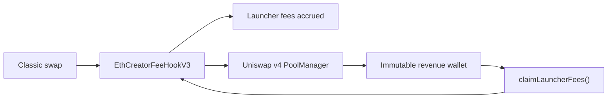

# Classic protocol revenue binder

## Decision

The next Classic Mainnet release binds its immutable
`launcherFeeRecipient` to:

`0x4957f49620AFf3Adbbe8195a4f633E49cc93376c`

This wallet receives Programmable's fixed 10-basis-point share in native ETH.
It is independent of the Deep launch model. Classic V2 remains historical and
unchanged.

## Revenue flow

The configured wallet is the only address that can initiate its claim, and the
PoolManager redeems the exact native amount directly to that wallet.

## Security properties

### Immutable destination

The Classic hook receives the revenue wallet in its constructor. It exposes no
setter, proxy or upgrade path. Mainnet deployment rejects every other
recipient.

### Fixed disclosed share

Programmable's share remains exactly 10 basis points of native swap volume.
Creator fees may vary by launch configuration, but the Programmable share
cannot be changed after deployment.

### Claim authority

`EthCreatorFeeHookV3.claimLauncherFees()` accepts only the immutable
`launcherFeeRecipient`. An unrelated caller cannot claim or redirect revenue.
The optional `claimLauncherFeesTo` path is also controlled exclusively by that
same wallet.

### Exact accounting

The Mainnet fork lifecycle asserts that:

- launcher fees accrue only as native PoolManager claims;
- an unrelated caller cannot claim them;
- the immutable revenue wallet receives exactly the reported amount;
- the hook's launcher accrual and PoolManager claim are zero afterward.

## Tested composition

`ClassicV3MainnetForkTest` runs against pinned Mainnet state and covers the
official Uniswap dependencies, a Classic launch, buy, sell, creator claims and
the Programmable revenue claim. Deterministic deployment tests reject any
different launcher-fee recipient.

Slither 0.11.5 was rerun against the Classic hook and launcher. Its raw output
contains dependency noise and known reviewed findings in the Classic sources,
so this release does not claim a clean external audit. Stateful fee and reward
invariants ran 1,000 sequences of 128 calls. Manticore is not available in the
local toolchain and is not counted as passing evidence.

## Mainnet evidence

The Mainnet release binds the reviewed bytecode directly to the revenue wallet.
All seven deployment receipts reached finality, all sources match on Etherscan and
Sourcify, and the live lifecycle redeemed the exact Programmable amount to
`0x4957f49620AFf3Adbbe8195a4f633E49cc93376c`. The app manifest pins the same
addresses and runtime hashes.
