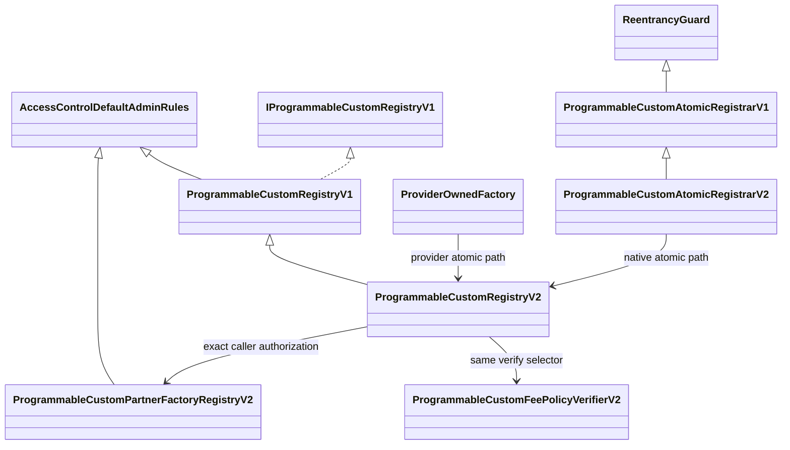
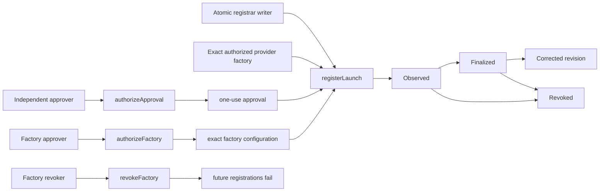

# Custom Registry generation 2 security workflow

## Component and inheritance graph

## State transitions and authorization

| State | Authorized writer | Property |
| --- | --- | --- |
| Factory authorization | `APPROVER_ROLE` | exact source/runtime/config/permissions/fee/chain/generation |
| Factory revocation | independent `REVOKER_ROLE` | terminal for future registrations |
| Approval | independent Registry `APPROVER_ROLE` | exact launch and registration binding, one use |
| Registration | native writer or exact active factory | live primary runtime match and one-use deployment ID |
| Finality | `FINALIZER_ROLE` | native block hash and configured depth |
| Correction | `CORRECTOR_ROLE` | contiguous append-only revision |
| Revocation | `REVOKER_ROLE` | terminal launch state |

## Security properties exercised

1. Generation 2 is compile-time pinned and chain/generation checks reject cross-scope replay.
2. A previously unknown nonzero provider is structurally valid only with exact active factory authorization.
3. A provider tag, copied template metadata, global writer, wrong caller, altered runtime, configuration, permissions,
   repository/commit, fee evidence, or revoked authorization fails closed.
4. Native Custom is exactly 10 BPS; partner templates are exactly 20 = 15 + 5 with no additional native 10 BPS.
5. Partner legs use one currency/basis/charge-mode/rounding basis and separate recipients and claim rights.
6. The 37 fixed registration fields and nested fee policy bind approval, source/build/artifacts, deployment/runtime,
   configuration/permissions, model/template/provider, assets/markets/capabilities, review, and finality.
7. Approval, deployment, transition evidence, and factory evidence are one-use; counts are monotonic.
8. Atomic deployment, initialization, runtime validation, and registration revert together on any failure.
9. Revocation is terminal and correction history remains append-only.

Focused unit and 1,000-run fuzz tests cover provider neutrality, exact factory checks, fee splits, shared basis,
claim isolation, runtime/config/permission mutation, fake attribution, and commitment changes. Stateful invariants run
256 sequences at depth 64 and cover one-use bindings, cross-generation rejection, monotonic counts, and terminal
revocation. The CI profile raises fuzzing to 10,000 runs and invariants to 1,000 sequences at depth 128.

## Static analysis and feature checks

Slither `0.11.5` analyzed the focused Registry source set with 101 detectors (233 compiled contracts because Foundry
resolves the full dependency graph). It reported no High, Medium, Low, or Optimization findings. The six
Informational results were one mixed dependency-pragma group, the inherited V1 constructor's deliberate
configuration-check complexity, and four uppercase immutable/interface naming notices. The constructor branches are
fail-closed checks; uppercase names are stable manifest-facing protocol fields.

- Upgradeability: the four Generation 2 components are direct deployments and contain no proxy/delegatecall upgrade
  path. A provider launch may still be upgradeable and must bind implementation/admin/permissions in its runtime set.
- ERC conformance: the Registry continues to expose the frozen `IProgrammableCustomRegistryV1` ERC-165 interface.
  The package is not an ERC-20/721/1155 implementation.
- Token integration: the Registry and verifier transfer no tokens. The atomic registrar can forward only the exact
  approved constructor/initializer ETH value and requires a zero residual balance.
- Cryptography: commitments use typed `abi.encode` plus Keccak-256 with explicit domains; there is no custom signature
  scheme or randomness.

Slither's contract summary, function summary, and variables-and-authorization printers were also reviewed against
the diagrams above. They found no unmodeled Generation 2 state-writing entry point.

## Manual review areas

- signer, threshold, and operational-role custody;
- exact factory and launch runtime closure, including proxies and upgrade/admin authorities;
- accounting, rounding, accrual currency, claim separation, and reentrancy in provider-owned templates;
- oracle, bridge, hook, PoolManager, external protocol, and off-chain dependencies;
- reproducible build, source publication, and explorer runtime verification;
- nonce freeze, transaction ordering, and exact deployment calldata/value;
- finality, reorg, indexer backfill, cursor, and API projection behavior; and
- real canary, manifest publication, production parity, and current release authorization.

The contract package provides provenance and review bindings, not a guarantee that a launch is safe, risk-free,
non-upgradeable, or independently audited.

Privacy review: all commitments, roles, addresses, and evidence hashes are public calldata/state and must not contain
secrets. Front-running review: copying an approval or atomic request is insufficient because launch wallet, exact
factory caller, CREATE2 target, configuration, runtime and one-use IDs are bound; an authorized factory can still
control its own ordering, which is an operational/provider risk. DeFi review: the verifier proves declared policy
structure, not actual market accounting; each provider template's hook, fee accrual/claim logic, reentrancy boundary,
oracle/bridge dependencies, rounding, and authority controls remain a separate exact-revision release gate.
