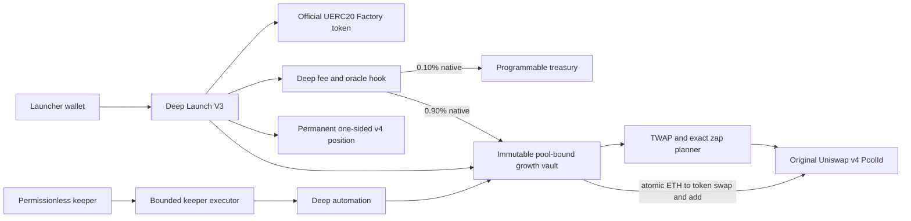

# Deep V3 local security and release evidence

Evidence date: 2026-07-29
Public model: Deep
Internal release: `deep-full-range-v3`
Contract-core commit: `7627c46e5370e01186f627aba964615911f38af5`

## Result

The exact Deep V3 source snapshot passes its focused build, unit, fuzz, invariant, deployment-rehearsal and Mainnet-fork checks.

- 86 tests passed, 0 failed, 0 skipped across 14 suites.
- Fuzz tests ran 10,000 cases each.
- Five stateful invariants ran 1,000 campaigns at depth 128: 640,000 handler calls, 0 handler reverts.
- Three fork tests passed at Ethereum block 25,635,400.
- Ten deterministic deployment-plan tests passed, including vacancy, nonce, salt, chain, runtime and source-commitment failure paths.
- Slither produced 77 raw detector instances. Every detector class is triaged in `slither-results-deep-v3.json`; no confirmed High or Medium vulnerability remains from that scan.
- The exact-source `forge build --sizes --no-cache` passed. The smallest runtime margin is 429 bytes on the hook factory.

This is not an external audit. No Mainnet deployment, signature, transaction, external submission or publication was performed.

## Source snapshot

The contract-core sources were clean against the recorded commit when this evidence was produced. The application, operator and release evidence are frozen separately in the final release commit.

| Source | SHA-256 |
| --- | --- |
| `LiquidityGrowthFeeOracleHookFactoryV2.sol` | `c3b77fe2485070e27f3bc28d5e84f0e453f2a45cb98ef4395a4cc27414d2787a` |
| `LiquidityGrowthFeeOracleHookV2.sol` | `1e76920b314d925dfca520f78f12cbb7498b8cad554da0a40a9c60debe37c653` |
| `LiquidityGrowthFullRangePolicyV3.sol` | `8c7da3fa2f1fbbbf26415a6c9ee9ada3eb1508dc31db99ea3e6f54c037cf7e48` |
| `LiquidityGrowthZapPlannerV3.sol` | `b3f02e8452d0e94a9717f0bd6d313d3e0eb2236dcddf3d9f7f4a89018d95bdbf` |
| `LiquidityGrowthFullRangeVaultFactoryV3.sol` | `45bf14fb7b6c29e44cab65c433175f3928e0b0c17efc629f6ea0bba311234f69` |
| `LiquidityGrowthFullRangeVaultV3.sol` | `a8acb5e1ff5b2ec10fa51683757dc299ee0a52524df91837216860a94b63426b` |
| `LiquidityGrowthFullRangePositionPlannerV3.sol` | `b0d1073b8437145e4f9a9bbf2db3c45faf10e70e863df628d6536a8ef9f76960` |
| `LiquidityGrowthFullRangeAutomationV3.sol` | `26df0332202d148e8ce80e818956fd1dd6df1919be6bf899a6f8a98c16ddd6d6` |
| `LiquidityGrowthFullRangeLaunchV3.sol` | `107b38380807d25acf7ce8fe2f2bd7d2a5351af54d54bc08d1601ba45e2f7235` |
| `DeepKeeperExecutorV2.sol` | `6fdb967bb86821fd554395bb37e290ec1010b1da72a9ba7c72c6a1f327fba685` |
| `ILiquidityGrowthFeeOracleHookV2.sol` | `c30d437145b2b1ae292b0db0a00e38a347100dafe57935507b0ff42ee8f47d84` |
| `LiquidityGrowthSwapMathV3.sol` | `d304a1c1715f6a3de27d7c52d9c42aabbf2495fc5b1f5d4d157ce2593435a281` |

## Security boundary



Deep charges exactly 1.00% on the native side of ordinary swaps. Exactly 0.10 percentage point accrues to Programmable and 0.90 percentage point accrues to the pool's growth vault. The v4 LP fee is fixed at zero. The vault's internal ETH-to-token swap is exempt only through a transient, pool-bound, digest-bound intent.

No beneficiary receives token fees. The vault has no owner, admin, upgrade, payout, rescue, withdrawal or negative-liquidity entry point.

## V1 and V2 comparison

V1 is a tracked baseline. The V2 files currently present in the worktree are untracked and were used only for semantic comparison; they are not part of this release evidence.

Deep V3 intentionally replaces the older target-and-reserve model:

- V1 and the current V2 snapshot reserve 150 million tokens and stop growth at a fixed native target before exposing creator reward and payout surfaces.
- V3 has no growth target, beneficiary, reward claim, payout-address change or token reserve. Growth ETH is continuously converted and added to permanent same-pool liquidity, subject to policy bounds.
- V1 compounds no more often than every 30 minutes. V3 allows an eligible cycle every five minutes but caps the rolling 30-minute exposure with eight records and an anchored 25-basis-point trusted-depth limit.
- V3 adds a 30-minute long TWAP, five-minute short TWAP, raw-versus-truncated oracle comparison, 100-tick pre-swap spot bound, 25-tick internal impact bound and 125-tick post-swap envelope.
- V3 simulates the exact-input swap onchain, includes the directional Uniswap protocol fee, binds the plan to the original PoolId and nonce, checks the realized swap and price, and adds both assets atomically.
- V3 launches through the official UERC20 factory with a nonzero minimum output, bounded initial-buy price limit and deadline.

## Hook permissions

The required v4 hook bitmap is exactly `0x3AEC`.

Enabled callbacks:

- before and after initialize
- before add liquidity
- before remove liquidity
- before and after swap
- before donate
- before-swap return delta
- after-swap return delta

The return-delta permissions are high-risk by nature. Here they are restricted to fixed native fee accounting and are covered by all four ordinary swap modes. The internal compound route must match the registered growth vault, native-to-token direction, transient state, domain tag and plan digest. Remove-liquidity and donate always revert for registered Deep pools.

## Authorization and mutability

| Surface | Authorization |
| --- | --- |
| Pool registration and finalization | The UERC20 token's recorded creator, which is the immutable launcher |
| Initial pool creation and position | Atomic launcher lifecycle only |
| Growth-fee claim | Exact registered growth vault only |
| Programmable-fee claim | Immutable treasury only |
| Compound intent | Exact registered growth vault only |
| Vault initialization | Factory only, one-use configuration commitment |
| Vault work | Permissionless, parameter-free and policy-bound |
| Automation registration | Immutable launcher only |
| Keeper execution | Permissionless candidates, fresh onchain reassessment, fixed target and calldata |
| Liquidity removal, rescue and upgrade | No authorized path exists |

The pool, hook, token, vault, planner, PositionManager and PoolManager bindings are immutable after initialization.

## Static analysis

Slither 0.11.5 scanned only detector results whose source path belongs to the Deep V3 release graph. Raw impact counts were:

| Impact | Instances |
| --- | ---: |
| High | 4 |
| Medium | 27 |
| Low | 17 |
| Informational | 26 |
| Optimization | 3 |

The four High findings are false positives for Solidity's zero-initialized storage. The 27 Medium findings consist of intended zero-initialized locals, deliberately discarded tuple fields and one reentrancy warning on a transiently guarded, immutable dependency graph. All 19 detector classes and all 77 instances are dispositioned in the JSON evidence file.

`forge lint` also reported 13 High/Medium unsafe-cast warnings. Each cast is bounded before use:

- compound input is at most 0.25 ETH before conversion to `int256`;
- positive PoolManager deltas are branch-checked before conversion to `uint256`;
- tick bitmap words derive from valid v4 ticks at spacing 200 and remain inside `int16`;
- bit indices are masked to eight bits;
- TWAP means remain inside the valid `int24` tick domain.

No source suppression was added for this evidence pass.

## Tested properties

The focused suite covers:

- exact 90/10 native fee conservation in exact-input and exact-output buys and sells;
- no recursive hook fee during an authenticated internal compound;
- same-PoolId swap and liquidity addition;
- add-only full-range growth liquidity;
- permanently blocked liquidity removal and donation;
- complete PoolManager delta settlement;
- fee, ETH and token conservation under forced balances and unsolicited tokens;
- minimum compound, maximum compound, five-minute cooldown and rolling exposure cap;
- 30-minute oracle maturation and cardinality growth;
- raw, short, long, pre-spot, post-spot and price-impact rejection paths;
- protocol-fee-aware swap simulation against the real PoolManager;
- launch rollback on minimum-output failure;
- deterministic CREATE2 hook address and exact permission flags;
- deterministic six-transaction infrastructure graph;
- stale nonce, wrong treasury, zero salt, occupied address, wrong chain and runtime drift failures;
- malformed keeper return data, action drift, duplicate candidates and insufficient gas protection.
- sustained same-pool oracle capture followed by an immediate compound backrun at 0.02, 0.1 and 0.5 ETH sampled inputs; every sampled native round trip remained loss-making and each compound stayed within the 25-basis-point rolling exposure cap.

The adversarial suite also demonstrates the boundary of the oracle design: a manipulation sustained for the full oracle window can become the TWAP. The rolling exposure cap and per-swap price limits reduce the amount exposed; they do not make oracle manipulation impossible.

## Mainnet-fork evidence

The fork tests pin Ethereum block 25,635,400 and validate the official contracts and runtime hashes used by the release:

- PoolManager
- PositionManager
- StateView
- V4Quoter
- UERC20Factory
- Permit2
- Universal Router
- locked position forwarder factory

The fork creates a complete token launch, checks permanent initial-position custody, exercises all four fee modes, matures the oracle, compounds through the permissionless executor into the original PoolId, verifies no recursive Programmable fee and repeats the compound with a directional protocol fee.

Pinned source revisions include:

- Uniswap v4 Core `59d3ecf53afa9264a16bba0e38f4c5d2231f80bc`
- Uniswap v4 Periphery `ad04c9f24a170accf5ea1b2836bbafd514537ca6`
- Uniswap Liquidity Launcher `e4660afe4f820f4a39181c7ea1f9bce6c423499f`
- Uniswap UERC20 Factory `6f18f1cdf80dc173d33d3cd6bbe91ee52c314f68`
- Permit2 `cc56ad0f3439c502c246fc5cfcc3db92bb8b7219`
- OpenZeppelin Contracts `21c8312b022f495ebe3621d5daeed20552b43ff9`
- OpenZeppelin Uniswap Hooks `26dc8e53f812a1ca390d470342adb6cd8c3286ad`

## Code maturity scorecard

This scorecard applies the Trail of Bits nine-category maturity framework to the current Deep V3 contract and operating design. It is a code-maturity assessment, not an external audit or evidence that production operations are ready.

| Category | Rating | Evidence and limiting factor |
| --- | --- | --- |
| Arithmetic | Satisfactory — 3/4 | Solidity 0.8.26, `FullMath`, `SafeCast`, fixed bounds, exact four-mode fee tests, 10,000-run fuzzing and conservation invariants cover the critical formulas. Integer fee rounding remains explicit and favors growth by at most 9 wei over the ideal 9:1 split. |
| Auditing and monitoring | Moderate — 2/4 | Critical lifecycle, fee, intent, exposure and keeper outcomes emit distinct events, and an incident runbook exists. There is no independent audit, active production monitoring, alert history or completed incident drill. |
| Authentication and access control | Satisfactory — 3/4 | Dependencies and policy are immutable; initialization, registration, fee claims and transient compound intents are bound to exact actors and tested. The vault exposes no owner, upgrade, rescue or withdrawal path. |
| Complexity management | Moderate — 2/4 | Planner, vault, hook, launcher, automation and executor responsibilities are separated, but return deltas, transient intent state, oracle history, atomic settlement and the off-chain keeper form a high-complexity composition. |
| Decentralization | Moderate — 2/4 | Onchain work is permissionless and no administrator can remove locked liquidity or change policy. The official keeper, its gas funding, RPC selection, deployment and activation remain centrally operated even though another caller may execute the same parameter-free work. |
| Documentation | Satisfactory — 3/4 | Design, source provenance, security properties, residual risks, release gates and operator recovery are documented. Production procedures have not yet been validated by a live canary and incident exercise. |
| Transaction ordering and oracle risk | Moderate — 2/4 | Initial-buy deadlines and price limits, long and short TWAPs, raw/truncated comparison, spot limits, internal impact limits and rolling exposure bounds reduce atomic manipulation. A distortion sustained for the complete same-pool oracle window remains an accepted residual risk. |
| Low-level manipulation | Moderate — 2/4 | Transient storage and bounded memory-safe assembly are narrow and tested, and established Uniswap/OpenZeppelin primitives are reused. There is no independent differential or formal verification of every low-level path and compiler assumption. |
| Testing and verification | Moderate — 2/4 | The focused suite has 86 passing tests, 10,000-case fuzz tests, 640,000 invariant handler calls, deterministic deployment rehearsals and a pinned Mainnet fork. There is no published 100% branch/statement coverage, mutation testing, formal proof, external audit or live Mainnet canary evidence. |

**Overall maturity: 2.3/4 — Moderate.** The strongest evidence is arithmetic conservation, immutable custody and adversarial testing. The largest gaps are independent review, live monitoring and incident rehearsal, formal or mutation coverage, sustained-oracle residual risk and centrally funded keeper operations.

## Residual risks

1. A sustained manipulation that controls the full TWAP window can pass an oracle based on that market alone.
2. Five minutes is the earliest eligible retry, not a guaranteed execution interval. Keeper, RPC, gas and transaction inclusion determine liveness.
3. The first compound needs the observation cardinality and real 30-minute history to mature.
4. Permanent, ownerless liquidity has no emergency recovery path. A latent bug can permanently strand value.
5. Return-delta hook permissions are intrinsically sensitive even though this implementation restricts and tests them.
6. The hook factory has only 429 bytes of EIP-170 runtime headroom.
7. Fork results prove behavior at one pinned historical state, not future Mainnet state or successful production operations.
8. Keeper gas is externally funded. At the 0.002 ETH minimum compound threshold, execution gas can exceed both the complete growth budget and the 0.1% Programmable share. Deep is not self-funding.
9. Oracle staging and compounding are separate actions. The same accrued growth can satisfy the per-action economic ratio twice, so that ratio does not prove the complete lifecycle is self-funding.
10. Permissionless work can be completed by another caller after simulation and before inclusion. The reviewed transaction can then become stale or confirm without productive work and consume bounded gas, but it cannot redirect fees or remove liquidity.

If a keeper defers a cycle, ordinary fees continue accruing safely. Growth fees remain accounted to that PoolId in the hook until the vault claims them, claimed but unused ETH remains in `pendingGrowthNative`, and amounts above the per-cycle cap remain for later rounds. A blocked or failed cycle cannot redirect fees and does not consume accounting because the call either returns no work or reverts atomically.

## Remaining release gates

Before Deep can be enabled for normal users:

1. Freeze the exact source commit, compiler settings and dependency revisions.
2. Produce the final release manifest with predicted addresses, broadcaster nonce, hook salt and expected constructor graph.
3. Recheck every official dependency runtime hash at the intended deployment block.
4. Confirm every predicted address is vacant and the treasury is exact.
5. Simulate the complete six-transaction deployment and one canary launch against the intended Mainnet state.
6. Obtain explicit owner approval before signing, spending gas or broadcasting.
7. Record transaction receipts, deployed runtime hashes, constructor arguments and a source commitment tied to the frozen release.
8. Obtain Etherscan exact source verification and a Sourcify API v2 `match` for every deployed Deep contract.
9. Run a real canary launch with bounded initial-buy quote, price limit and deadline.
10. Bind the website to the reviewed manifest and refuse launch when runtime hashes, chain, indexer or quote simulation disagree.
11. Activate the keeper only with its reviewed dual-RPC, durable lease, dedicated credential, funding cap, five-minute schedule, monitoring and alerting.

Foundry is configured with `bytecode_hash = "none"` and `cbor_metadata = false`. Sourcify can therefore return a source `match`, but it cannot provide the metadata-backed cryptographic `exact_match` result for these artifacts. Release evidence must not describe Sourcify as an exact or full match. The production verification bundle requires Etherscan exact source verification, the Sourcify API v2 match, deployment receipts, deployed runtime hashes and the frozen source commitment together.

An independent audit has not been performed. If the owner chooses to ship without one, that is a conscious risk acceptance rather than evidence that the contracts were externally audited.

## Commands and result

```sh
forge build --sizes --no-cache \
  src/LiquidityGrowthFeeOracleHookFactoryV2.sol \
  src/LiquidityGrowthFeeOracleHookV2.sol \
  src/LiquidityGrowthFullRangePolicyV3.sol \
  src/LiquidityGrowthZapPlannerV3.sol \
  src/LiquidityGrowthFullRangeVaultFactoryV3.sol \
  src/LiquidityGrowthFullRangeVaultV3.sol \
  src/LiquidityGrowthFullRangePositionPlannerV3.sol \
  src/LiquidityGrowthFullRangeAutomationV3.sol \
  src/LiquidityGrowthFullRangeLaunchV3.sol \
  src/DeepKeeperExecutorV2.sol \
  src/interfaces/ILiquidityGrowthFeeOracleHookV2.sol \
  src/libraries/LiquidityGrowthSwapMathV3.sol

FOUNDRY_PROFILE=ci forge test \
  --match-contract '^(LiquidityGrowthFeeOracleHookV2PermissionsTest|LiquidityGrowthZapPlannerV3Test|LiquidityGrowthFullRangeV3PolicyTest|LiquidityGrowthFullRangeV3Test|LiquidityGrowthFullRangeV3FeeAccountingTest|LiquidityGrowthFullRangeV3SecurityTest|LiquidityGrowthDeepAdversarialTest|LiquidityGrowthFullRangeAutomationV3Test|LiquidityGrowthFullRangeLaunchV3Test|DeepKeeperExecutorV2Test|DeployMainnetDeepFullRangeInfrastructureV3Test|DeployMainnetDeepFullRangeInfrastructureV3SecurityTest|LiquidityGrowthFullRangeV3MainnetForkTest|LiquidityGrowthFullRangeV3StatefulInvariantTest)$' \
  -vv

forge lint --severity high --severity med -- \
  src/LiquidityGrowthFeeOracleHookFactoryV2.sol \
  src/LiquidityGrowthFeeOracleHookV2.sol \
  src/LiquidityGrowthFullRangePolicyV3.sol \
  src/LiquidityGrowthZapPlannerV3.sol \
  src/LiquidityGrowthFullRangeVaultFactoryV3.sol \
  src/LiquidityGrowthFullRangeVaultV3.sol \
  src/LiquidityGrowthFullRangePositionPlannerV3.sol \
  src/LiquidityGrowthFullRangeAutomationV3.sol \
  src/LiquidityGrowthFullRangeLaunchV3.sol \
  src/DeepKeeperExecutorV2.sol \
  src/interfaces/ILiquidityGrowthFeeOracleHookV2.sol \
  src/libraries/LiquidityGrowthSwapMathV3.sol
```

CI result: 86 passed, 0 failed, 0 skipped.

A repository-wide cold size build is presently blocked by stack-too-deep errors in unrelated Quote Asset and Stock Paired sources. Those files are outside this review and were not changed. The exact Deep V3 source graph builds from cold state without them.
