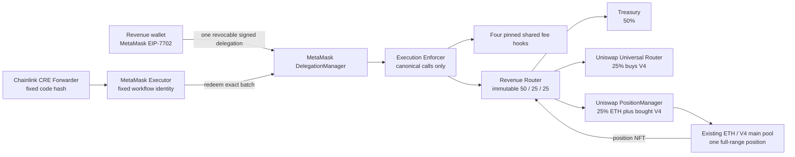
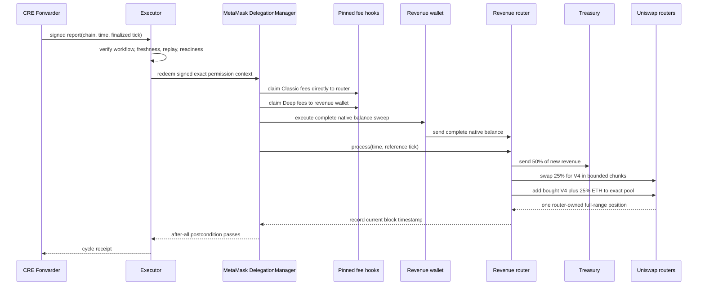
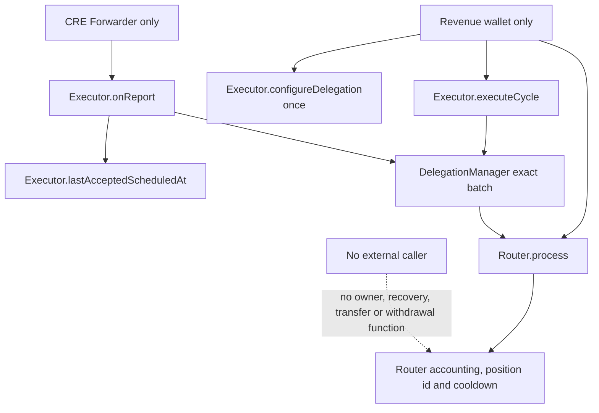

# Protocol revenue V1 security diagrams

## Trust and custody

```mermaid
flowchart LR
    CRE["Chainlink CRE Forwarder\nfixed code hash"] --> EX["MetaMask Executor\nfixed workflow identity"]
    RW["Revenue wallet\nMetaMask EIP-7702"] -->|"one revocable signed delegation"| DM["MetaMask DelegationManager"]
    EX -->|"redeem exact batch"| DM
    DM --> EN["Execution Enforcer\ncanonical calls only"]
    EN --> H["Four pinned shared fee hooks"]
    EN --> R["Revenue Router\nimmutable 50 / 25 / 25"]
    R --> T["Treasury\n50%"]
    R --> UR["Uniswap Universal Router\n25% buys V4"]
    R --> PM["Uniswap PositionManager\n25% ETH plus bought V4"]
    PM --> LP["Existing ETH / V4 main pool\none full-range position"]
    LP -->|"position NFT"| R
```

## Atomic daily sequence

```mermaid
sequenceDiagram
    participant C as CRE Forwarder
    participant E as Executor
    participant D as MetaMask DelegationManager
    participant H as Pinned fee hooks
    participant W as Revenue wallet
    participant R as Revenue router
    participant T as Treasury
    participant U as Uniswap routers

    C->>E: signed report(chain, time, finalized tick)
    E->>E: verify workflow, freshness, replay, readiness
    E->>D: redeem signed exact permission context
    D->>H: claim Classic fees directly to router
    D->>H: claim Deep fees to revenue wallet
    D->>W: execute complete native balance sweep
    W->>R: send complete native balance
    D->>R: process(time, reference tick)
    R->>T: send 50% of new revenue
    R->>U: swap 25% for V4 in bounded chunks
    R->>U: add bought V4 plus 25% ETH to exact pool
    U-->>R: one router-owned full-range position
    R-->>D: record current block timestamp
    D-->>E: after-all postcondition passes
    E-->>C: cycle receipt
```

Any failed step reverts the complete sequence.

## State writers

```mermaid
flowchart TD
    A["Revenue wallet only"] --> P["Router.process"]
    A --> F["Executor.executeCycle"]
    A --> G["Executor.configureDelegation\nonce"]
    C["CRE Forwarder only"] --> O["Executor.onReport"]
    O --> X["Executor.lastAcceptedScheduledAt"]
    F --> D["DelegationManager exact batch"]
    O --> D
    D --> P
    P --> S["Router accounting, position id and cooldown"]
    N["No external caller"] -.->|"no owner, recovery, transfer or withdrawal function"| S
```
