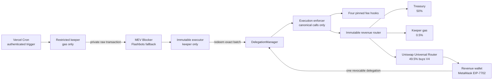
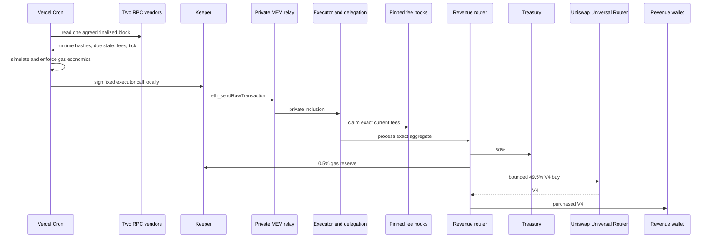
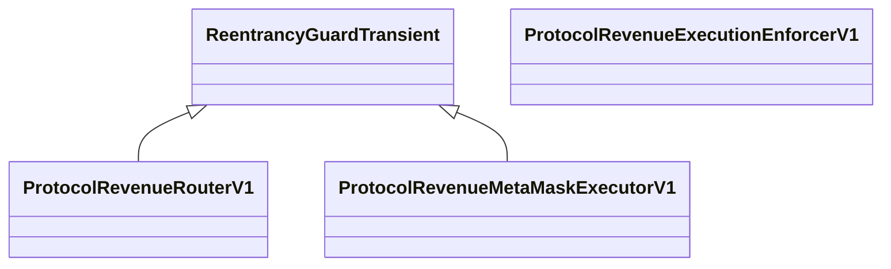

# Protocol revenue V1 security diagrams

## Trust and custody

## Daily execution

Any failed onchain step reverts the complete cycle. Prior wallet and router balances are excluded.

## Inheritance and state authorization

Slither's inheritance printer confirms that the router and executor inherit only OpenZeppelin's transient reentrancy
guard; the enforcer is a direct implementation of its narrow caveat interface. There is no proxy or upgrade base.

Slither's function and authorization printers reduce the state-writing surface to:

| Contract | State writer | Authorization |
| --- | --- | --- |
| Executor | `configureDelegation` | fixed revenue wallet |
| Executor | `executeKeeperCycle` | immutable keeper |
| Executor | `executeCycle` | fixed revenue wallet |
| Router | `process` | fixed revenue wallet through the enforced delegation or manual fallback |
| Enforcer | none | stateless validation only |

The raw inheritance output is stored in `security/diagrams/protocol-revenue-v1-executor-inheritance.dot`.
