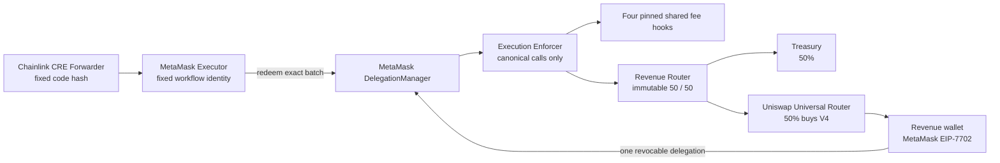
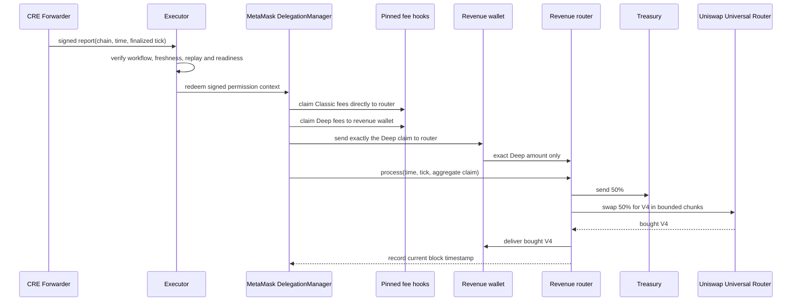
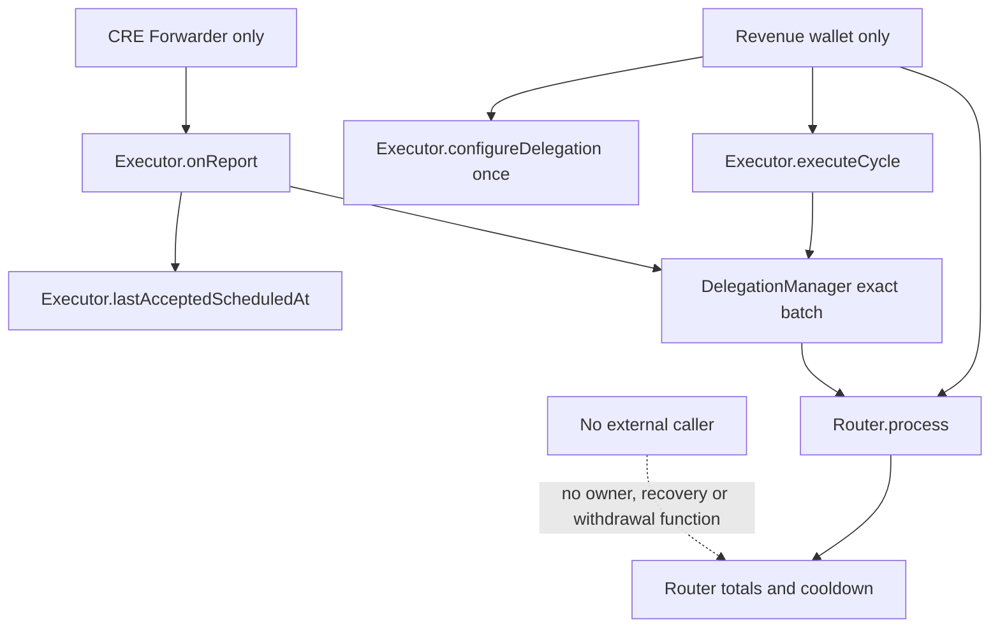

# Protocol revenue V1 security diagrams

## Trust and custody

## Atomic daily sequence

Any failed step reverts the complete sequence. Prior wallet and router balances are not part of the aggregate claim.

## State writers

