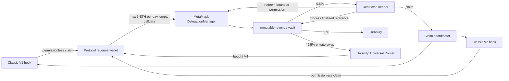

# Protocol revenue V2 flow

The ERC-7715 permission can only transfer bounded native ETH from the revenue wallet to the Vault. It cannot execute
claims, swaps or arbitrary calls. The Vault can only apply the fixed split and buy through the pinned `$V4` pool.
