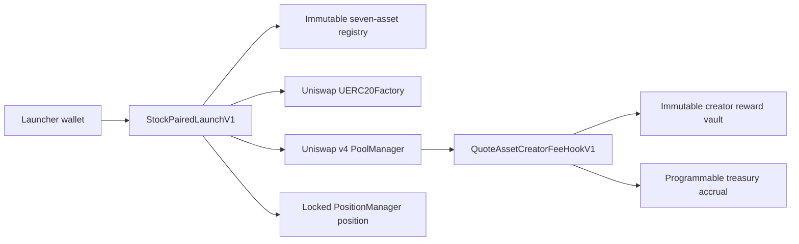

# Stock-Paired V1 security review

## Scope

- `StockQuoteRegistryV1`
- `StockPairedPositionPlannerV1`
- `QuoteAssetFeeSplitVaultV1`
- `QuoteAssetFeeSplitVaultFactoryV1`
- `QuoteAssetCreatorFeeHookV1`
- `QuoteAssetCreatorFeeHookFactoryV1`
- `StockPairedLaunchV1`
- `DeployMainnetStockPairedInfrastructureV1`

## Architecture

The launcher, hook, registry, planner and factories are non-upgradeable. The quote assets remain
issuer-controlled and can be paused, restricted or upgraded by Ondo.

## Hook permissions

| Permission | Enabled | Purpose |
| --- | --- | --- |
| `beforeInitialize` | Yes | Allows only the recorded launcher to initialize the registered pool |
| `beforeSwap` | Yes | Charges the disclosed quote-denominated fee when quote is specified |
| `afterSwap` | Yes | Charges the disclosed quote-denominated fee when quote is unspecified |
| `beforeSwapReturnDelta` | Yes | Accounts for the quote fee taken into PoolManager claims |
| `afterSwapReturnDelta` | Yes | Accounts for the quote fee taken after the pool amount is known |
| All other hook permissions | No | No liquidity, donation or dynamic-fee callbacks |

Both delta-return permissions are high-risk surfaces. Every non-zero returned delta is backed in the
same callback by the matching `PoolManager.take(..., true)` claim. Partial fills fail closed, and the
stateful invariant suite checks liability conservation across exact-input and exact-output buys and
sells in both currency orders.

## Properties covered

- The quote asset must be one of the seven reviewed tokens.
- New launches stop when the quote token, beacon or implementation runtime changes.
- The complete launched-token supply enters the locked one-sided position.
- The creator receives launched tokens only through the initial quote-token buy.
- Buy and sell fees total 1.00% of the quote amount.
- Creator rewards are 0.90% and the Programmable share is 0.10% of the same total.
- Hook claims always cover recorded creator and Programmable liabilities.
- Beneficiaries and percentages are immutable after launch.
- A beneficiary can claim or change only its own payout address.
- Partial fills, fee-on-transfer behavior and reentrant launch callbacks fail closed.
- Both possible currency orders complete through the current Mainnet quoter and Universal Router.

## Test evidence

- 14 unit, fuzz and adversarial tests in `StockPairedLaunchV1.t.sol`
- 4 stateful invariants with 512,000 total handler calls in `StockPairedFeeAccountingInvariant.t.sol`
- 5 pinned Mainnet-fork tests in `StockPairedMainnetFork.t.sol`
- 3 deterministic deployment and launch rehearsals in `DeployMainnetStockPairedInfrastructureV1.t.sol`
- 9 release-operator and canary transaction-construction tests

The Mainnet fork covers all seven quote assets. It also covers direct buy, sell, creator claim and
Programmable claim through both token orderings.

## Static analysis

Slither 0.11.5 ran with 101 detectors against the Stock-Paired source paths.

No High or Medium finding remains. The remaining results are:

- `calls-loop`: constructor-only metadata checks over exactly seven assets. The loop is bounded and
  deployment reverts atomically if an issuer token call fails.
- `reentrancy-benign`: the launch writes its record after external calls. The full launch is protected
  by `ReentrancyGuardTransient`; a malicious quote-token callback is covered by an adversarial test.
- `pragma`: dependency packages use compatible Solidity ranges while production sources pin 0.8.26.
- `unimplemented-functions`: a known Slither/OpenZeppelin BaseHook false positive.

Slither could not generate IR for two signed-int helper paths. Those paths are covered by all four swap
modes, both currency orders, fuzz tests and stateful invariants. Static analysis is therefore reviewed
but not represented as complete formal coverage.

The latest gas report measured the hook registration at 53,493 gas, creator claims at 26,705 gas and
launcher claims between 22,274 and 80,894 gas in the unit fixture. The complete atomic launch used
about 3.95 million gas in the successful launch cases. The launcher runtime is 19,186 bytes, below the
24,576-byte EIP-170 limit.

## Manual review

- There is no proxy, owner, mutable allowlist or emergency withdrawal path.
- The hook does not use `tx.origin`, signatures, randomness, an oracle or a single-block price check.
- Reward loops are capped at eight beneficiaries. Registry construction is capped at seven assets.
- The launch and claim paths use transient reentrancy guards and exact balance-delta checks.
- Metadata is public by design; no private data or secrets belong in launch metadata.
- Initial buys have no caller-supplied minimum token output because launch fixes the first pool state
  and executes atomically. Public trading uses the official v4 Quoter and Universal Router path with
  explicit slippage and deadlines.
- The issuer token is the main external trust boundary. Runtime pinning stops new launches after a
  reviewed implementation change, but it cannot protect an existing pool from issuer controls.

## External assumptions

Ondo controls the quote-token beacon, implementation and token-level transfer controls. A pause,
restriction or upgrade can affect trading in an existing pool. The registry can stop new launches after
a reviewed runtime changes, but it cannot make an issuer-controlled asset permissionless.

Routing, token-list, explorer and scanner acceptance are external decisions. They must be checked again
after deployment and cannot be guaranteed by the contracts.

## Deployment boundary

The candidate Mainnet plan is simulation-only until the broadcaster nonce, dependency hashes, gas
estimate and all six target addresses are refreshed immediately before signing. Source verification and
deployed-address lifecycle evidence remain post-deployment gates.

The localhost release operator validates the exact six-transaction dry run, source commitment,
constructor arguments, CREATE and CREATE2 addresses, hook flags, dependency runtimes, issuer runtimes,
two independent RPC snapshots, nonce order, zero transaction value, live simulations and gas ceilings.
It has no private key and cannot sign without the connected wallet.

The separate canary gate requires an exact quote-token approval, launch, Universal Router buy and sell,
creator claim, Programmable claim and permanent position-lock proof. The website remains fail-closed
until the six sources match both Etherscan and Sourcify and the canary evidence matches two Mainnet
RPCs.
