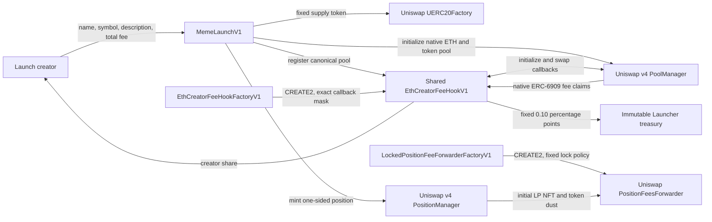
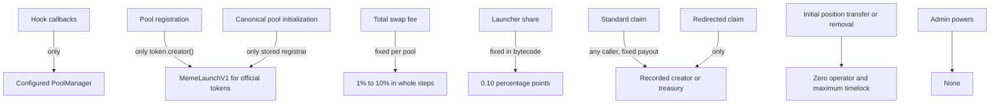

# Meme Launch V1 security architecture

```mermaid
flowchart LR
    Creator["Launch creator"]
    Launcher["MemeLaunchV1"]
    TokenFactory["Uniswap UERC20Factory"]
    HookFactory["EthCreatorFeeHookFactoryV1"]
    Hook["Shared EthCreatorFeeHookV1"]
    PoolManager["Uniswap v4 PoolManager"]
    PositionManager["Uniswap v4 PositionManager"]
    PositionFactory["LockedPositionFeeForwarderFactoryV1"]
    Forwarder["Uniswap PositionFeesForwarder"]
    Treasury["Immutable Launcher treasury"]

    Creator -->|"name, symbol, description, total fee"| Launcher
    Launcher -->|"fixed supply token"| TokenFactory
    Launcher -->|"register canonical pool"| Hook
    Launcher -->|"initialize native ETH and token pool"| PoolManager
    Launcher -->|"mint one-sided position"| PositionManager
    PositionFactory -->|"CREATE2, fixed lock policy"| Forwarder
    PositionManager -->|"initial LP NFT and token dust"| Forwarder
    HookFactory -->|"CREATE2, exact callback mask"| Hook
    Hook <-->|"initialize and swap callbacks"| PoolManager
    PoolManager -->|"native ERC-6909 fee claims"| Hook
    Hook -->|"creator share"| Creator
    Hook -->|"fixed 0.10 percentage points"| Treasury
```

## Authority map

```mermaid
flowchart TD
    Callback["Hook callbacks"] -->|"only"| PoolManager["Configured PoolManager"]
    Registration["Pool registration"] -->|"only token.creator()"| Launcher["MemeLaunchV1 for official tokens"]
    Initialization["Canonical pool initialization"] -->|"only stored registrar"| Launcher
    TotalFee["Total swap fee"] -->|"fixed per pool"| Bounds["1% to 10% in whole steps"]
    LauncherShare["Launcher share"] -->|"fixed in bytecode"| TenBps["0.10 percentage points"]
    StandardClaim["Standard claim"] -->|"any caller, fixed payout"| RecordedRecipient["Recorded creator or treasury"]
    RedirectClaim["Redirected claim"] -->|"only"| RecordedRecipient
    PositionControl["Initial position transfer or removal"] --> Locked["Zero operator and maximum timelock"]
    Admin["Admin powers"] --> None["None"]
```

The auction and direct-liquidity diagrams describe internal prototypes only and are not part of the current public product.
