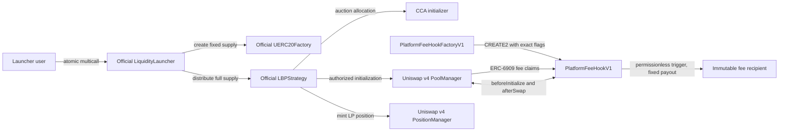
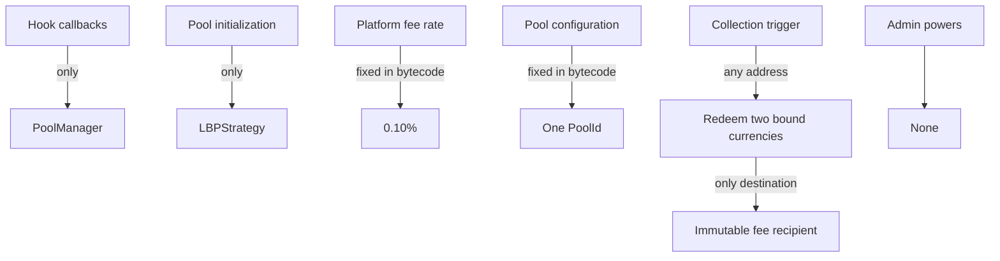

# Security architecture

```mermaid
flowchart LR
    User[Launcher user]
    Launcher[Official LiquidityLauncher]
    TokenFactory[Official UERC20Factory]
    Auction[CCA initializer]
    Strategy[Official LBPStrategy]
    Factory[PlatformFeeHookFactoryV1]
    Hook[PlatformFeeHookV1]
    PoolManager[Uniswap v4 PoolManager]
    PositionManager[Uniswap v4 PositionManager]
    Treasury[Immutable fee recipient]

    User -->|atomic multicall| Launcher
    Launcher -->|create fixed supply| TokenFactory
    Launcher -->|distribute full supply| Strategy
    Strategy -->|auction allocation| Auction
    Factory -->|CREATE2 with exact flags| Hook
    Strategy -->|authorized initialization| PoolManager
    Hook <-->|beforeInitialize and afterSwap| PoolManager
    Strategy -->|mint LP position| PositionManager
    PoolManager -->|ERC-6909 fee claims| Hook
    Hook -->|permissionless trigger, fixed payout| Treasury
```

## Authority map

```mermaid
flowchart TD
    PoolCallback[Hook callbacks] -->|only| PoolManager
    PoolInitialization[Pool initialization] -->|only| LBPStrategy
    FeeRate[Platform fee rate] -->|fixed in bytecode| TenBp[0.10%]
    PoolConfig[Pool configuration] -->|fixed in bytecode| PoolId[One PoolId]
    FeeCollection[Collection trigger] -->|any address| Redeem[Redeem two bound currencies]
    Redeem -->|only destination| Treasury[Immutable fee recipient]
    Admin[Admin powers] --> None[None]
```
