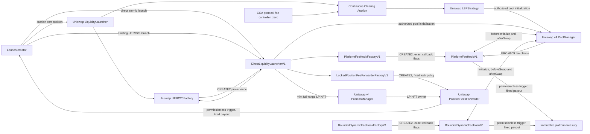

# Security architecture

## Authority map

```mermaid
flowchart TD
    PoolCallback[Hook callbacks] -->|only| PoolManager
    AuctionInitialization[Auction pool initialization] -->|only| LBPStrategy
    DirectInitialization[Direct pool initialization] -->|only| DirectLiquidityLauncherV1
    ExistingTokenLaunch[Existing token launch] -->|only| FactoryRecordedCreator[Factory recorded creator]
    FeeRate[Platform fee rate] -->|fixed in bytecode| TenBp[0.10%]
    DynamicRate[Dynamic LP fee] -->|fixed rule and bounds| Bounded[0.30% to 1.00%]
    AuctionProceeds[Auction proceeds] -->|zero CCA protocol fee controller| PoolFunding[100% to pool funding]
    PoolConfig[Pool configuration] -->|fixed in bytecode| PoolId[One PoolId]
    PlatformCollection[Platform fee collection] -->|any address| Treasury[Immutable platform treasury]
    LPCollection[LP fee collection] -->|any address| Creator[Immutable launch creator]
    PositionControl[Position transfer or liquidity removal] --> Locked[No operator and uint256 max timelock]
    Admin[Admin powers] --> None[None]
```

The generated Slither inheritance graph is stored in `inheritance-graph.dot`. Slither’s function and state-authorization views are summarized in `function-surface.md` and `state-authorization.md`.
