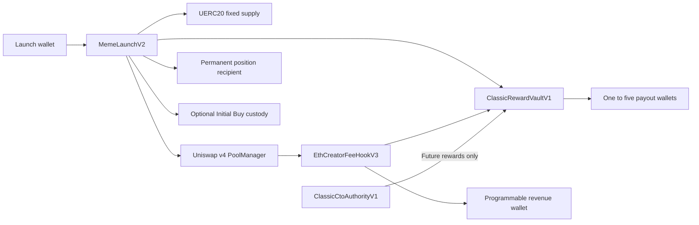

# Classic security diagrams

These diagrams describe the configurable Classic candidate. The Sepolia deployment is
verified and lifecycle tested. Ethereum deployment remains a separate release gate.

Critical boundaries:

- Only the canonical PoolManager may call hook callbacks and the launch unlock callback.
- The reward vault alone may redeem its pool's creator-fee claim.
- The immutable Programmable wallet alone may redeem or redirect the 0.10 percentage-point share.
- Every payout-wallet or CTO update checkpoints the previous reward configuration first.
- The position recipient exposes no practical transfer or liquidity-removal path.
