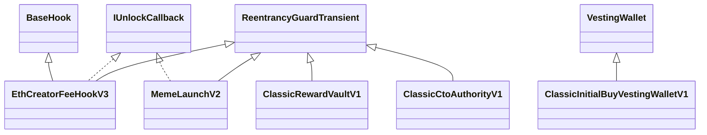

# Inheritance and dependency surface

All release contracts are concrete and non-upgradeable. Factories use deterministic
CREATE2 deployment and bind an immutable configuration hash to every recognized child.
