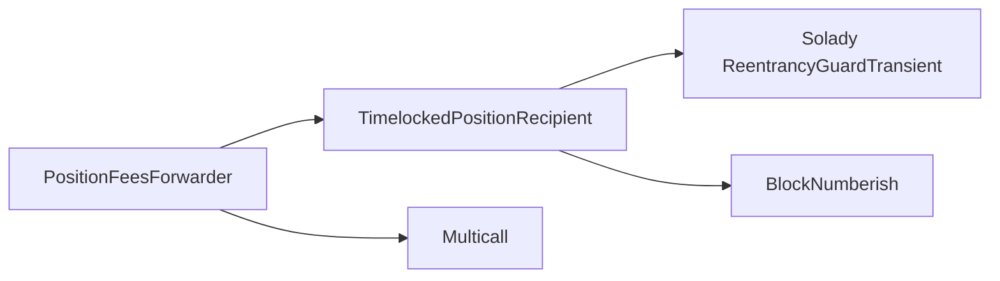

# Deep FullRange V1 inheritance

```mermaid
flowchart TB
    subgraph Core["Deep FullRange V1 core"]
        Launch["LiquidityGrowthFullRangeLaunchV1"]
        Automation["LiquidityGrowthFullRangeAutomationV1"]
        Vault["LiquidityGrowthFullRangeVaultV1"]
        VaultFactory["LiquidityGrowthFullRangeVaultFactoryV1"]
        Planner["LiquidityGrowthFullRangePositionPlannerV1"]
        Policy["LiquidityGrowthFullRangePolicyV1"]
    end

    subgraph Support["Shared support contracts"]
        Hook["LiquidityGrowthFeeOracleHookV1"]
        HookFactory["LiquidityGrowthFeeOracleHookFactoryV1"]
        Range["LiquidityGrowthRangeSourceV1"]
        RangeFactory["LiquidityGrowthRangeSourceFactoryV1"]
        SplitVault["FeeSplitVaultV1"]
        SplitFactory["FeeSplitVaultFactoryV1"]
        ForwarderFactory["LockedPositionFeeForwarderFactoryV1"]
    end

    subgraph Inherited["Inherited contracts and interfaces"]
        Unlock["IUnlockCallback"]
        OZGuard["OpenZeppelin ReentrancyGuardTransient"]
        BaseHook["OpenZeppelin BaseHook"]
    end

    Launch --> Unlock
    Launch --> OZGuard
    Automation --> OZGuard
    Vault --> Unlock
    Vault --> OZGuard
    Hook --> BaseHook
    Hook --> OZGuard
    SplitVault --> OZGuard
```

The factories, position planner and range source have no base contracts. `LiquidityGrowthFullRangePolicyV1` is an
internal library.

## Permanent-position dependency

The initial Uniswap position is held by the upstream `PositionFeesForwarder`. Its inheritance is part of the custody
boundary even though the implementation lives in the pinned `liquidity-launcher` dependency.

No contract in the reviewed scope inherits an owner, proxy-admin, pause, upgrade or arbitrary-execution role.
