# Deep FullRange V1 state and authorization

```mermaid
flowchart TD
    Creator["Any launch creator"] -->|"valid launch"| LaunchState["Launch hash and token to vault record"]
    Launcher["Immutable FullRange launcher"] -->|"register once"| PoolConfig["Hook pool and fee configuration"]
    Launcher -->|"register once"| Registry["Automation vault registry"]
    PoolManager["Canonical Uniswap v4 PoolManager"] -->|"enabled callbacks"| FeeOracle["Fee accrual and oracle observations"]
    RewardVault["Factory-bound reward vault"] -->|"creator-fee claim"| FeeOracle
    Treasury["Immutable protocol treasury"] -->|"protocol-fee claim"| FeeOracle
    Anyone["Any caller"] -->|"bounded process or compound"| Growth["Growth accounting and add-only full-range liquidity"]
    Anyone -->|"monotonic growth"| OracleCapacity["Oracle cardinality"]
    Beneficiary["Immutable beneficiary"] -->|"own claim or payout address"| Rewards["Beneficiary claim ledger"]
    Factory["Canonical vault factory"] -->|"one-time committed initialization"| VaultConfig["Vault configuration"]
    Upstream["Upstream vault or PoolManager"] -->|"restricted native receipt"| VaultBalance["Vault native balance"]
```

## Write authority

| State group | Writer | Authorization and bounds |
| --- | --- | --- |
| `launchHashOf`, `growthVaultOf` | `LiquidityGrowthFullRangeLaunchV1.launch` | Permissionless launch entry, but only after the complete atomic launch validates and succeeds; `nonReentrant` |
| Automation `_vaults`, `isRegisteredVault` | `registerAndStageOracle` | Only the immutable launcher; the vault must pass factory provenance checks |
| Vault-factory `initializationCommitment` | `deployOrGet` | Permissionless deterministic deployment; commitment is derived from every initialization argument and deleted after initialization |
| Vault-factory `configurationHashOf` | `deployOrGet` | Written only after the clone initializes and reports its committed configuration |
| Vault initialization state | `initialize` | Only `FACTORY`, exactly once, and only while its exact commitment is present |
| Growth and liquidity accounting | `process`, `compoundPending`, PoolManager callback | Permissionless trigger with no caller-selected pool, range, amount or recipient; oracle, reserve, depth, cooldown and fixed-target gates remain enforced |
| Beneficiary payout destination | `setPayoutAddress` | Only the immutable beneficiary can change its own destination; the destination receives no authority |
| Beneficiary claim ledger | `claimRewards` | Only the immutable beneficiary; payment goes to its current payout destination |
| Hook pool configuration | `registerPool` | Only the token’s recorded creator, which is the launcher for official launches; one registration per pool |
| Hook fee and observation accounting | PoolManager hook callbacks | BaseHook restricts callbacks to the canonical PoolManager |
| Hook oracle capacity | `increaseObservationCardinalityNext` | Permissionless and monotonic; cannot shrink history capacity or change the pool |
| Hook creator-fee balance | `claimCreatorFees` | Only the pool’s recorded reward vault |
| Hook protocol-fee balance | `claimLauncherFees`, `claimLauncherFeesTo` | Only the immutable protocol treasury |
| Fee-split payout destination and claim ledger | `setPayoutAddress`, `claim` | Only the immutable beneficiary can mutate its own entries |
| Factory provenance mappings | Factory deployment methods | Permissionless CREATE2 deployment, but the recorded hash is derived from the complete fixed configuration |

## Callback and native-transfer boundaries

| Entry point | Accepted caller |
| --- | --- |
| Launcher `unlockCallback` | Canonical PoolManager only |
| Growth vault `unlockCallback` | Canonical PoolManager only |
| Hook callbacks and hook `unlockCallback` | Canonical PoolManager only |
| Growth vault `receive` | Its immutable upstream fee vault or canonical PoolManager only |
| Fee-split vault `receive` | Canonical PoolManager only |

There is no owner setter, admin withdrawal, liquidity-removal, rescue, pause, proxy upgrade or beneficiary-share update
in this scope. Permissionless keeper calls can advance only the predetermined state machine.
