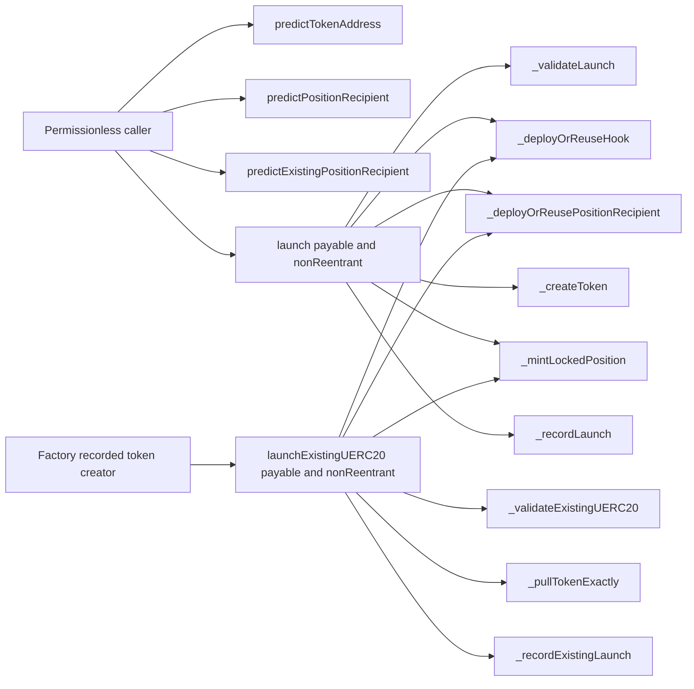

# Function surface

Generated from:

```sh
slither . --print function-summary --filter-paths 'lib|test|script' --exclude-dependencies
```



`DirectLiquidityLauncherV1` has five explicit external entry points. The three prediction methods are read-only. `launch` and `launchExistingUERC20` are the two state-changing entry points and both use OpenZeppelin’s transient reentrancy guard. They write only the token-to-launch-hash record after all external composition calls succeed.

Slither reported a maximum cyclomatic complexity of 4; no Launcher function reached the review threshold of 11. The direct paths have no owner, administrator, arbitrary-call entry point, delegatecall or upgrade entry point.

The contract makes scoped calls only to its immutable PoolManager, PositionManager, UERC20Factory and Launcher factories. The deployment script pins the official dependency bytecode before deploying the contract.

`BoundedDynamicFeeHookV1` adds no administrative entry point. Its public state-changing surface is permissionless fee forwarding to the immutable treasury; pool initialization and swap updates are callback-gated by `BaseHook.onlyPoolManager`. `feeForTickMovement` and `poolKey` are read-only. `BoundedDynamicFeeHookFactoryV1.deploy` is permissionless and accepts only a CREATE2 address with the exact callback mask.
