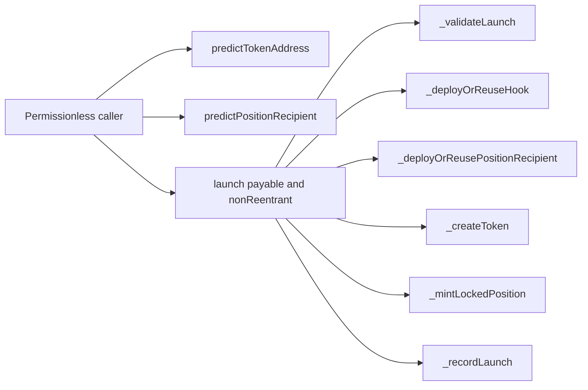

# Function surface

Generated from:

```sh
slither . --print function-summary --filter-paths 'lib|test|script' --exclude-dependencies
```



`DirectLiquidityLauncherV1` has three external entry points. The two prediction methods are read-only. `launch` is the only state-changing entry point and is protected by OpenZeppelin’s transient reentrancy guard. It writes only the token-to-launch-hash record after all external composition calls succeed.

Slither reported a maximum cyclomatic complexity of 7 in `_validateLaunch`; no Launcher function reached the review threshold of 11. The direct path has no owner, administrator, arbitrary-call entry point, delegatecall or upgrade entry point.

The contract makes scoped calls only to its immutable PoolManager, PositionManager, UERC20Factory and Launcher factories. The deployment script pins the official dependency bytecode before deploying the contract.
