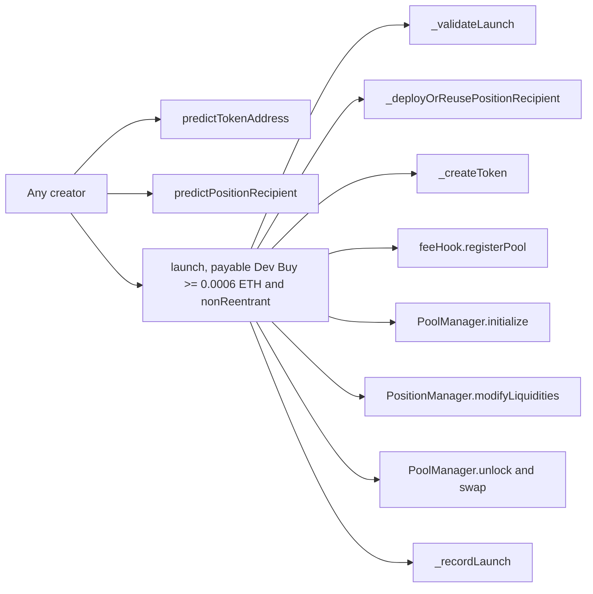

# Meme Launch V1 function surface

`MemeLaunchV1` has two read-only prediction methods, one read-only PoolKey method and one state-changing launch method.
The launch accepts a creator-selected Dev Buy of at least 0.0006 ETH and is protected by OpenZeppelin’s transient
reentrancy guard. Its `unlockCallback` is PoolManager-gated, settles the exact selected native delta and sends the
purchased tokens directly to the creator. It writes only the token launch hash
after every external composition call succeeds.

`EthCreatorFeeHookV1` exposes registration, fee quotes and claims. Registration is creator-bound. Standard claims are
permissionless with fixed recipients. Redirected claims require the recorded recipient. Hook callbacks and the unlock
callback are PoolManager-gated.

`EthCreatorFeeHookFactoryV1.deploy` is permissionless but succeeds only for a CREATE2 address with the exact callback
mask. The permanent-position factory is likewise permissionless and fixes the zero operator and maximum timelock.

The public contract surface has no owner, upgrade, pause, delegatecall or arbitrary external-call entry point.
