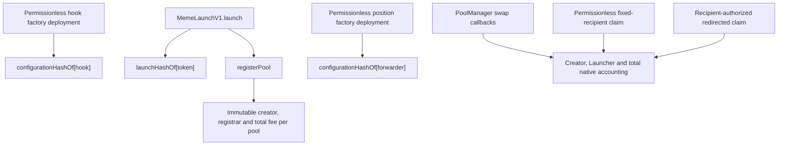

# Meme Launch V1 state and authorization

| Contract | Mutable state | Who can write | Effect |
| --- | --- | --- | --- |
| `MemeLaunchV1` | `launchHashOf[token]` | Any caller completing a valid atomic launch | Records the immutable launch commitment |
| `EthCreatorFeeHookFactoryV1` | `configurationHashOf[hook]` | Any caller completing a valid CREATE2 deployment | Records factory provenance |
| `LockedPositionFeeForwarderFactoryV1` | `configurationHashOf[forwarder]` | Any caller completing a valid CREATE2 deployment | Records permanent-recipient provenance |
| `EthCreatorFeeHookV1` | per-pool creator, registrar, fee and creator accrual; global Launcher and total accrual | Registrar once during launch; PoolManager during swaps; claim functions during redemption | Fixes pool economics and accounts native fees |

There is no role assignment or revocation state. The only payout discretion is a recovery method: the recorded creator or
treasury may redirect its own accrued claim when direct ETH reception fails. No third party can change that destination.

Factory provenance alone is insufficient for Explore. Indexers must also require the paired verified Meme Launch events.
