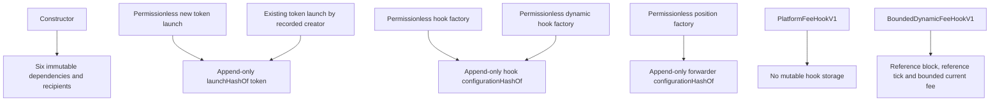

# State and authorization

Generated from:

```sh
slither . --print vars-and-auth --filter-paths 'lib|test|script' --exclude-dependencies
```



| Contract | Mutable state | Who can write | Effect |
| --- | --- | --- | --- |
| `DirectLiquidityLauncherV1` | `launchHashOf[token]` | Any valid new-token caller, or the creator recorded by a provenance-verified existing UERC20 | Records the immutable launch commitment for the selected token |
| `PlatformFeeHookFactoryV1` | `configurationHashOf[hook]` | Any caller completing a valid CREATE2 deployment | Records factory provenance |
| `BoundedDynamicFeeHookFactoryV1` | `configurationHashOf[hook]` | Any caller completing a valid CREATE2 deployment | Records factory provenance |
| `LockedPositionFeeForwarderFactoryV1` | `configurationHashOf[forwarder]` | Any caller completing a valid CREATE2 deployment | Records factory provenance |
| `PlatformFeeHookV1` | None | Nobody | Fee, pool, initializer and recipient stay immutable |
| `BoundedDynamicFeeHookV1` | `referenceBlock`, `referenceTick`, `currentLpFee` | Only PoolManager during initialization or the first successful swap in a later block | Advances the immutable bounded fee rule; authorities, rule and payout stay immutable |

There is no role assignment or revocation state because there are no privileged functions. Factory provenance alone is not a verified launch: indexers must also require the matching new-token, existing-token or complete official auction launch record.
