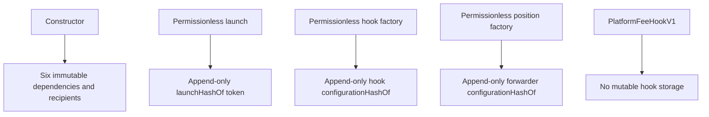

# State and authorization

Generated from:

```sh
slither . --print vars-and-auth --filter-paths 'lib|test|script' --exclude-dependencies
```



| Contract | Mutable state | Who can write | Effect |
| --- | --- | --- | --- |
| `DirectLiquidityLauncherV1` | `launchHashOf[token]` | Any caller completing a valid launch | Records the immutable launch commitment for the newly created token |
| `PlatformFeeHookFactoryV1` | `configurationHashOf[hook]` | Any caller completing a valid CREATE2 deployment | Records factory provenance |
| `LockedPositionFeeForwarderFactoryV1` | `configurationHashOf[forwarder]` | Any caller completing a valid CREATE2 deployment | Records factory provenance |
| `PlatformFeeHookV1` | None | Nobody | Fee, pool, initializer and recipient stay immutable |

There is no role assignment or revocation state because there are no privileged functions. Factory provenance alone is not a verified launch: indexers must also require the direct launch record or the complete official auction path.
