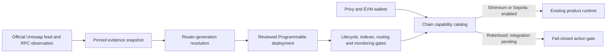

# Robinhood Chain integration

Status: `INTEGRATION_PENDING`. This branch adds wallet-level chain recognition and a pinned dependency observation. It does not deploy Programmable contracts or enable Robinhood reads, launches, prepared transactions, swaps, indexing, or provider availability.

## Implemented boundary

| Capability | Ethereum | Sepolia | Robinhood mainnet | Robinhood testnet |
| --- | --- | --- | --- | --- |
| Wallet connection | Enabled | Enabled | Enabled | Enabled |
| Product reads | Enabled by the active deployment manifest | Enabled by the active deployment manifest | Disabled | Disabled |
| Prepared transactions | Enabled | Enabled | Disabled | Disabled |
| Launches | Enabled by the active release gates | Enabled by the active release gates | Disabled | Disabled |
| Trades | Enabled by the active release gates | Enabled by the active release gates | Disabled | Disabled |

The capability catalog is the client-safe boundary. The server-side transaction parser remains restricted to chain IDs `1` and `11155111`, and `/api/trade/prepare` returns a conflict response for chain ID `4663` before doing RPC work.

## Selected architecture

Robinhood is an additive chain, not a replacement for Ethereum. The selected rollout has three stages:

1. Recognize Robinhood mainnet and testnet in connected EVM wallets and expose their names without enabling value-moving actions.
2. Build and independently review a Robinhood-specific Programmable deployment using Fee Policy V2, exact contract/runtime bindings, and an explicitly selected Universal Router generation.
3. Activate reads, then launches, then exact-input trading only after deployment, lifecycle, indexing, quote/execution parity, provider, monitoring, and clean integration-build evidence exists.

Replacing the Ethereum configuration was rejected because it would silently reinterpret existing deployment manifests. Reusing the current Classic V3 deployment unchanged was rejected because its fee rounding/accounting and block-number assumptions do not satisfy the Robinhood integration requirements.

## Integration graphs

| Graph | Current state | Required next evidence |
| --- | --- | --- |
| User journey | Wallet can connect and identify Robinhood; product actions stop | End-to-end rehearsal with explicit network/action disclosures |
| Product state | `integration-pending` is separate from `ready` | Reviewed activation transition and rollback behavior |
| Value flow | No Robinhood value movement exists | Fee V2 platform/project liability and claim conservation |
| Authority | No new deployer, admin, signer, or claimant authority added | Exact deployer, immutable fee owner, separate admin, and custody review |
| System | Network catalog and evidence snapshot are isolated from active deployment bindings | Chain-aware read, indexer, quote, and execution adapters |
| Lifecycle | No Robinhood launch lifecycle exists | Deploy, source-verify, initialize, trade, claim, exit, and monitor receipts |
| Security | Unsupported actions fail before RPC/signing | Contract threat model, fork tests, invariants, and independent review |
| Observability | RPC code hashes are captured at one block | Dual-provider runtime checks, lag/reorg handling, alerts, and runbooks |
| Deployment/rollback | No deploy or activation mechanism exists | Clean production integration commit, staged flags, canary, and rollback plan |

## Pinned Robinhood observation

`config/robinhood-chain.v1.json` records:

- Robinhood mainnet chain ID `4663` and testnet chain ID `46630`;
- the public RPC and explorer endpoints from Robinhood documentation;
- the official Uniswap deployment-feed version, generation time, source commit, and downloaded feed SHA-256;
- PoolManager, PositionManager, StateView, V4Quoter, Permit2, and Universal Router records;
- runtime code hashes observed on Robinhood mainnet at block `33771369`; and
- the unresolved Universal Router conflict between the official feed and installed `@uniswap/universal-router-sdk@5.11.1`.

The feed's short source references remain recorded as `unresolved`; an official address record plus runtime code does not establish source identity.

The public Robinhood RPC is rate-limited and is evidence for this bounded observation only. It is not a production provider binding.

## Contract and routing blockers

1. Select one Universal Router generation. The official deployment feed points to `0x06Af...bf99`; the installed SDK's `V2_1_1` table points to `0x8876...0904`. Both have runtime code, but they are different contracts. The integration must bind the selected router, SDK encoding, V4Planner behavior, Permit2, quoter, PoolKey, hook data, directions, exactness, limits, and tests end to end.
2. Implement Fee Policy V2 for every canonical Robinhood scope. The platform allocation is 10 bps of executed gross quote volume, with an immutable platform owner, separate admin, independent platform/project cumulative remainders, pool-and-quote isolation, and owner-only claims.
3. Start with one hook instance per pool and exact-input native ETH/token swaps. Exact output stays rejected until gross-witness, partial-fill, fee rounding, and quote/execution parity are proven.
4. Do not port block-number windows literally. Robinhood Chain is an Arbitrum Nitro L2, and EVM `block.number` has L1-estimate semantics. Any L2-block-dependent behavior must use the reviewed ArbSys boundary or be redesigned around time/confirmed state.
5. Deploy and verify a chain-local position-forwarder/factory path if the selected launcher needs one. The Ethereum factory address is not a Robinhood deployment.
6. Add a chain-aware indexer with explicit start block, confirmation policy, reorg rollback, deterministic resync, and RPC reconciliation. Indexing is not routing or availability evidence.
7. Record provider-specific quote and interface observations separately. Protocol compatibility or a local successful simulation does not establish hosted Uniswap routing or product availability.

## Activation gate

Robinhood capabilities may change from `integration-pending` only after all of these are bound to the exact reviewed commit:

- coherent pinned Solidity and TypeScript dependencies;
- contract tests, invariants, fork tests, static analysis, and independent review;
- deployment transactions, addresses, constructor/configuration values, source verification, and runtime code hashes;
- provider-backed lifecycle receipts for launch, buy, sell, fee accrual, claim, liquidity exit, and failure recovery;
- indexer backfill, parity, reorg, freshness, and monitoring evidence;
- quoter/execution parity for every exposed direction and exactness mode;
- explicit hosted-provider observations without approval or endorsement claims; and
- a clean integration build from the reviewed `production` commit, followed by separately authorized activation.

Until then, the strongest accurate state is: wallet integration implemented and locally tested; product integration pending; not deployed; not source verified as a Programmable release; not lifecycle verified; not indexed; not quoted; not tradable; not available.
