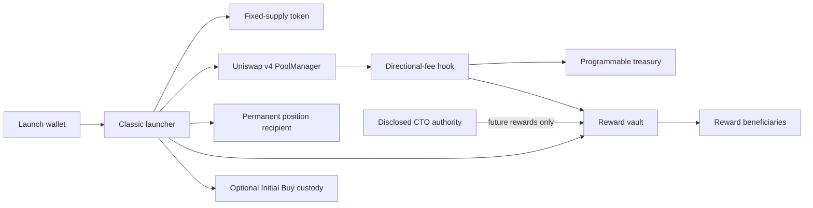

# Classic security properties

This document defines the security boundary of the configurable Classic launch
lifecycle. It describes the local candidate, not a deployed release.

## Scope

The candidate launches one fixed-supply token, initializes one Uniswap v4 pool, places
the supply in one permanently held one-sided position, executes a mandatory Initial Buy
and records immutable fee and reward rules in one transaction.

The release consists of:

- `MemeLaunchV2`, the atomic launcher
- `EthCreatorFeeHookV3`, the shared directional-fee hook
- `ClassicLaunchPolicyV1`, bounded metadata and allocation validation
- `ClassicRewardVaultFactoryV1` and `ClassicRewardVaultV1`, creator-reward accounting
- `ClassicCtoAuthorityV1`, the disclosed CTO authority
- `ClassicInitialBuyVestingWalletFactoryV1` and
  `ClassicInitialBuyVestingWalletV1`, optional Initial Buy custody
- `LockedPositionFeeForwarderFactoryV1`, the existing permanent position recipient

None of these contracts is upgradeable.



## Roles and authority

### Launch wallet

- Supplies the token metadata, directional fees and creator-reward allocations.
- Pays the Initial Buy and receives its tokens directly or through an immutable
  custody wallet.
- Has no token owner privileges after launch.
- Cannot change fee rates, supply, pool parameters or liquidity custody.

### Reward beneficiary

- Claims only ETH already allocated to its payout address.
- May change one allocation it currently owns to a new payout address.
- Does not need acceptance from the new address.
- Cannot move rewards accrued before the change.

### CTO authority

- May replace only the future creator-reward allocation after a disclosed approval.
- Cannot redirect historic rewards.
- Cannot change fees, Programmable's share, token supply, token behavior, Initial Buy
  custody or the locked position.
- Uses a two-step authority transfer.

### Programmable treasury

- Receives the disclosed 0.10 percentage-point share of each swap fee.
- Has no privileged creator-reward claim path.
- Has no token, pool or liquidity control.

### Anyone

- May trigger permissionless factory deployment of an exact counterfactual reward or
  custody contract.
- Cannot substitute another configuration because each factory authenticates the
  deployed configuration hash.

## Immutable launch properties

- Supply is `1,000,000,000` tokens with 18 decimals.
- No owner mint, blacklist, pause, arbitrary rescue or ERC-20 transfer tax exists.
- Buy and sell fees are selected independently from 1% through 10%.
- The 0.10 percentage-point Programmable share is included in the selected total.
- Fee rates cannot change after pool registration.
- Initial Buy is at least `0.0006 ETH`.
- Reward allocations contain one through five positive shares totaling exactly 100%.
- The position recipient and Initial Buy custody schedule cannot change.

## Reward checkpoint property

Every payout-wallet change and CTO first pulls all creator fees accrued under the
current configuration. Those fees are allocated before the configuration changes.

For every completed checkpoint:

```text
sum(new beneficiary credits) = creator fees received in that checkpoint
```

The final allocation receives integer-division remainder, so no creator fee is stranded.
Across the vault lifecycle:

```text
total received = total claimed + total checkpointed claimable
```

ETH forced into the vault is excluded from this accounting because only the balance
increase observed while redeeming the hook's PoolManager claim is recorded.

## Payout-wallet changes

- The current wallet for the chosen allocation must call the change.
- The change affects only future checkpoints.
- Unclaimed historic ETH stays claimable by the old wallet.
- A destination may already own another allocation; its future shares then consolidate.
- A zero address and no-op change are rejected.
- There is intentionally no administrator recovery for a mistyped destination.

## Community takeovers

- Only the current shared CTO authority can execute a CTO.
- A nonzero approval reference is recorded onchain.
- The complete future allocation is replaced atomically.
- The new allocation must contain one through five unique wallets whose positive shares
  total 100%.
- Historic ETH stays under the previous configuration.
- The authority itself does not receive or custody creator rewards.

## Initial Buy custody

- `Unlocked` sends the Initial Buy tokens directly to the launch wallet.
- `FixedLock` releases 100% at the configured date.
- `LinearVesting` begins at launch and reaches 100% on the configured end date.
- `CliffLinearVesting` releases 0% before the cliff and then vests linearly to the end.
- The launch wallet is the immutable beneficiary.
- Ownership transfer and renunciation are disabled.
- Only the beneficiary can release vested assets.
- Schedules are immutable and bounded to 1 through 3,650 days.

## Uniswap v4 boundary

- Only the canonical PoolManager can invoke the launcher's unlock callback.
- Native settlement must equal the Initial Buy exactly.
- The resulting token balance increase must equal the swap result.
- The shared hook is bound to the expected PoolManager, zero LP fee and tick spacing.
- The reward vault accepts native ETH only from its bound PoolManager.
- Pool registration binds the reward vault and immutable directional fees before the
  first swap.

## Threat model and known limitations

- A compromised CTO authority can redirect future creator rewards after a checkpoint.
  It cannot access historic rewards or change token and pool economics.
- Sending a payout allocation to an unusable or incorrect address is irreversible.
- A beneficiary contract that rejects ETH cannot claim until it changes its allocation
  to a compatible wallet.
- Forced ETH sent with `selfdestruct` is intentionally not distributed and has no
  rescue path.
- Public metadata and social links are untrusted display data and must remain escaped
  by indexers and clients.
- The launcher runtime is 22,933 bytes. It is below Ethereum's 24,576-byte limit but
  only 67 bytes below the project's stricter 23,000-byte release ceiling. Any launcher
  change requires a fresh size and source-commitment check.
- Static analysis cannot produce complete SlithIR for the v4 unlock callback in the
  pinned dependency graph. Unit, fuzz, invariant and pinned-fork tests cover the
  settlement path, but they do not replace an independent audit.
- A successful local rehearsal is not deployment, source verification, canary evidence
  or production activation.

## Release gates

Before any production activation:

1. Build the exact pinned source tree and record the source commitment.
2. Refresh the deterministic deployment plan against the live deployment-wallet nonce.
3. Deploy and verify all seven candidate contracts on Sepolia.
4. Complete a launch, buy, sell, beneficiary claim, payout-wallet change, CTO and each
   custody schedule on Sepolia.
5. Verify runtime hashes and constructor bindings through two independent RPC endpoints.
6. Deploy and verify the same source commitment on Ethereum.
7. Complete a low-value Ethereum canary lifecycle.
8. Write exact addresses, runtime hashes and deployment block into the app manifest.
9. Confirm the app preflight gate before exposing the configurable Classic UI.

## Local evidence commands

```bash
cd contracts
forge build
forge test
slither . --exclude-dependencies --filter-paths lib

cd ..
npm test -- --run
npx tsc --noEmit
next build --webpack
node contracts/scripts/verify-classic-v3-release-manifest.mjs
```

Foundry stateful invariants are the executable property tests for reward conservation,
beneficiary isolation and directional-fee accounting. `echidna-test` is not installed
in the current toolchain; no Echidna result is claimed.
