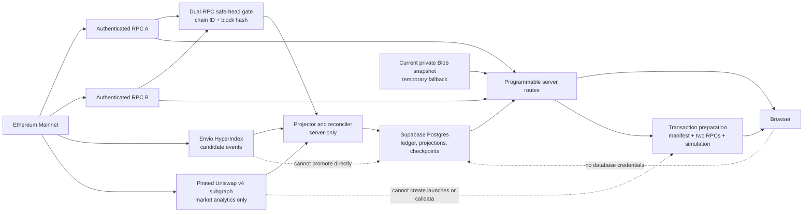

# Realtime data-pipeline architecture

Status: implementation design. This document does not record an Envio Cloud,
Supabase, RPC, or production activation.

## Scope and non-negotiable boundaries

The first migration covers historical and current public records for:

- Classic V2;
- Classic V3;
- Stock-Paired V1;
- Stock-Paired V2; and
- Stock-Paired V3.

Adaptive and Deep releases are outside this migration. Existing routes that are
specific to those models stay on their current path.

The system has three distinct data authorities:

1. Ethereum logs and manifest-pinned runtime state are authoritative for
   Programmable launches, configuration, fees, rewards, payouts, and claims.
   Envio HyperIndex makes those records available quickly, but its records are
   candidates until the application verifies and promotes them.
2. The pinned Uniswap v4 subgraph is the only approved offchain analytics
   source for this migration. Ethereum remains authoritative. The subgraph
   cannot create a Programmable launch, authorize a reward, select a different
   pool, or supply transaction calldata.
3. Supabase Postgres owns application metadata, profile data, the immutable
   application event ledger, verified projections, reconciliation results, and
   checkpoints. Browser roles have no direct table access.

Launch, trade, claim, payout-update, and reward-conversion preparation remains
manifest-derived, revalidated by two independent RPCs, and simulated before a
response is returned. Indexed data can identify a candidate; it cannot remove
those gates.

## Trust boundaries



Envio's database is an upstream provider boundary, not the application read
model. Envio can roll back its own entities after a reorg, but that rollback
does not undo writes already made to Postgres. The projector therefore owns an
independent event identity, safe-head policy, rewind protocol, and
reconciliation history.

## Current production read paths

The current implementation provides the rollback path and establishes the DTOs
that the first migration must preserve.

| Route group | Current dependency | Target responsibility |
| --- | --- | --- |
| `/api/explore`, `/api/explore/token` | private Vercel Blob snapshot, then live RPC; pinned Uniswap subgraph enrichment | verified launch projection plus separately verified market analytics |
| `/api/explore/token/chart` | durable launch model plus PoolManager log replay | pinned `Swap`, `PoolHourData`, and `PoolDayData` for the recorded pool |
| `/api/indexers/v1/tokens`, `/api/indexers/v1/token`, `/api/indexers/v1/token-list` | same durable Explore model | server-side public views over the verified projection |
| `/api/explore/profile` | durable model plus derived creator balances | private, `no-store` account view over verified projections |
| `/api/profile/classic-v3` | request-time launcher log replay and reward-vault reads | indexed vault discovery and history; two-RPC claimability and simulation remain live |
| `/api/profile/stock-paired` | durable model plus request-time vault reads across RPCs | indexed vault discovery and history; two-RPC claimability, receipts, quotes, and simulation remain live |
| `/api/explore/launch/stock-paired` | two-RPC receipt and event verification | indexed candidate lookup followed by the same two-RPC receipt verification |
| `/api/explore/profile/claim` | durable candidate plus RPC simulation | indexed candidate lookup followed by manifest binding, two-RPC revalidation, and simulation |
| `/api/trade/prepare` | durable registry plus two-RPC quotes and simulations | indexed candidate lookup; no change to transaction authority |
| `/api/launch/preflight` | checked-in manifests, runtime checks, RPC reads, and simulation | no indexed authority; projection may only reduce discovery work |
| `/api/transaction-status` | live RPC receipt/transaction lookup | stays live and `no-store` |
| `/api/ops/index`, `/api/ops/index-v2` | cron replay to private Blob | retained until parity and rollback gates pass |
| `/api/ops/health` | Blob freshness and dual-RPC health | adds Envio, projection, reconciliation, circuit, and fallback state |

The model-specific `/api/explore/launch` route currently serves Deep V2 and is
not part of this migration.

## Ingestion and promotion

### 1. Candidate ingestion

HyperIndex uses only the static contracts and event ABIs in
[EVENT-SOURCES.md](./EVENT-SOURCES.md). Its chain start block is `25624130`,
the earliest included source. Every handler writes deterministic entities and
has no HTTP, RPC, filesystem, queue, email, webhook, or Postgres side effect.

Dynamic vaults are registered from factory events:

- `ClassicRewardVaultDeployed` registers the emitted Classic reward vault;
- `QuoteAssetFeeSplitVaultDeployed` registers the emitted Stock-Paired reward
  vault.

The registration handler uses the emitted address only. It does not call an
RPC. The ordinary event handler records the factory event separately. A
candidate is promoted only when the factory address, emitted hook, pool ID,
launcher event, release manifest, and two-RPC log replay agree.

This follows HyperIndex's `contractRegister` model, but the application does
not depend on Envio's internal dynamic-address registry as durable discovery
state. The factory event in the application ledger is the durable evidence.

Initial reward beneficiaries and shares are constructor inputs, not indexed
events. Envio handlers do not attempt to recover them and retain the same
no-network-effects rule. After an occurrence reaches the safe head, a separate
server-only seed verifier reads both RPCs at the exact creation block hash or,
when historical getters are unavailable, verifies and decodes the identical
transaction input returned by both RPCs. The source-specific methods, selectors,
getter sets, commitments, and fallback rules are defined in
[EVENT-SOURCES.md](./EVENT-SOURCES.md).

### 2. Safe head

For each advancement, the projector reads both configured RPCs in parallel:

```text
require chainIdA == 1
require chainIdB == 1
safeHead = min(headA, headB) - 12
require blockHashA(safeHead) == blockHashB(safeHead)
```

If `min(headA, headB) < 12`, or either chain ID or safe-head block hash
disagrees, advancement freezes. The system does not choose one RPC, lower the
confirmation depth, or promote Envio's head. Existing verified rows remain
readable; transaction preparation fails closed if its required live
revalidation cannot complete.

The projector records both observed heads, the safe-head number and hash, RPC
endpoint identifiers (never URLs or credentials), and the observation time in
each projection run.

### 3. Immutable logical identities and fork occurrences

The immutable logical event identity remains:

```text
(chain_id, transaction_hash, log_index)
```

It identifies one logical receipt-log position but is not a database primary
key for chain placement: the same transaction can be re-mined with the same log
index at a different block. The append-only ledger therefore uses two layers:

```text
chain_event_identity
  primary key (chain_id, transaction_hash, log_index)

chain_event_occurrence
  primary key (chain_id, transaction_hash, log_index, block_hash)
  foreign key (chain_id, transaction_hash, log_index)
```

Addresses and hashes are stored as lowercase hex. Each occurrence retains:

- block number and block hash;
- transaction index;
- source address;
- event type;
- ordered topics and raw data;
- decoded payload;
- `payload_hash = keccak256(abi.encode(topics, data))`;
- release version;
- first-seen Envio cursor; and
- first verification run ID.

Two occurrences of one logical identity may have different placement or
payload because execution after re-mining can observe different block context.
Both are retained. The same occurrence key with different block number,
transaction index, source, event type, topics, data, or payload hash is a hard
integrity conflict and is never overwritten.

Canonicality is not mutated into either raw row.
`chain_event_occurrence_status_history` appends `observed`, `canonical`,
`orphaned`, `superseded`, or `conflicted` decisions and the complete two-RPC
receipt/block evidence. To select `canonical`, both RPCs must return the same
successful receipt, block hash/number, transaction index, and log at the
logical log index; that block must be at or below the safe head. A database
constraint permits at most one current canonical occurrence for a logical
identity. RPC disagreement or two competing canonical placements freezes
advancement.

A re-mined occurrence with a changed payload produces a high-severity reorg
finding, not a destructive update to the old row. Once both RPCs agree on the
new canonical placement, the old occurrence is appended as `orphaned`, the new
one as `canonical`, and affected projections are rewound and rebuilt.

### 4. Verified projections

Only events at or below the dual-RPC safe head can affect these derived tables:

- `launch_projection`;
- `pool_projection`, including the recorded pool ID and canonical PoolKey;
- `fee_accrual_projection`;
- `reward_vault_projection`;
- `reward_allocation_projection`;
- `claim_projection`;
- `account_reward_projection`; and
- `market_projection`.

Every projection row carries its release version, last source event identity,
last source occurrence block hash, projection run ID, promoted block
number/hash, and `verified_at`. Application metadata and profiles are separate
tables and are never reconstructed from chain events.

Projection code is a deterministic fold over only the current canonical
occurrence for each logical identity, ordered by:

```text
block_number, transaction_index, log_index
```

An occurrence that is merely observed, superseded, conflicted, or orphaned is
never folded. Reward-allocation projections additionally require a verified
seed record tied to the same canonical factory occurrence. Seed provenance
stores the creation occurrence key, recovery method, method selector, input
hash, normalized allocation hash, both RPC result hashes, exact block
number/hash, getter set or decoded calldata path, configuration commitments,
verification run, and finality time.

The projection transaction writes derived rows, reconciliation results, and
the checkpoint atomically. An API route never discovers or inserts a vault,
advances a checkpoint, or repairs a projection.

### 5. Reconciliation

The reconciler performs six independent comparisons:

1. Envio candidate identities and payload hashes against dual-RPC logs.
2. Every occurrence placement and status against both RPC receipts and blocks.
3. Initial reward seeds against historical getters or verified transaction
   calldata, factory/vault commitments, and the canonical creation occurrence.
4. Projection aggregates against a fresh fold of canonical occurrences.
5. Existing DTOs from the indexed resolver against the legacy Blob/RPC
   resolver.
6. Reward allocations reconstructed from the seed plus later canonical
   payout/configuration events against exact-block vault getters.

Reconciliation results are append-only and name the source range, release
version, compared counts, mismatch identities, run version, and timestamps.
Market analytics are reconciled separately; their absence cannot remove an
otherwise verified launch.

## Backfill, resume, and rewind

Backfill runs release by release from the exact start blocks in
[EVENT-SOURCES.md](./EVENT-SOURCES.md). It advances in transactions bounded by
the lower of 2,000 blocks or 2,000 events. A checkpoint is scoped by chain,
release version, source group, and projector version.

On resume:

1. read the last checkpoint;
2. ask both RPCs for its block hash;
3. resume only if both hashes equal the checkpoint hash;
4. otherwise find the highest earlier checkpoint whose hash both RPCs agree
   on;
5. append `orphaned` decisions for affected occurrences and their seed
   records;
6. delete and rebuild only derived projection rows after that checkpoint; and
7. replay through the current safe head before advancing the public pointer.

Logical identities, occurrence rows, seed records, and reconciliation history
are never deleted by the rewind. If the same logical identity appears in a new
block hash, append the new occurrence, verify its receipt with both RPCs,
reseed any constructor-derived allocation against that occurrence, and fold
only after the new placement is canonical. If no common checkpoint exists,
rebuild the affected release from its manifest start block. A reorg that
reaches or crosses a promoted checkpoint is a critical alert and immediately
removes indexed eligibility for affected routes.

## Uniswap market analytics

The only approved source is:

- subgraph ID:
  `DiYPVdygkfjDWhbxGSqAQxwBKmfKnkWQojqeM2rkLb3G`;
- deployment:
  `QmZsgJLiLQKpb8hxTmQ5LWyrFVvfWzVaL4WK8dfFBn7EeK`.

The adapter first queries `Pool` at the dual-RPC-confirmed block number,
verifies the returned `_meta.block.hash` against both RPCs, and pins every
`Swap`, `PoolHourData`, and `PoolDayData` page to that exact hash. Every entity
query uses `subgraphError: deny`. Every response must satisfy all of the
following:

- `_meta.deployment` equals the approved deployment;
- `_meta.block.number` equals the requested block;
- `_meta.block.hash` equals the dual-RPC block hash;
- `_meta.hasIndexingErrors` is `false`;
- the body is at most 128 KiB;
- each paginated query uses `orderBy: id`, an `id_gt` cursor, and exactly 250
  entities per full page;
- time windows are half-open; and
- the request completes inside 2.5 seconds.

The exact operations and fields are in
[EVENT-SOURCES.md](./EVENT-SOURCES.md). A schema or deployment change requires
a new review and parity run; an environment variable cannot authorize a
different deployment.

The join key is always the pool ID recorded by the verified Programmable
launch. The adapter reconstructs the canonical PoolKey from the verified
currencies, fee, tick spacing, and hook, recomputes its pool ID, and rejects a
mismatch. It never substitutes a third-party pool with higher TVL.

For dynamic-fee pools, the subgraph's `Pool.feeTier` can be the last applied
fee. It is analytics only: it is not compared with the canonical PoolKey fee
and is never used to compute the pool ID.

All `sqrtPriceX96` values are parsed as bigint. Price conversion handles either
token ordering and uses token decimals; WETH or native ETH is never assumed to
be token0. `market_volume_*` from Uniswap and `hook_gross_volume_*` from
Programmable fee events remain separate fields because they have different
accounting semantics.

If the subgraph is unavailable, behind the requested block, has indexing
errors, exceeds its response bound, or fails any pool-key check, the launch is
returned with market data pending. It is not hidden and no unverified market
value is substituted.

## Read-source selection and feature flags

Each route group has an explicit server-only activation flag:

| Flag | Routes |
| --- | --- |
| `INDEXED_EXPLORE_LIST_READS_ENABLED` | `/api/explore`, `/api/indexers/v1/tokens`, `/api/indexers/v1/token-list` |
| `INDEXED_EXPLORE_TOKEN_READS_ENABLED` | `/api/explore/token`, `/api/indexers/v1/token` |
| `INDEXED_EXPLORE_CHART_READS_ENABLED` | `/api/explore/token/chart` |
| `INDEXED_CREATOR_PROFILE_READS_ENABLED` | `/api/explore/profile` and the Stock-Paired profile projection used by `/api/profile/stock-paired` |
| `INDEXED_CLASSIC_V3_PROFILE_READS_ENABLED` | Classic V3 launch/reward history used by `/api/profile/classic-v3` |
| `INDEXED_LAUNCH_LOOKUP_ENABLED` | Classic V3 and Stock-Paired launch confirmation lookups |

Three control flags apply across route groups:

```text
INDEXED_READ_SHADOW_COMPARE_ENABLED
INDEXED_READ_REQUIRE_PARITY_ENABLED
INDEXED_READ_LIVE_FALLBACK_ENABLED
```

All route flags default to `false`. `INDEXED_READ_REQUIRE_PARITY_ENABLED`
defaults to `true` and must remain true in production. During rollout,
`INDEXED_READ_LIVE_FALLBACK_ENABLED` is true. Shadow comparison is enabled
separately and does not activate an indexed response.

When `INDEXED_READ_SHADOW_COMPARE_ENABLED` is true, responses still come from
the existing path for route groups whose activation flag is false. A
server-side comparison job executes the indexed resolver and records normalized
DTO hashes; request handlers do not write comparison results.

When a route flag is true, that route resolves sources in this order:

1. verified indexed projection;
2. a valid recent private Blob snapshot; then
3. the existing live dual-RPC path.

The Blob validity window remains 15 minutes during migration. It must pass the
existing content-hash, manifest, release, block-hash, and model validation.
Fallback does not make a projection valid and is recorded in health and
provenance headers.

An enabled route stays on, or immediately returns to, the legacy order when
any of these conditions holds:

- its explicit route flag is false;
- `INDEXED_READ_REQUIRE_PARITY_ENABLED` is not true in production;
- the required release or address set differs from a checked-in manifest;
- the projection checkpoint is above the current safe head;
- the checkpoint block hash does not match both RPCs;
- any required logical event lacks exactly one dual-RPC-canonical occurrence;
- a required initial reward seed is missing, conflicted, or tied to an
  orphaned occurrence;
- projection lag is more than 2 blocks behind the safe head;
- the last complete reconciliation is older than 5 minutes;
- a reconciliation conflict is unresolved for the route's release;
- the indexed response fails the existing DTO validator;
- Postgres, Envio, or the relevant circuit is unavailable;
- the projection is ineligible and
  `INDEXED_READ_LIVE_FALLBACK_ENABLED` is false, in which case the route stops
  after the valid Blob attempt instead of starting a live replay; or
- the release has not passed the parity gates below.

Transaction-preparation routes never switch authority. They may consume an
indexed candidate only after the active-release and projection checks pass,
then they re-derive the deployment from checked-in manifests, revalidate using
both RPCs, and simulate. Account rewards, claimability, launch confirmation,
and all transaction-preparation responses use `Cache-Control: private,
no-store`.

Public list, detail, chart, token-list, and public indexer responses may retain
their current bounded CDN caches. Account-specific reward and claimability
views remain private and `no-store`. Existing response bodies remain unchanged
in the first migration.

## Timeout and circuit policy

Timeouts include connection, headers, and body reads:

| Dependency | Per-attempt timeout | Attempts in a request |
| --- | ---: | ---: |
| Supabase read view | 1.0 s | 1 |
| private Blob fallback | 1.5 s | 1 |
| RPC head/hash or bounded read | 2.0 s | 1 per independent RPC, in parallel |
| Envio GraphQL candidate read | 2.0 s | 1 |
| pinned Uniswap subgraph | 2.5 s | 1 |

Retries belong in background backfill/reconciliation jobs, not public request
handlers. Envio, Uniswap, Blob, and Postgres each have an independent circuit:
three consecutive failures open it for 30 seconds; one half-open probe may
close it. The subgraph's existing in-process three-failure circuit can remain
at 10 seconds until the shared circuit is installed.

RPC chain-ID or block-hash disagreement is not counted as an ordinary provider
failure. It freezes safe-head advancement immediately. A circuit must never
turn a two-RPC requirement into a one-RPC result.

## Health, lag, and provenance

`/api/ops/health` adds these server-produced fields:

```text
status
chainId
safeHead.number
safeHead.hash
safeHead.confirmations
safeHead.headA
safeHead.headB
envio.progressBlock
envio.sourceBlock
envio.lagBlocks
envio.isReady
projection.status
projection.blockNumber
projection.blockHash
projection.lagBlocks
projection.lastReconciledAt
projection.releaseVersions
projection.canonicalOccurrenceCount
projection.pendingOccurrenceCount
projection.unverifiedRewardSeedCount
projection.lastRewardSeedVerifiedAt
fallback.blobAgeSeconds
fallback.activeSource
circuits.<dependency>.state
market.deployment
market.blockNumber
market.blockHash
market.lagBlocks
checkedAt
```

The endpoint exposes no provider URL, project reference, database identifier,
or credential. Existing DTO bodies stay unchanged; server routes emit these
bounded provenance headers:

```text
X-Programmable-Read-Source: indexed|blob|rpc
X-Programmable-Projection-Block
X-Programmable-Projection-Hash
X-Programmable-Projection-Lag
X-Programmable-Reconciled-At
X-Programmable-Release-Version
```

Alert thresholds are:

| Condition | Warning | Critical |
| --- | --- | --- |
| RPC chain ID or safe-head hash disagreement | n/a | immediately |
| projection lag behind safe head | more than 4 blocks for 2 min | more than 12 blocks for 5 min |
| last complete reconciliation | older than 2 min | older than 5 min |
| Envio progress lag behind safe head | more than 12 blocks for 2 min | more than 64 blocks for 5 min |
| unresolved identity, payload, release, or projection mismatch | n/a | immediately |
| competing occurrence placement or reward-seed mismatch | n/a | immediately |
| reorg reaches a promoted checkpoint | n/a | immediately |
| private Blob age while fallback is enabled | older than 10 min | invalid at 15 min |
| any upstream circuit open | more than 1 min | more than 5 min |
| market analytics unavailable | more than 5 min | never hides launch; page after 30 min |

## Database roles and credentials

Use distinct server-only Postgres roles:

| Role | Capability |
| --- | --- |
| `programmable_migrator` | schema migrations only; not present in application runtime |
| `programmable_projector` | insert ledger/status history, update projections and checkpoints |
| `programmable_reconciler` | read ledger/projections and append reconciliation runs/findings |
| `programmable_api_reader` | `SELECT` on approved views and functions only |

`anon` and `authenticated` receive no schema usage or table privileges for
pipeline tables. Row-level security remains enabled as defense in depth, but
the browser receives neither a Supabase URL/key pair with table access nor a
service-role credential. Public and account views are called only by server
routes. Projector, reconciler, API, Envio, Uniswap, Blob, and RPC credentials
are separate and independently rotatable.

No request handler uses the Supabase service-role key. Administrative,
migration, or provider tokens are never exposed through `NEXT_PUBLIC_*`,
responses, logs, or health fields.

## Shadow parity, activation, and rollback

A route is eligible for `active` only after all of these gates pass:

1. backfill reaches the safe head for all five included releases;
2. two clean full replays produce identical logical identities, occurrence
   placements/statuses, reward seeds, payload hashes, projections, and
   checkpoints;
3. dual-RPC replay has zero missing, extra, or changed included events;
4. deterministic existing DTO fields match at 100% across the historical
   corpus and seven consecutive days of shadow comparisons;
5. missing Uniswap analytics produces only the documented pending state;
6. a staged reorg drill rewinds and replays without changing pre-fork rows;
7. Blob and live-RPC fallback drills pass;
8. timeout, circuit, least-privilege, and credential-boundary checks pass; and
9. no critical reconciliation finding remains open.

Activation is per route key. A failure removes that route key from active
selection; it does not require a production deployment or delete indexed data.
Keep the private Blob writer and two-RPC replay path until all routes have met
the parity gates and an owner separately approves retirement.

Rollback is configuration-only: set all six route flags and
`INDEXED_READ_SHADOW_COMPARE_ENABLED` to `false`.
`INDEXED_READ_REQUIRE_PARITY_ENABLED` remains `true`.

The indexed database remains available for diagnosis. Rollback does not mutate
provider accounts, truncate the ledger, or change transaction preparation.

## Development and paid production activation

Development consists of a local HyperIndex process, a disposable local
Postgres/Supabase database, fixture and Mainnet backfills, and read-only
provider calls. Local success proves code and replay behavior only.

Paid or hosted production activation is a separate owner-approved operation.
Before it:

- approve the provider plan, cost ceiling, region, retention, and support
  requirements;
- create production projects and narrowly scoped credentials;
- apply reviewed migrations with `programmable_migrator`;
- configure authenticated, independent production RPCs;
- run the complete backfill, parity, reorg, fallback, and alert gates;
- record provider deployment IDs and secret ownership outside the repository;
  and
- authorize route flags independently from provider provisioning.

Creating an Envio Cloud or Supabase project, adding billing, storing production
secrets, deploying the application, or enabling a production route is not part
of this design task.

## Evidence

Address, block, release, and ABI evidence comes from checked-in files:

- `contracts/config/app-deployments.v1.json`;
- `contracts/deployments/mainnet-classic-v2.json`;
- `contracts/deployments/mainnet-classic-v3.json`;
- `contracts/deployments/mainnet-stock-paired-v1.json`;
- `contracts/deployments/mainnet-stock-paired-v2.json`;
- `contracts/deployments/mainnet-stock-paired-v3.json`; and
- the Solidity sources listed in [EVENT-SOURCES.md](./EVENT-SOURCES.md).

Provider behavior referenced here is limited to Envio's official
[dynamic-contract](https://docs.envio.dev/docs/HyperIndex/dynamic-contracts),
[reorg](https://docs.envio.dev/docs/HyperIndex/reorgs-support), and
[observability](https://docs.envio.dev/docs/HyperIndex/observability)
documentation. Provider documentation does not override the application
safe-head or reconciliation policy.
