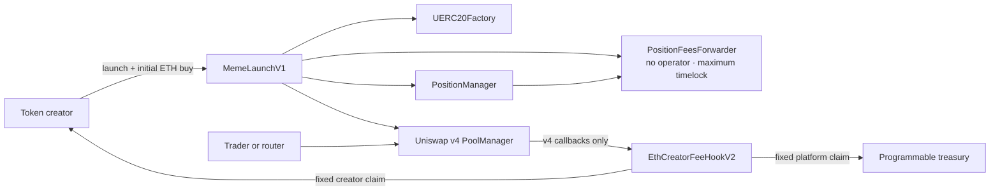

# Classic security properties

This document maps the intended Classic properties to the contracts and tests that exercise them. It is a review aid,
not an audit report.

## Trust boundaries



The launcher, hook and factories are non-upgradeable. None exposes an owner, administrator, pause function or parameter
setter. The external Uniswap and UERC20 contracts are pinned dependencies and remain separate trust assumptions.

## State and authorization

Slither's function and state-write printers were used to review the public write paths. The relevant authorization
rules are:

| Action | Authorized caller | Destination control |
| --- | --- | --- |
| Register a pool | Creator recorded by the launched token | Creator and fee are fixed |
| Enter a hook callback | Uniswap v4 `PoolManager` | Pool shape and registration are checked |
| Trigger a creator claim | Anyone | Payment goes only to the recorded creator |
| Redirect a creator claim | Recorded creator | Creator selects the replacement destination |
| Trigger a platform claim | Anyone | Payment goes only to the immutable treasury |
| Redirect a platform claim | Immutable treasury | Treasury selects the replacement destination |
| Remove or transfer launch liquidity | No configured actor | Position forwarder has no operator and maximum timelock |

## Accounting

For gross native ETH amount `x`, total fee rate `t` and fixed Programmable rate `p`:

```text
totalFee    = floor(x × t / 10,000)
platformFee = floor(x × p / 10,000)
creatorFee  = totalFee - platformFee
```

For exact native output, the hook rounds the gross amount up before applying the split so the requested net amount is
preserved. The implementation uses Uniswap `FullMath` and OpenZeppelin `SafeCast`. Unsupported partial fills revert
instead of leaving fee accounting ambiguous.

## Invariants and evidence

| Property | Primary evidence |
| --- | --- |
| Pool fee configuration never changes | `invariant_poolFeeConfigurationNeverChanges` |
| Public fee disclosure never changes | `invariant_publicFeeDisclosureNeverChanges` |
| Native claims cover internal accounting | `invariant_nativeClaimsAlwaysCoverInternalAccounting` |
| Fees do not remain as loose hook balances | `invariant_feesNeverAccumulateAsLooseHookBalances` |
| Hook callback mask remains exact | `invariant_callbackMaskRemainsExact` |
| Unauthorized claims cannot redirect funds | `test_unregisteredPoolCannotBeClaimedAndPermissionlessClaimCannotRedirect` |
| Creator claim reentrancy is blocked | `test_creatorClaimBlocksReceiveReentrancyWithoutBlockingPayout` |
| Complete supply enters permanent custody | `test_exactSupplyIsAccountedForInOneSidedPermanentlyCustodiedPosition` |

The complete suites are in [`test/`](../../test/). CI runs unit, integration, fuzz, invariant, regression, static-analysis
and coverage checks.

## Ordering and MEV

Token creation, pool initialization, permanent position custody and the creator's initial buy occur in one transaction.
No third party can trade against an uninitialized Classic pool between those steps.

The launch transaction can still be observed, delayed, censored or reordered before inclusion. Once launched, swaps
have the normal ordering and sandwich risks of public AMM trading. Slippage limits, deadlines and transaction routing
belong to the router or calling interface; the hook does not claim to prevent MEV.

Classic uses no oracle. A future model that depends on price observations needs its own oracle and ordering analysis.

## Manual review boundaries

- Token metadata and project links are public and should never contain secrets.
- Contract addresses must be read from the release manifest rather than inferred from the interface.
- A broken RPC, indexer or metadata service can affect visibility without changing onchain contract behavior.
- The absence of upgrade and pause authority removes administrative control and also removes administrative recovery.
