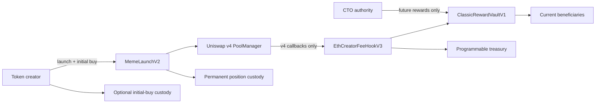

# Classic security properties

This document maps the intended `classic-v3` properties to the contracts and tests that exercise them. It is a review
aid, not an audit report.

## Trust boundaries



The launcher, hook, policy, factories and vault implementations are non-upgradeable. The fee hook and launcher expose
no owner, pause function, fee setter, blacklist or mint path.

`ClassicCtoAuthorityV1` is the one administrative trust boundary. Its current authority can replace a reward vault's
future beneficiary configuration. The vault checkpoints accrued ETH first, so the authority cannot redirect historic
rewards, alter buy or sell fees, change supply, pause trading or remove launch liquidity.

## State and authorization

| Action | Authorized caller | Effect |
| --- | --- | --- |
| Launch | Any wallet that supplies the minimum initial buy | Creates one token, pool, vault and locked position |
| Register a pool | The recorded token creator, the launcher | Stores immutable buy fee, sell fee and reward vault |
| Enter hook callbacks | Uniswap v4 `PoolManager` | Applies the registered directional fee |
| Claim creator rewards | Current or historic beneficiary | Pays only rewards owned by the caller |
| Change one payout wallet | Current wallet for that allocation | Moves only future accrual to the new wallet |
| Replace future reward configuration | Current CTO authority | Checkpoints first, then activates the new split |
| Transfer CTO authority | Current authority proposes; new authority accepts | Two-step authority transfer |
| Claim Programmable rewards | Immutable treasury | Pays the treasury or its selected claim destination |
| Release custodied initial-buy tokens | Immutable launch-wallet beneficiary | Releases only according to the launch schedule |
| Remove or transfer launch liquidity | No configured actor | Position forwarder has no operator and maximum timelock |

## Fee accounting

For gross native ETH amount `x`, directional fee rate `t` and fixed Programmable rate `p`:

```text
totalFee       = floor(x × t / 10,000)
programmable   = floor(x × p / 10,000)
creatorRewards = totalFee - programmable
```

`p` is always `10` basis points. `t` is set independently for buys and sells from `100` to `1000` basis points in
`100`-basis-point steps. The Programmable share is deducted from the selected total and is never added on top.

For exact native output, the hook rounds the gross amount up before applying the split so the requested net amount is
preserved. Unsupported partial fills revert instead of leaving fee accounting ambiguous.

## Reward checkpoints

The reward vault pulls all newly accrued creator fees before a payout-wallet or CTO configuration change:

- ETH received before a beneficiary changes its wallet remains claimable by the previous wallet;
- ETH received after the change follows the new wallet;
- a CTO cannot take historic rewards from the prior configuration;
- active shares are positive, unique and total `100%`; and
- deterministic division remainders go to the final active beneficiary.

## Invariants and evidence

| Property | Primary evidence |
| --- | --- |
| Directional fee economics never change | `invariant_directionalEconomicsNeverChange` |
| Native claims exactly cover accrued accounting | `invariant_nativeClaimsExactlyCoverAccruedAccounting` |
| Reward configuration and dependencies remain bound | `invariant_rewardConfigurationNeverChanges` |
| Claim and payout accounting is conserved | `invariant_claimAndPayoutAccountingIsConserved` |
| Hook callback mask and loose balances remain exact | `invariant_callbackMaskAndLooseBalancesRemainExact` |
| All reward-vault ETH remains claimable or claimed | `invariant_allReceivedEthIsClaimableOrAlreadyClaimed` |
| Active reward shares always total `100%` | `invariant_activeSharesAlwaysTotalOneHundredPercent` |
| CTO and vault dependencies never change | `invariant_ctoAuthorityAndVaultDependenciesNeverChange` |
| Full official-contract lifecycle works on a Mainnet fork | `test_fullLifecycleUsesOfficialMainnetContractsAndBeneficiaryOwnedClaims` |

The complete suites are in [`test/`](../../test/). CI separates deterministic unit, fuzz and invariant tests from the
network-backed Mainnet-fork evidence.

## Ordering and MEV

Token creation, pool initialization, permanent position custody and the creator's initial buy occur in one transaction.
No third party can trade against an uninitialized Classic pool between those steps.

The launch transaction can still be observed, delayed, censored or reordered before inclusion. Once launched, swaps
have the normal ordering and sandwich risks of a public AMM. Slippage limits, deadlines and routing belong to the
router or calling interface; the hook does not claim to prevent MEV.

Classic uses no oracle.

## Manual review boundaries

- A compromised CTO authority can replace future creator-reward recipients after checkpointing.
- The lack of pause and upgrade paths removes administrative recovery as well as upgrade risk.
- A beneficiary contract that rejects native ETH can block only its own claim transaction.
- Contract addresses must be read from the release manifest rather than inferred from the interface.
- A broken RPC, indexer or metadata service can affect visibility without changing onchain behavior.
- Permanent lock properties depend on the pinned forwarder and PositionManager semantics.
