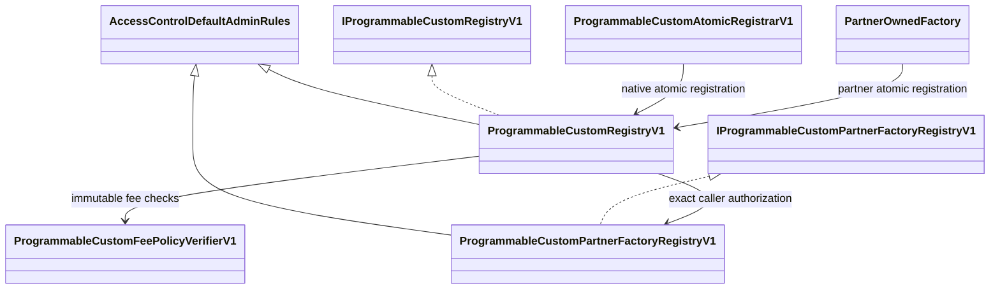
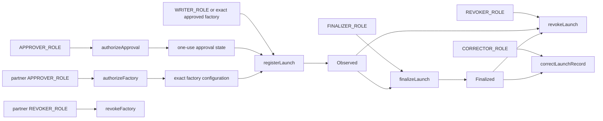

# Programmable Custom Registry V1 security workflow

## Inheritance and component graph

## State-changing function summary

## Variables and authorization map

| State | Writer | Required authorization | Security property |
| --- | --- | --- | --- |
| `_approvalStates`, `approvalConsumed` | `authorizeApproval` / `registerLaunch` | independent approver / exact registration caller | one approval is consumed once |
| `deploymentConsumed` | `registerLaunch` | first-party writer or exact approved factory | deployment ID cannot replay |
| `_launchStates`, `_launchDetails`, `_recordHashes` | registration, finality, correction, revocation | function-specific role/caller | append-only lifecycle and terminal revocation |
| `transitionEvidenceConsumed` | every control transition | transition-specific role | evidence cannot replay across transitions |
| `_factoryStates`, `evidenceConsumed` | partner authorization/revocation | partner approver/revoker | exact factory config; terminal revocation |
| Registry role mappings | default admin | delayed two-step single admin | operational keys can be revoked; admin transfer is delayed |

`registerLaunch` intentionally has no single Solidity role modifier. It dispatches on `providerId`: native Custom
requires `WRITER_ROLE`; partner-attributed Custom requires the exact approved factory caller and a current runtime and
configuration match. A global writer cannot register a partner launch.

## Security properties and invariant coverage

The release asserts:

1. approval, deployment ID, approval evidence, and transition evidence are one-use;
2. approval and writer authority cannot be co-located;
3. partner approver and partner revoker authority cannot be co-located;
4. a partner launch caller must equal the exact authorized factory and still have its authorized runtime code hash;
5. configuration hash changes with source commit, chain, factory/runtime, launch runtime set, permissions, or fee;
6. AEON partner fee is exactly 20 = 15 + 5 with no native 10-bps surcharge;
7. native Custom fee is exactly 10 bps to the fixed Programmable recipient;
8. no-market records cannot smuggle a recipient, fee leg, market path, or activation;
9. registration checks the live primary-contract runtime;
10. failed atomic registration rolls the deployment back;
11. finality requires native historical block hashes and minimum depth;
12. record revision is contiguous and revocation is terminal; and
13. counts are monotonic and equal successful transitions.

The focused suite includes negative tests for wrong caller/factory/runtime/configuration/permissions/source commit,
wrong provider fee policy, wrong split/recipient/basis/claim rights, extra 10 bps, replay, expiration, cross-chain and
cross-generation substitution, failed initialization, reentrancy, shallow finality, reused evidence, skipped
correction, and post-revocation mutation. Invariant handlers exercise one-use bindings, monotonic counts, and terminal
revocation.

## Static analysis result

Slither was run separately against the final main Registry and partner-factory registry with dependencies excluded.
It reported no High, Medium, Low, or Optimization findings for either target. The main Registry had five
Informational findings: one constructor cyclomatic-complexity notice and four deliberate uppercase immutable/interface
naming notices. The partner registry had four deliberate uppercase immutable/interface naming notices. The
constructor branches are fail-closed deployment configuration checks; the uppercase names match immutable protocol
manifest fields.

## Manual review areas

Static tools do not establish the following and each remains a release gate:

- exact mainnet source-to-runtime reproduction and explorer verification;
- signer and threshold-authority custody;
- AEON factory implementation, hook accounting, claims, permissions, and recipient control;
- proxy and external-dependency closure in the runtime set;
- reproducible build and exact Git object retention;
- indexer reorg handling and receipt/log reconciliation;
- API/manifest canonicalization and per-market fee rendering;
- wallet-chain/account freshness immediately before send;
- simulation equivalence to the exact final calldata/value; and
- full public same-transaction canary across Website, Registry, Explorer, API, and Developer Manifest.
