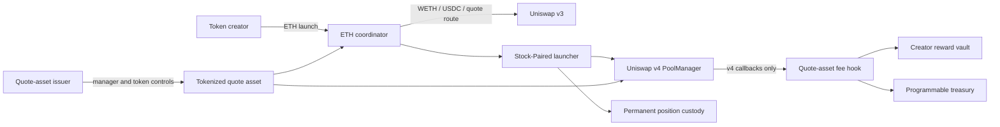

# Stock-Paired security properties

This document maps the intended Stock-Paired candidate properties to its deployed contracts and evidence. It is a
review aid, not an audit report.

## Trust boundaries



The registry, planner, factories, hook, launcher and coordinator are non-upgradeable Programmable contracts. The V2
registry is ownerless and fixes exactly eleven accepted quote-asset addresses at construction.

The tokenized quote assets are external contracts. Their issuer can retain pause, transfer, upgrade, eligibility,
custody or jurisdiction controls outside Programmable. Passing the registry checks does not remove those dependencies.

## State and authorization

| Action | Authorized caller | Effect |
| --- | --- | --- |
| Launch | Any wallet satisfying the launch parameters | Creates one token, reward vault, v4 pool and locked position |
| Register a pool | Its recorded launcher | Binds the pool to its quote asset and reward vault |
| Enter hook callbacks | Uniswap v4 `PoolManager` | Applies the fixed quote-asset fee |
| Claim creator rewards | An immutable beneficiary | Pays only that beneficiary's quote-asset entitlement |
| Change a payout address | The beneficiary for that allocation | Changes only its own claim destination |
| Claim Programmable rewards | Immutable treasury | Pays the treasury or its selected destination |
| Change quote assets or routes | No configured actor | Requires a new deployment |
| Remove or transfer launch liquidity | No configured actor | Position custody has no operator and a maximum timelock |

Creator reward beneficiaries and shares are fixed at launch. Each beneficiary controls its own payout address. A reward
claim transfers the selected quote asset; an interface conversion to ETH is a separate transaction with a fresh quote,
deadline and minimum output.

## Fee accounting

For gross quote-asset amount `x`:

```text
totalFee       = floor(x × 100 / 10,000)
programmable   = floor(x × 10 / 10,000)
creatorRewards = totalFee - programmable
```

The fixed total is 1.00%. The creator configuration receives 0.90% and Programmable receives 0.10%. The Programmable
share is deducted from the total. It is not added on top.

The launched token has no transfer tax and the v4 pool's LP fee is zero. Unsupported partial fills revert rather than
leaving fee accounting ambiguous.

## Quote-asset admission

Before deployment, the candidate checked each quote asset against:

1. acceptance by the issuer's token manager;
2. pinned token, beacon, implementation and manager runtime hashes;
3. the expected symbol and 18 decimals;
4. the exact Uniswap v3 USDC pool, fee tier and pool runtime;
5. a `0.01 ETH` WETH to USDC to quote asset and back route returning at least 90% of input; and
6. agreement between two Ethereum RPCs at one block.

Before each new launch, the ownerless registry repeats the manager-acceptance, shared-runtime, token-runtime, decimals
and symbol checks. A failed check stops new launches for the affected asset. It cannot freeze an existing pool or
override issuer controls.

The round-trip floor is an admission rule, not a promise of future route depth, price or execution.

## Position and coordinator boundaries

Token creation, pool initialization, reward-vault deployment, complete launch-position custody and the initial buy
execute as one launch flow. The ETH coordinator converts the caller's ETH through immutable v3 route definitions,
approves only the amount passed to the launcher and clears the approval after launch. It retains no user balance after
a successful call.

A launch transaction remains exposed to normal public-mempool ordering, delay and censorship. Every conversion still
needs an unexpired deadline and explicit output floor.

## Current evidence

The deployed candidate passed:

- deterministic registry, launch, fee-accounting and reward-vault tests;
- fuzz and invariant coverage for quote-asset accounting;
- pinned Mainnet-fork deployment and lifecycle tests;
- a two-RPC route audit across all eleven included assets;
- an ETH-first Mainnet canary with buy, sell, creator claim and Programmable claim; and
- permanent launch-position custody checks.

The exact candidate source and test tree is fixed at
[`cdd102b`](https://github.com/0xprogrammable/programmable/tree/cdd102bed3d7556ab276ad381f54cbf6de8b2eab/contracts).
The Mainnet evidence is linked from the [model record](../../models/stock-paired/README.md).

## Manual review boundaries

- The launched token is not a share and does not grant a claim on the quote asset.
- Quote-asset holders depend on the external issuer, custodian, transfer rules and eligible jurisdictions.
- A registry check can block future launches after issuer or runtime drift, but cannot repair an existing pool.
- Pinned v3 routes can become illiquid or economically unusable after deployment.
- A broken router, RPC, indexer or metadata service can affect access and visibility without changing pool state.
- Similar Match verification is not accepted as the final Etherscan source record.
- No independent audit or public security contest has been completed.

Stock-Paired remains a `candidate` until every release gate in
[`models/stock-paired/model.json`](../../models/stock-paired/model.json) is complete.
