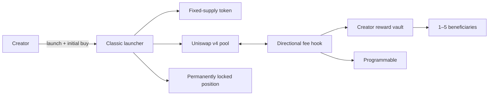

# Classic

**Status:** Available 
**Network:** Ethereum 
**Pair:** Native ETH

Classic launches a fixed-supply token, initializes its Uniswap v4 pool, permanently locks the launch position and
completes the creator's initial buy in one transaction.

[Launch Classic](https://programmable.family) ·
[Model manifest](model.json) ·
[Release record](../../releases/classic-v3/RELEASE.md) ·
[Deployment record](../../deployments/ethereum.json) ·
[Security properties](../../docs/security/CLASSIC_PROPERTIES.md)

## Launch flow

The launcher:

1. creates a one-billion-token UERC20;
2. registers separate immutable buy and sell fees;
3. initializes the native ETH pool;
4. places the complete token supply into a one-sided position;
5. sends the position to a forwarder with no operator and a maximum timelock; and
6. executes the creator's initial buy.

The initial buy must be at least `0.0006 ETH`. There is no separate ETH liquidity deposit.

## Fees

| Setting | Value |
| --- | --- |
| Buy fee | `1%` to `10%`, selected at launch |
| Sell fee | `1%` to `10%`, selected separately at launch |
| Programmable share | `0.10` percentage points |
| Creator share | Selected directional fee minus `0.10` percentage points |
| Token transfer tax | None |
| Uniswap v4 LP fee | Zero |

Fees are collected in native ETH. The Programmable share is deducted from the selected buy or sell fee, never added on
top. Fee rates cannot change after launch.

## Creator rewards

Creator rewards can go to:

- the launch wallet;
- one external wallet; or
- a fixed percentage split across two to five wallets.

Shares must total `100%`. Each active beneficiary alone can claim its rewards. A beneficiary may replace its own payout
wallet without approval from the new wallet. The vault checkpoints first, so ETH earned before the change remains
claimable by the previous wallet and only future rewards move.

### Community Takeover authority

The disclosed CTO authority may replace the complete reward configuration for future rewards. The vault checkpoints
all accrued ETH before the change, so the authority cannot move rewards already earned by prior beneficiaries. The
authority itself can move only through a two-step transfer.

This is a deliberate administrative trust boundary. It exists for approved Community Takeovers and does not control
token supply, fee rates, trading or launch liquidity.

## Initial-buy custody

The launch wallet chooses one immutable custody schedule:

| Mode | Behavior |
| --- | --- |
| Unlocked | Initial-buy tokens go directly to the launch wallet |
| Fixed lock | All tokens release after the selected date |
| Linear vesting | Tokens vest continuously from launch to the final date |
| Cliff plus linear | Vesting starts after the cliff and completes on the final date |

Scheduled custody supports durations from `1` to `3650` days. The launch-wallet beneficiary cannot be replaced.

## Liquidity custody

The launch position is transferred to an official Uniswap `PositionFeesForwarder` created by
`LockedPositionFeeForwarderFactoryV1`.

| Setting | Value |
| --- | --- |
| Operator | Zero address |
| Timelock block | `type(uint256).max` |
| Configured liquidity removal path | None |
| LP fee | Zero |

The forwarder can collect position fees without decreasing liquidity. Classic uses a zero LP fee, so creator earnings
come from the hook rather than from removing or selling launch liquidity.

## Deployed contracts

Technical names identify the verified immutable release.

| Contract | Address |
| --- | --- |
| `MemeLaunchV2` | [`0xC3bd…De770`](https://etherscan.io/address/0xC3bd04aAc2fb2ba58efD7Eb673E544E0B80De770#code) |
| `EthCreatorFeeHookV3` | [`0x35Fe…720CC`](https://etherscan.io/address/0x35Fe236EA82F7cF525c9719d7df8F49F94D720CC#code) |
| `EthCreatorFeeHookFactoryV3` | [`0x61c6…70770`](https://etherscan.io/address/0x61c616E98F9f71bFe813FE4359D012de2Ae70770#code) |
| `ClassicRewardVaultFactoryV1` | [`0xF289…eab2a`](https://etherscan.io/address/0xF28967f9DFaC3Ca21384b59D6D75C8106b3eab2a#code) |
| `ClassicInitialBuyVestingWalletFactoryV1` | [`0xDe21…C66f4`](https://etherscan.io/address/0xDe21b9c0Cc0AfDB9be20e8236113f066BB8C66f4#code) |
| `ClassicLaunchPolicyV1` | [`0x53a4…20d1a`](https://etherscan.io/address/0x53a4d1E6ab184389D3581085AB73CD3549B20d1a#code) |
| `ClassicCtoAuthorityV1` | [`0x9746…18c0C`](https://etherscan.io/address/0x9746469Cd79fdDc5aA7218e7dd51c829ee518c0C#code) |
| `LockedPositionFeeForwarderFactoryV1` | [`0x291a…4dB507`](https://etherscan.io/address/0x291a9ff1059d225d02B1659430804486404dB507#code) |

Transactions, runtime hashes and source-verification records are in
[`deployments/ethereum.json`](../../deployments/ethereum.json). The full deployment and lifecycle record is in
[`releases/classic-v3/mainnet-manifest.json`](../../releases/classic-v3/mainnet-manifest.json).

## Source and tests

| Area | Path |
| --- | --- |
| Launcher | [`src/MemeLaunchV2.sol`](../../src/MemeLaunchV2.sol) |
| Fee hook | [`src/EthCreatorFeeHookV3.sol`](../../src/EthCreatorFeeHookV3.sol) |
| Reward vault | [`src/ClassicRewardVaultV1.sol`](../../src/ClassicRewardVaultV1.sol) |
| Initial-buy custody | [`src/ClassicInitialBuyVestingWalletV1.sol`](../../src/ClassicInitialBuyVestingWalletV1.sol) |
| CTO authority | [`src/ClassicCtoAuthorityV1.sol`](../../src/ClassicCtoAuthorityV1.sol) |
| Tests | [`test/`](../../test/) |

Classic has unit, integration, fuzz, invariant and Mainnet-fork coverage. It has not received an independent
smart-contract audit or public security contest. The full trust model and known limitations are in
[`SECURITY.md`](../../SECURITY.md).
