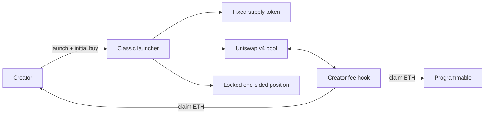

# Classic

**Status:** Available 
**Network:** Ethereum 
**Pair:** Native ETH

Classic launches a fixed-supply token, initializes its Uniswap v4 pool, locks the launch position and completes the
creator's initial buy in one transaction.

[Launch Classic](https://programmable.family) ·
[Model manifest](model.json) ·
[Release record](../../releases/classic-v2/RELEASE.md) ·
[Deployment record](../../deployments/ethereum.json) ·
[Security properties](../../docs/security/CLASSIC_PROPERTIES.md)

## Launch flow

The launcher:

1. creates a one-billion-token UERC20;
2. registers and initializes its native ETH pool;
3. places the complete token supply into a one-sided position;
4. sends the position to a forwarder with no operator and a maximum timelock; and
5. executes the creator's initial buy.

The initial buy must be at least `0.0006 ETH`. There is no separate ETH liquidity deposit.

## Fees

| Fee | Current launch setting |
| --- | --- |
| Total swap fee | `1.00%` |
| Creator share | `0.90%` |
| Programmable share | `0.10%` |
| Token transfer tax | None |
| Uniswap v4 LP fee | Zero |

The fee is collected in native ETH on both buys and sells. Creator and Programmable claims are recorded separately in
`PoolManager`, and each claim has an immutable recipient.

The deployed hook accepts total fee configurations from `1%` to `10%` in one-point increments. Programmable currently
launches Classic at `1%`.

## Liquidity custody

The launch position is transferred to an official Uniswap `PositionFeesForwarder` created by
`LockedPositionFeeForwarderFactoryV1`.

| Setting | Value |
| --- | --- |
| Operator | Zero address |
| Timelock block | `type(uint256).max` |
| Configured liquidity removal path | None |
| LP fee | Zero |

The forwarder can collect position fees without decreasing liquidity. Classic uses a zero LP fee, so creator earnings
come from the hook rather than from removing or selling launch liquidity.

## Deployed contracts

Technical contract names are retained because they identify the verified immutable source.

| Contract | Address |
| --- | --- |
| `MemeLaunchV1` | [`0xD240…E6bAd`](https://etherscan.io/address/0xD240D06f8586eB799f20056054e5b527405E6bAd#code) |
| `EthCreatorFeeHookV2` | [`0x025a…b20CC`](https://etherscan.io/address/0x025a386eAa79f6067d29848FD05ccC71bEAb20CC#code) |
| `EthCreatorFeeHookFactoryV2` | [`0xD405…5fd67`](https://etherscan.io/address/0xD405D8d88D7E4Dae4e1dAdce9A458234D9A5fd67#code) |
| `LockedPositionFeeForwarderFactoryV1` | [`0x291a…4dB507`](https://etherscan.io/address/0x291a9ff1059d225d02B1659430804486404dB507#code) |

Transactions and runtime code hashes are recorded in
[`deployments/ethereum.json`](../../deployments/ethereum.json). Contract parameters are recorded in the
[Classic specification](../../spec/classic-v2.json).

## Source and tests

| Area | Path |
| --- | --- |
| Launcher | [`src/MemeLaunchV1.sol`](../../src/MemeLaunchV1.sol) |
| Fee hook | [`src/EthCreatorFeeHookV2.sol`](../../src/EthCreatorFeeHookV2.sol) |
| Hook factory | [`src/EthCreatorFeeHookFactoryV2.sol`](../../src/EthCreatorFeeHookFactoryV2.sol) |
| Position custody | [`src/LockedPositionFeeForwarderFactoryV1.sol`](../../src/LockedPositionFeeForwarderFactoryV1.sol) |
| Tests | [`test/`](../../test/) |

Classic has unit, integration, fuzz, invariant and regression coverage. It has not received an independent
smart-contract audit or public security contest. The full trust model and known limitations are in
[`SECURITY.md`](../../SECURITY.md), with the property-to-test map in
[`docs/security/CLASSIC_PROPERTIES.md`](../../docs/security/CLASSIC_PROPERTIES.md).
