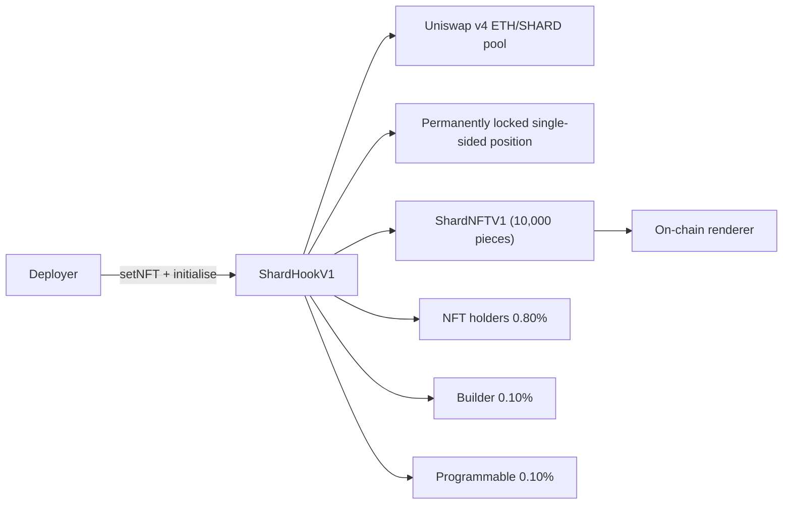

# Shards

**Status:** Design<br>
**Target network:** Ethereum<br>
**Model id:** `shards`

Single-sided bonding-curve market for a fixed 10,000-piece on-chain-art NFT collection; every swap pays a 1.00% native-ETH fee split 0.80% to collection holders, 0.10% to the builder and 0.10% to Programmable.

This document describes a proposed model. It is not available for launch and has no production deployment.

[Fixed parameters](../../spec/shards-v1.json) ·
[Security properties](SECURITY.md) ·
[Test plan](TEST_PLAN.md) ·
[Model manifest](model.json)

**Builder:** [`jesse-stahl`](https://github.com/jesse-stahl)<br>
**Builder beneficiary:** `0xceeBB3A6543CeBEB2ED66963897A0abEA52A50cC`

## Behavior

One launch deploys one collection. Each launch has its own `ShardHookV1`, its own `ShardTokenV1`, its own
`ShardNFTV1` and its own renderer, and those four contracts serve exactly one creator's fixed 10,000-piece
collection. There is no shared instance and nothing is reused between launches.



The lifecycle:

1. **Deploy.** `ShardTokenV1` mints its whole fixed supply — `10_000 * 1e18` SHARD — to its deployer and has no
   mint, burn or owner. `ShardHookV1` is CREATE2-deployed at a mined salt so its address carries its permission
   flags, and takes the pool manager, the SHARD token, the three ticks, the start price, the deployer, the
   launcher fee recipient and the builder fee recipient as constructor arguments. `ShardNFTV1` is then deployed
   against the hook address and the renderer address, with all 10,000 ids sitting in its own archive.
2. **Wire.** The deployer calls `setNFT` once. It is deployer-gated, rejects the zero address and reverts
   `AlreadyInitialised` on a second call. The NFT address cannot be a constructor argument because the two
   addresses would depend on each other through CREATE2.
3. **Initialise.** The deployer calls `initialise` once. It requires the hook to hold exactly `10_000e18` SHARD,
   requires the start tick to sit at or above `tickUpper`, initialises the pool at `startSqrtPriceX96` and seeds
   liquidity. It is one-shot, spends no ETH and tolerates a front-run: if the canonical pool already exists the
   `Pool.PoolAlreadyInitialized` revert is caught and seeding continues, and any other revert is re-thrown.
4. **Lock.** Seeding mints two overlapping single-sided positions owned by the hook: 3,000 SHARD across the full
   range `[tickLower, tickUpper]` and 7,000 SHARD across the concentrated band `[tickBand, tickUpper]`. The
   rounding remainder that never entered a position is recorded as `seedDust`. `poolManager.modifyLiquidity` is
   called only from `_mintPosition` and only with a positive `liquidityDelta`. There is no withdrawal path, no
   operator and no owner; v4 keys positions on `msg.sender`, so no other contract can address them.
5. **Trade.** Buying SHARD pushes the tick down, so the collection gets more expensive as it sells through and
   the pool thins out below `tickBand`. Two mutually exclusive trade paths exist. Third parties swap through any
   router or aggregator and pay the 1.00% in `beforeSwap`/`afterSwap`; they then call `redeem` or `redeemMany` to
   turn 1e18 SHARD into a piece, with no second fee. Buyers of art call `buyNFT`, `buyMany` or `buyMax` on the
   hook, which swap through `poolManager.unlock` — v4 skips a hook's own callbacks, so those paths charge the
   1.00% explicitly in their own bodies. Sellers call `sellNFT` or `sellMany`. Batches are capped at
   `MAX_BATCH = 50`, and a third-party swap is capped at the same 50 SHARD of movement (`SwapTooLarge`).
6. **Regenerate.** `acquire` writes a fresh seed for the id it hands out, which is the art. `release` sets the
   seed to zero and the piece is gone. `_update` deliberately does not touch the seed, so a wallet-to-wallet
   transfer never rerolls the art. There is no NFT-to-SHARD reverse path, which is what makes a free reroll
   impossible.
7. **Accrue.** Every fee is native ETH. Third-party fees are minted as ERC-6909 claims against the pool manager
   and redeemed to real ETH by `_sweepClaims` before any payout. Holder fees run through a scaled accumulator;
   an acquired piece joins the earning set from the block after acquisition, and fees accrued while nothing is
   circulating are escrowed and released to the first holder.
8. **Claim.** Holders call `claim(tokenIds)` and are paid their settled balance. The builder calls
   `claimBuilderFees`. Programmable calls `claimLauncherFees`. All three are beneficiary-only, and all fees sit
   in the hook until claimed.

Anyone may pay outside revenue into the holder pool with `donate()`, or by sending ETH to a `ShardFeeForwarderV1`
and letting anyone flush it. Donations are not split — they go to holders in full.

## Pool and hook

| Setting | Value |
| --- | --- |
| Currency0 | Native ETH (`address(0)`) |
| Currency1 | SHARD (`ShardTokenV1`, 18 decimals, fixed `10_000e18` supply) |
| Uniswap v4 LP fee | `0` — the hook takes the fee, not the LP |
| Tick spacing | `60` |
| Pools per deployment | One, pinned in `poolKey` at construction and re-checked on every callback |
| Liquidity | 3,000 SHARD full range plus 7,000 SHARD concentrated band, both single-sided, both permanent |
| Direction | Buying SHARD moves the tick down |

### Hook permissions

Read directly from `getHookPermissions()` in [`src/ShardHookV1.sol`](../../src/ShardHookV1.sol):

| Permission | Enabled |
| --- | --- |
| `beforeInitialize` | Yes |
| `afterInitialize` | No |
| `beforeAddLiquidity` | No |
| `afterAddLiquidity` | No |
| `beforeRemoveLiquidity` | No |
| `afterRemoveLiquidity` | No |
| `beforeSwap` | Yes |
| `afterSwap` | Yes |
| `beforeDonate` | No |
| `afterDonate` | No |
| `beforeSwapReturnDelta` | Yes |
| `afterSwapReturnDelta` | Yes |
| `afterAddLiquidityReturnDelta` | No |
| `afterRemoveLiquidityReturnDelta` | No |

Both return-delta flags are required because the fee is always taken on the ETH leg, and ETH is the specified
currency exactly when `zeroForOne == exactIn`:

| `zeroForOne` | Kind | ETH is | Charged in | Return delta |
| --- | --- | --- | --- | --- |
| `true` | exactIn | specified | `beforeSwap` | positive specified delta |
| `true` | exactOut | unspecified | `afterSwap` | positive unspecified delta |
| `false` | exactIn | unspecified | `afterSwap` | positive unspecified delta |
| `false` | exactOut | specified | `beforeSwap` | positive specified delta |

A positive delta means the hook is owed, which exactly cancels the ERC-6909 claim minted for the fee.

`beforeInitialize` rejects any pool whose currency0 is not native ETH, whose currency1 is not this launch's SHARD,
whose fee is not `0`, whose tick spacing is not `60`, or whose start price is not the exact `startSqrtPriceX96`
(`WrongStartPrice`). `beforeSwap` and `afterSwap` both refuse to run before `initialise` (`NotInitialised`) and
refuse any pool id other than the canonical one (`WrongPool`).

### Parameters

Immutable from construction: `deployer`, `shard`, `tickLower`, `tickBand`, `tickUpper`, `startSqrtPriceX96`,
`launcherFeeRecipient`, `poolKey`, and the constants `FEE_BPS = 100`, `HOLDER_SHARE_BPS = 8000`,
`BUILDER_SHARE_BPS = 1000`, `LAUNCHER_SHARE_BPS = 1000`, `MAX_BATCH = 50`, `SEED_AMOUNT = 10_000e18`.
`ShardNFTV1` holds `hook` and `renderer` as immutables.

Write-once: `nft` (via `setNFT`), `initialised`, `seedDust`, `seedLiquidity`, `seedLiquidityBand`.

The only mutable configuration in the model is `builderFeeRecipient`. Only the current holder of the role may
call `setBuilderFeeRecipient`, the zero address is rejected, and accrued-but-unclaimed builder fees follow the
role to the successor. There is no owner, no admin, no pause, no upgrade path and no proxy.

### External calls and dependencies

The hook calls Uniswap v4's `PoolManager` (`initialize`, `unlock`, `modifyLiquidity`, `swap`, `settle`, `take`,
`mint`, `burn`, `balanceOf`), its own launch's SHARD token and its own launch's NFT contract. It also makes one
gas-capped `staticcall` to `0x…0064` for `arbBlockNumber()`, used only as extra entropy for the art seed; off an
Arbitrum-stack chain the call returns nothing and the value is zero. It sends raw ETH for buyer refunds, seller
payouts and claims. There is no oracle, no price feed, no keeper, no relayer and no offchain service.

Dependencies are pinned in [`foundry.toml`](../../foundry.toml): solc `0.8.26`, `cancun`, optimizer on at
1,000 runs, with Uniswap v4 core and periphery, OpenZeppelin contracts, OpenZeppelin uniswap-hooks and Solady
under `lib/`. Exact revisions are recorded in [`spec/shards-v1.json`](../../spec/shards-v1.json).

### Addresses that can move funds or change behavior

| Address | Power | Bound |
| --- | --- | --- |
| `deployer` | `setNFT`, `initialise` | One-shot each; moves no funds; both are dead after the launch transaction |
| `builderFeeRecipient` | `claimBuilderFees`, `setBuilderFeeRecipient` | Only the accrued builder balance; cannot touch holder, launcher or pool funds |
| `launcherFeeRecipient` | `claimLauncherFees` | Immutable address; only the accrued launcher balance |
| Any NFT holder | `claim(tokenIds)` | Paid to `nft.ownerOf(id)`, never to the caller |
| Any account | `donate()`, `redeem`, `buyNFT`, `buyMany`, `buyMax`, `sellNFT`, `sellMany`, third-party swaps | Ordinary market access; `donate` can only give ETH away |
| `PoolManager` | `unlockCallback`, hook callbacks | Caller identity checked on every entry |

Nobody can remove liquidity, change the fee rate, change the split, mint or burn SHARD, mint an NFT outside the
market path, or redirect holder fees.

## Economics

| Setting | Value |
| --- | --- |
| Total swap fee | `1.00%` of the ETH leg, inclusive |
| Holder share | `0.80%` of swap volume (`10_000 - 1_000 - 1_000` bps of the fee) |
| Builder share | `0.10%` of swap volume (`1_000` bps of the fee) |
| Programmable share | `0.10%` of swap volume (`1_000` bps of the fee) |
| Fee currency | Native ETH |
| LP fee | Zero |
| Token transfer tax | None |

The fee is charged once, on the ETH leg, on every third-party swap and on every hook-market trade — `buyNFT`,
`buyMany`, `buyMax`, `sellNFT` and `sellMany`. The two paths are mutually exclusive by construction, because v4
skips a hook's callbacks when the hook is itself the swapper, so nothing is charged twice and nothing is free.
`redeem` and `redeemMany` charge nothing: those shards already paid on the way out of the pool.

### Inclusive basis

The fee is always 1.00% of the total ETH the trade moves, never 1.00% added on top:

- **Exact input.** The known amount is already the total, so `fee = gross * 100 / 10000`.
- **Exact output.** The known amount is the net the user receives or the pool must find, so the total is
  `net + fee` and `fee = net * 100 / 9900`, which solves `fee = 1% * (net + fee)`. Charging `net * 100 / 10000`
  there would be 0.990% and quietly cheaper than the exact-input path.

`buyNFT`, `buyMany` and `buyMax` use the exact-output basis on what the curve actually consumed; `sellNFT` and
`sellMany` use the exact-input basis on what the pool released. `buyMax` sizes its swap against a worst-case
exact-input fee first and clamps the final fee to it, so a partially consumed exact-input buy is never billed on
the refunded remainder.

### The split

Every fee event runs through `_distributeFee`:

```solidity
builderCut  = fee * 1000 / 10000;
launcherCut = fee * 1000 / 10000;
builderFeesAccrued  += builderCut;
launcherFeesAccrued += launcherCut;
_distribute(fee - builderCut - launcherCut);   // holders
```

Both cuts round down, so the rounding remainder always lands with holders and
`builderCut + launcherCut + holderAmount == fee` holds exactly.

**Worked example — a 1 ether fee event.** A trade whose ETH leg is 100 ether pays a 1 ether fee.

| Recipient | Amount | Share of the fee | Share of the 100 ether traded |
| --- | ---: | ---: | ---: |
| Holders | `0.8 ether` | 80% | 0.80% |
| Builder | `0.1 ether` | 10% | 0.10% |
| Programmable | `0.1 ether` | 10% | 0.10% |

**Worked example — a 999 wei fee event.** Rounding dust goes to holders.

| Recipient | Amount |
| --- | ---: |
| Builder | `99 wei` (`999 * 1000 / 10000 = 99.9`, floored) |
| Programmable | `99 wei` |
| Holders | `801 wei` (`999 - 99 - 99`) |

**Donations are not split.** `donate()` calls `_distribute` directly, so all of it goes to holders. A gift to a
collection is not swap volume.

### Holder accounting and custody

Holder fees accrue into a scaled accumulator (`accFeePerNFT`, precision `1e18`), with the sub-wei remainder
carried in `dustScaled` so no wei is stranded. A piece joins the earning set from the block after it is acquired,
so a buyer cannot earn from the fee their own purchase paid. A seller is settled out of the earning set before
their exit fee is distributed, for the same reason. Fees that accrue while nothing is circulating go to
`escrowBalance` and are released to the pool the moment a piece is circulating again.

All fees — holder, builder and launcher — sit in the hook until claimed. Third-party fees arrive as ERC-6909
claims and are converted to real ETH by `_sweepClaims`, which every claim path runs first. The launch position
itself is never custody: nothing can withdraw it, so the only ETH that ever leaves the hook is a buyer refund, a
seller payout or a claim.

## Release gates

This model is not available for launch. Before it can move past `design`:

- **Factory contract.** v1 has no factory. Every launch is a manual CREATE2 deployment plus a two-call wiring
  step, which is not a shippable creator path. A factory must deploy and wire the token, hook, NFT and renderer
  atomically, closing the window between deployment and `initialise`.
- **Ethereum mainnet fork lifecycle test.** The complete lifecycle — deploy, wire, initialise, third-party swap,
  hook-market buy and sell, batch paths, accrual and all three claim paths — must run against the pinned Uniswap
  v4 deployment on a Mainnet fork, in the style of
  [`test/ClassicV3MainnetFork.t.sol`](../../test/ClassicV3MainnetFork.t.sol).
- **Independent review.** No independent smart-contract audit or public security contest has been performed.
- **Deployment and source-verification evidence.** A published Ethereum deployment record with transaction
  hashes, runtime code hashes and explorer source verification for every contract, plus a release manifest.

See [`SECURITY.md`](SECURITY.md) and [`TEST_PLAN.md`](TEST_PLAN.md).

## Source

| Area | Path |
| --- | --- |
| Hook | [`src/ShardHookV1.sol`](../../src/ShardHookV1.sol) |
| Fee distributor | [`src/ShardFeeDistributorV1.sol`](../../src/ShardFeeDistributorV1.sol) |
| NFT | [`src/ShardNFTV1.sol`](../../src/ShardNFTV1.sol) |
| Token | [`src/ShardTokenV1.sol`](../../src/ShardTokenV1.sol) |
| Constants | [`src/ShardConstantsV1.sol`](../../src/ShardConstantsV1.sol) |
| Errors | [`src/ShardErrorsV1.sol`](../../src/ShardErrorsV1.sol) |
| Renderer | [`src/GeometricRendererV1.sol`](../../src/GeometricRendererV1.sol) |
| Router | [`src/ShardSwapRouterV1.sol`](../../src/ShardSwapRouterV1.sol) |
| Donation forwarder | [`src/ShardFeeForwarderV1.sol`](../../src/ShardFeeForwarderV1.sol) |
| Tests | [`test/`](../../test/) |
