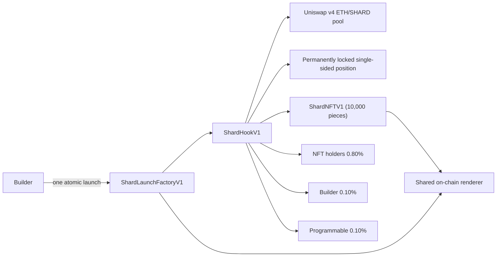

# Shards

**Status:** Design 
**Target network:** Ethereum 
**Model id:** `shards`

Single-sided bonding-curve market for a fixed 10,000-piece on-chain-art NFT collection; every swap pays a 1.00% native-ETH fee split 0.80% to collection holders, 0.10% to the builder and 0.10% to Programmable.

This document describes a proposed model. It is not available for launch and has no production deployment.

[Fixed parameters](../../spec/shards-v1.json) ·
[Security properties](SECURITY.md) ·
[Numbered source properties](../../docs/security/SHARDS_PROPERTIES.md) ·
[Test plan](TEST_PLAN.md) ·
[Candidate deployment plan](../../releases/shards-v1/mainnet-manifest.json) ·
[Model manifest](model.json)

**Builder:** [`jesse-stahl`](https://github.com/jesse-stahl) 
**Builder beneficiary:** `0xceeBB3A6543CeBEB2ED66963897A0abEA52A50cC`

## Behavior

One factory can launch multiple independent collections. Each launch has its own `ShardHookV1`, `ShardTokenV1`
and `ShardNFTV1`; every collection from that factory uses the factory's one immutable shared renderer.

The lifecycle:

1. **Predict.** The raw salt, hook salt, curve parameters, start price, and builder recipient commit to SHARD.
   The exact supplied hook creation bytes plus constructor arguments predict the hook, whose low 14 bits must
   equal the five required permission flags. The hook and shared renderer then predict the NFT.
2. **Launch atomically.** `ShardLaunchFactoryV1` validates the pinned hook-code hash, CREATE2-deploys SHARD and
   the hook, deploys the NFT against its shared renderer, checks `nft.hook() == hook`, binds the NFT, checked-
   transfers all `10_000e18` SHARD and calls `initialise` in one transaction. Any failure rolls everything back.
3. **Initialise.** Factory-driven `initialise` requires the hook to hold exactly `10_000e18` SHARD,
   requires the start tick to sit at or above `tickUpper`, initialises the pool at `startSqrtPriceX96` and seeds
   liquidity. It is one-shot, spends no ETH and tolerates a front-run: if the canonical pool already exists the
   `Pool.PoolAlreadyInitialized` revert is caught and seeding continues, and any other revert is re-thrown.
4. **Lock.** Seeding mints two overlapping single-sided positions owned by the hook: 3,000 SHARD across the full
   range `[tickLower, tickUpper]` and 7,000 SHARD across the concentrated band `[tickBand, tickUpper]`. The
   rounding remainder that never entered a position is recorded as `seedDust`. `poolManager.modifyLiquidity` is
   called only from `_mintPosition` and only with a positive `liquidityDelta`. There is no withdrawal path, no
   operator and no owner; v4 keys positions on `msg.sender`, so no other contract can address them.
5. **Trade.** Buying SHARD pushes the tick down, so the collection gets more expensive as it sells through and
   the pool thins out below `tickBand`. Two mutually exclusive trade paths exist. Third parties swap through any
   router or aggregator and pay the 1.00% in `beforeSwap`/`afterSwap`; they then call `redeem` or `redeemMany` to
   turn 1e18 SHARD into a piece, with no second fee. Buyers of art call `buyNFT`, `buyMany` or `buyMax` on the
   hook, which swap through `poolManager.unlock` — v4 skips a hook's own callbacks, so those paths charge the
   1.00% explicitly in their own bodies. Sellers call `sellNFT` or `sellMany`. Batches are capped at
   `MAX_BATCH = 50`, and a third-party swap is capped at the same 50 SHARD of movement (`SwapTooLarge`).
6. **Regenerate.** `acquire` writes a fresh seed for the id it hands out, which is the art. `release` sets the
   seed to zero and the piece is gone. `_update` deliberately does not touch the seed, so a wallet-to-wallet
   transfer never rerolls the art. There is no NFT-to-SHARD reverse path, which is what makes a free reroll
   impossible. V1 does not accept user-supplied artwork or renderer code: every collection launched by a factory
   uses that factory's immutable `GeometricRendererV1`.
7. **Accrue.** Every fee is native ETH. Third-party fees are minted as ERC-6909 claims against the pool manager
   and redeemed to real ETH by `_sweepClaims` before any payout. Holder fees run through a scaled accumulator;
   an acquired piece joins the earning set from the block after acquisition, and fees accrued while nothing is
   circulating are escrowed and released to the first holder.
8. **Claim.** Holders call `claim(tokenIds)` and are paid their settled balance. The builder calls
   `claimBuilderFees`. Programmable calls `claimLauncherFees`. All three are beneficiary-only, and all fees sit
   in the hook until claimed.

The effective token salt commits to the raw token salt, hook salt, all curve parameters, start price, and builder
recipient. The hook CREATE2 prediction hashes the actual hook creation bytes plus exact constructor arguments;
the factory does not infer initcode from a code hash alone. The NFT is also CREATE2-predicted from the hook and
immutable shared renderer, so unrelated factory launches cannot change its address.
Each launch stores and emits a configuration hash binding chain, factory, PoolManager, shared renderer,
beneficiaries, deployed addresses, curve parameters, both token salts, hook salt, and hook creation-code hash.
Because these inputs are public, an observer can sponsor the exact same configuration first. Changing any launch
parameter or hook salt changes the token prediction and cannot consume the intended configuration.

Anyone may pay outside revenue into the holder pool with `donate()`, or by sending ETH to a `ShardFeeForwarderV1`
and letting anyone flush it. Donations are not split — they go to holders in full.

## Pool and hook

| Setting | Value |
| --- | --- |
| Currency0 | Native ETH (`address(0)`) |
| Currency1 | SHARD (`ShardTokenV1`, 18 decimals, fixed `10_000e18` supply) |
| Uniswap v4 LP fee | `0` — the hook takes the fee, not the LP |
| Tick spacing | `60` |
| Pools per deployment | One, pinned in `poolKey` at construction and re-checked on every callback |
| Liquidity | 3,000 SHARD full range plus 7,000 SHARD concentrated band, both single-sided, both permanent |
| Direction | Buying SHARD moves the tick down |

### Hook permissions

Read directly from `getHookPermissions()` in [`src/ShardHookV1.sol`](../../src/ShardHookV1.sol):

| Permission | Enabled |
| --- | --- |
| `beforeInitialize` | Yes |
| `afterInitialize` | No |
| `beforeAddLiquidity` | No |
| `afterAddLiquidity` | No |
| `beforeRemoveLiquidity` | No |
| `afterRemoveLiquidity` | No |
| `beforeSwap` | Yes |
| `afterSwap` | Yes |
| `beforeDonate` | No |
| `afterDonate` | No |
| `beforeSwapReturnDelta` | Yes |
| `afterSwapReturnDelta` | Yes |
| `afterAddLiquidityReturnDelta` | No |
| `afterRemoveLiquidityReturnDelta` | No |

Both return-delta flags are required because the fee is always taken on the ETH leg, and ETH is the specified
currency exactly when `zeroForOne == exactIn`:

| `zeroForOne` | Kind | ETH is | Charged in | Return delta |
| --- | --- | --- | --- | --- |
| `true` | exactIn | specified | `beforeSwap` | positive specified delta |
| `true` | exactOut | unspecified | `afterSwap` | positive unspecified delta |
| `false` | exactIn | unspecified | `afterSwap` | positive unspecified delta |
| `false` | exactOut | specified | `beforeSwap` | positive specified delta |

A positive delta means the hook is owed, which exactly cancels the ERC-6909 claim minted for the fee.

`beforeInitialize` rejects any pool whose currency0 is not native ETH, whose currency1 is not this launch's SHARD,
whose fee is not `0`, whose tick spacing is not `60`, or whose start price is not the exact `startSqrtPriceX96`
(`WrongStartPrice`). `beforeSwap` and `afterSwap` both refuse to run before `initialise` (`NotInitialised`) and
refuse any pool id other than the canonical one (`WrongPool`).

### Parameters

Factory immutables are `poolManager`, `launcherFeeRecipient`, the shared `renderer`, and
`hookCreationCodeHash`. Hook immutables are `deployer` (the factory), `shard`, `tickLower`, `tickBand`,
`tickUpper`, `startSqrtPriceX96`,
`launcherFeeRecipient`, and the constants `FEE_BPS = 100`, `HOLDER_SHARE_BPS = 8000`,
`BUILDER_SHARE_BPS = 1000`, `LAUNCHER_SHARE_BPS = 1000`, `MAX_BATCH = 50`, `SEED_AMOUNT = 10_000e18`.
`ShardNFTV1` holds `hook` and `renderer` as immutables. `poolKey` is a storage struct (structs cannot be
Solidity `immutable`) assigned in the constructor and never written afterwards; no function mutates it.

Write-once: `nft` (via `setNFT`), `initialised`, `seedDust`, `seedLiquidity`, `seedLiquidityBand`.

The only mutable configuration in the model is `builderFeeRecipient`. Only the current holder of the role may
call `setBuilderFeeRecipient`, the zero address is rejected, and accrued-but-unclaimed builder fees follow the
role to the successor. There is no owner, no admin, no pause, no upgrade path and no proxy.

### External calls and dependencies

The hook calls Uniswap v4's `PoolManager` (`initialize`, `unlock`, `modifyLiquidity`, `swap`, `settle`, `take`,
`mint`, `burn`, `balanceOf`), its own launch's SHARD token and its own launch's NFT contract. Art seeds use the
previous Ethereum block hash, block timestamp, recipient, and an acquisition nonce. These public and
miner-influenceable inputs are non-secure randomness. The hook sends raw ETH for buyer refunds, seller
payouts and claims. There is no oracle, no price feed, no keeper, no relayer and no offchain service.

Dependencies are pinned in [`foundry.toml`](../../foundry.toml): solc `0.8.26`, `cancun`, optimizer on at
1,000 runs, with Uniswap v4 core and periphery, OpenZeppelin contracts, OpenZeppelin uniswap-hooks and Solady
under `lib/`. Exact revisions are recorded in [`spec/shards-v1.json`](../../spec/shards-v1.json).

### Addresses that can move funds or change behavior

| Address | Power | Bound |
| --- | --- | --- |
| factory as `deployer` | `setNFT`, `initialise` | One-shot each; both are consumed inside the atomic launch transaction |
| `builderFeeRecipient` | `claimBuilderFees`, `setBuilderFeeRecipient` | Only the accrued builder balance; cannot touch holder, launcher or pool funds |
| `launcherFeeRecipient` | `claimLauncherFees` | Immutable address; only the accrued launcher balance |
| Any NFT holder | `claim(tokenIds)` | Settlement credits each token's current owner; the ETH transfer pays only the caller's own accrued balance |
| Any account | `donate()`, `redeem`, `buyNFT`, `buyMany`, `buyMax`, `sellNFT`, `sellMany`, third-party swaps | Ordinary market access; `donate` can only give ETH away |
| `PoolManager` | `unlockCallback`, hook callbacks | Caller identity checked on every entry |

Nobody can remove liquidity, change the fee rate, change the split, mint or burn SHARD, mint an NFT outside the
market path, or redirect holder fees.

## Economics

| Setting | Value |
| --- | --- |
| Total swap fee | `1.00%` of the ETH leg, inclusive |
| Holder share | `0.80%` of swap volume (`10_000 - 1_000 - 1_000` bps of the fee) |
| Builder share | `0.10%` of swap volume (`1_000` bps of the fee) |
| Programmable share | `0.10%` of swap volume (`1_000` bps of the fee) |
| Fee currency | Native ETH |
| LP fee | Zero |
| Token transfer tax | None |

A disclosure for the acceptance record: `BUILDER_PROGRAM.md` allocates the 0.80% share to the *token creator*.
Shards has no separate creator payout — the collection holders collectively receive that share, and the creator
participates by holding pieces of their own collection. If Programmable requires a distinct creator allocation,
that is a contract change and a new model version.

The fee is charged once, on the ETH leg, on every third-party swap and on every hook-market trade — `buyNFT`,
`buyMany`, `buyMax`, `sellNFT` and `sellMany`. The two paths are mutually exclusive by construction, because v4
skips a hook's callbacks when the hook is itself the swapper, so nothing is charged twice and nothing is free.
`redeem` and `redeemMany` charge nothing: those shards already paid on the way out of the pool.

### Inclusive basis

The fee is always 1.00% of the total ETH the trade moves, never 1.00% added on top:

- **Exact input.** The known amount is already the total, so `fee = gross * 100 / 10000`.
- **Exact output.** The known amount is the net the user receives or the pool must find, so the total is
  `net + fee` and `fee = net * 100 / 9900`, which solves `fee = 1% * (net + fee)`. Charging `net * 100 / 10000`
  there would be 0.990% and quietly cheaper than the exact-input path.

`buyNFT`, `buyMany` and `buyMax` use the exact-output basis on what the curve actually consumed; `sellNFT` and
`sellMany` use the exact-input basis on what the pool released. `buyMax` sizes its swap against a worst-case
exact-input fee first and clamps the final fee to it, so a partially consumed exact-input buy is never billed on
the refunded remainder.

### The split

Every fee event runs through `_distributeFee` in `ShardFeeDistributorV1`. The combined builder + launcher
operator cut (20% of the fee) is taken with a carried remainder rather than flooring each 0.10% cut
independently:

- The operator entitlement is computed against the cumulative fee stream and carried in `operatorFeeRemainder`,
  so it is split-invariant: a run of tiny swaps accrues the same operator total as one aggregated swap. The old
  independent flooring let a stream of sub-threshold swaps evade the cut (ten 900-wei swaps paid 0; one 9,000-wei
  swap paid 9). It no longer does.
- The operator cut is then split evenly between the two payees, with the odd wei carried to the launcher
  (`operatorSplitParity`). Over any stream both cuts stay within one wei of the ideal cumulative 10%, and the
  launcher (Programmable) is never shorted below the builder in absolute accrual.
- `builderCut + launcherCut + holderAmount == fee` holds on every call. Whatever the operator cut does not take
  goes to holders.

The launcher recipient is the immutable constant `0x4957f49620AFf3Adbbe8195a4f633E49cc93376c` — the same address
Classic v3 uses — baked into `ShardLaunchFactoryV1`. It is not a constructor argument, so the factory cannot
route the Programmable share anywhere else. The builder recipient stays per-launch
(`LaunchParams.builderFeeRecipient`).

**Worked example — a 1 ether fee event.** A trade whose ETH leg is 100 ether pays a 1 ether fee.

| Recipient | Amount | Share of the fee | Share of the 100 ether traded |
| --- | ---: | ---: | ---: |
| Holders | `0.8 ether` | 80% | 0.80% |
| Builder | `0.1 ether` | 10% | 0.10% |
| Programmable | `0.1 ether` | 10% | 0.10% |

**Worked example — a stream of tiny fees.** Ten 900-wei fee events, previously worth 0 to the operators under
independent flooring, now accrue their cumulative 20% cut: `10 * 900 = 9000 wei` of fees yields `1800 wei` to the
operators, split `900 wei` builder and `900 wei` launcher, with the odd wei on an odd total carried to the
launcher. The remaining `7200 wei` goes to holders. The operator total matches a single 9,000-wei fee event.

**Donations are not split.** `donate()` calls `_distribute` directly, so all of it goes to holders. A gift to a
collection is not swap volume.

### Holder accounting and custody

Holder fees accrue into a scaled accumulator (`accFeePerNFT`, precision `1e18`), with the sub-wei remainder
carried in `dustScaled` so no wei is stranded. A piece joins the earning set from the block after it is acquired,
so a buyer cannot earn from the fee their own purchase paid. A seller is settled out of the earning set before
their exit fee is distributed, for the same reason. Fees that accrue while nothing is circulating go to
`escrowBalance` and are released to the pool the moment a piece is circulating again.

All fees — holder, builder and launcher — sit in the hook until claimed. Third-party fees arrive as ERC-6909
claims and are converted to real ETH by `_sweepClaims`, which every claim path runs first. The launch position
itself is never custody: nothing can withdraw it, so the only ETH that ever leaves the hook is a buyer refund, a
seller payout or a claim.

## Release gates

This model is not available for launch. The complete lifecycle — atomic factory launch, third-party swap,
redeem, hook-market buy and sell, holder accrual and all three claim paths — now runs against the pinned canonical
Uniswap v4 `PoolManager` on an Ethereum Mainnet fork in
[`test/ShardV1MainnetFork.t.sol`](../../test/ShardV1MainnetFork.t.sol), confirming the design composes with the
real v4 contract it would market-make on. Before it can move past `design`:

- **Exact-source re-review.** Maintainers must re-review the final source after the factory and checked-transfer changes.
- **Independent review.** Record independent security-review status for the exact source.
- **Deployment and source verification.** Complete a user-authorized Ethereum deployment, exact source
  verification, runtime/lifecycle evidence, and production-interface configuration for that release.

See [`SECURITY.md`](SECURITY.md) and [`TEST_PLAN.md`](TEST_PLAN.md).

## Source

| Area | Path |
| --- | --- |
| Hook | [`src/ShardHookV1.sol`](../../src/ShardHookV1.sol) |
| Launch factory | [`src/ShardLaunchFactoryV1.sol`](../../src/ShardLaunchFactoryV1.sol) |
| Fee distributor | [`src/ShardFeeDistributorV1.sol`](../../src/ShardFeeDistributorV1.sol) |
| NFT | [`src/ShardNFTV1.sol`](../../src/ShardNFTV1.sol) |
| Token | [`src/ShardTokenV1.sol`](../../src/ShardTokenV1.sol) |
| Constants | [`src/ShardConstantsV1.sol`](../../src/ShardConstantsV1.sol) |
| Errors | [`src/ShardErrorsV1.sol`](../../src/ShardErrorsV1.sol) |
| Renderer | [`src/GeometricRendererV1.sol`](../../src/GeometricRendererV1.sol) |
| Optional router helper | [`src/ShardSwapRouterV1.sol`](../../src/ShardSwapRouterV1.sol) |
| Optional donation-forwarder helper | [`src/ShardFeeForwarderV1.sol`](../../src/ShardFeeForwarderV1.sol) |
| Tests | [`test/`](../../test/) |
| Launch runbook | [`docs/SHARDS_LAUNCH_RUNBOOK.md`](../../docs/SHARDS_LAUNCH_RUNBOOK.md) |
