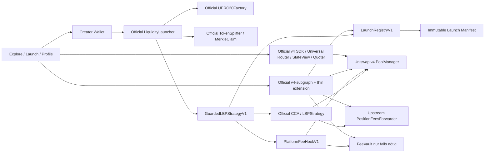

# Ethereum v4 Launchpad

> Archived research from 25 July 2026. Use `uniswap-official-stack-analysis-2026-07-26.md` for the current product decision, official deployment inventory and release state. This document contains broader concepts and an outdated deployment status.
>
> Fee update from 26 July 2026: the active Meme Launch product treats the selected 1–10% token fee as the complete hook fee. Launcher receives 0.10 percentage points from that total and the creator receives the remainder. The 0.10% share is not added on top.

## Research, Produktarchitektur und Mainnet-Masterplan

**Stand:** 25. Juli 2026
**Netzwerk:** Ethereum Mainnet, Chain ID 1
**Status:** Research- und Planungsbasis; kein Contract wurde deployed und kein Produkt veröffentlicht.

---

## 1. Entscheidung in einem Satz

Das Produkt sollte **nicht** als „erstes Uniswap-v4-Launchpad“ gebaut oder vermarktet werden. Es sollte das **No-Code-Studio für programmierbare Märkte** werden: Ein Mensch beschreibt, was sein Markt tun soll; die Plattform übersetzt das in einen Token, einen v4-Pool, einen passenden Hook und ein beweisbares Regelwerk.

Die sichtbare Positionierung:

> **Pick an asset. Choose how it behaves. Launch.**

Die technische Kategorie dahinter:

> **Verified v4 Launch OS — complexity hidden, every rule provable.**

„V4 Coin“ kann als verständliche Kurzform in Kampagnen funktionieren. Im Produkt selbst ist **Programmable Market** präziser: Nicht der ERC-20 allein, sondern die Kombination aus Asset, Markt und Regeln ist das eigentliche Produkt.

Die technische Zusage:

> Für einen „Verified Standard“-Launch können Creator und Plattform nachträglich weder Supply erhöhen, Transfers zensieren, die veröffentlichte Gebührenobergrenze erhöhen, Contract-Code austauschen noch die ausgewiesene initiale Liquidität entfernen.

Das ist deutlich stärker und ehrlicher als „unruggable“. Markt-, Wallet-, MEV-, Oracle-, externe Protokoll- und unentdeckte Smart-Contract-Risiken bleiben bestehen.

Die technische Grundregel ist ab jetzt verbindlich:

> **Adopt → Adapt → Build.**

Zuerst wird ein kanonischer, versionierter Uniswap- oder OpenZeppelin-Baustein unverändert integriert. Nur wenn dessen Semantik nicht exakt reicht, kommt ein dünner Adapter darum. Eigener Protokollcode entsteht ausschließlich für eine nachgewiesene Lücke. Unser Vorteil soll nicht eine zweite Token-Factory, eine zweite Auktion oder ein zweiter Router sein, sondern die sichere Policy-, Proof- und Produktoberfläche darüber.

---

## 2. Die fünf wichtigsten Korrekturen

### 2.1 Es gibt bereits v4-Launchpads

Die These „es gibt noch gar kein Launchpad für Uniswap v4“ ist am 25. Juli 2026 falsch.

- Uniswap selbst hat einen offiziellen [Liquidity Launchpad](https://developers.uniswap.org/docs/liquidity/liquidity-launchpad/overview), einen live nutzbaren [Launch-Auction-Flow](https://app.uniswap.org/liquidity/launch-auction) und eine [Auction-Explore-Fläche](https://app.uniswap.org/explore/auctions). Das System kann einen ERC-20 erstellen oder importieren, eine Continuous Clearing Auction durchführen und anschließend v4-Liquidität anlegen.
- [Klik Finance](https://klik.finance/docs) ist ein aktives Ethereum-Mainnet-v4-Launchpad mit Token-Deployment, v4-Liquidität und Fee-Claims.
- [Doppler](https://docs.doppler.lol/) bietet v4-basierte dynamische Auktionen, Migration und Fee-Streaming, einschließlich Ethereum-Integration.
- [Flaunch](https://docs.flaunch.gg/) kombiniert v4-Launches, Revenue Sharing, Fair-Launch-Mechanik und laufende Fee-Logik.
- [Clanker](https://github.com/clanker-devco/DOCS) hat einen aktuellen v4-Deployment- und Claim-Stack auf mehreren EVM-Chains.

**Konsequenz:** „v4“ ist kein Moat. Der Moat muss aus sicherer Modulkomposition, onchain Provenance, verständlicher Risikoanzeige, Auditqualität, Distribution und Lifecycle-Operations entstehen.

### 2.2 Ein „v4 Coin“ ist kein eigener Token-Standard

Technisch ist der Token normalerweise ein ERC-20. Das v4-Verhalten hängt an einem konkreten Pool:

```text
Launch = ERC-20
       + Distribution/Auktion
       + PoolKey
       + Hook
       + Liquiditätspositionen
       + Gebühren- und Empfängerlogik
       + Admin-/Governance-Modell
       + unveränderliches Launch-Manifest
```

Ein v4-`PoolKey` besteht aus:

```text
currency0, currency1, fee, tickSpacing, hooks
```

Der Hook gehört zum Pool, nicht zum Token. Derselbe Token kann deshalb gleichzeitig in einem anderen v4-Pool ohne diesen Hook, in v3/v2, OTC oder auf einer zentralen Börse gehandelt werden. Die Plattform kann einen **kanonischen Launch-Pool** zertifizieren, aber nicht jeden zukünftigen Handel des Tokens kontrollieren. Siehe [Uniswap v4 Hooks](https://developers.uniswap.org/docs/protocols/v4/concepts/hooks) und den gepinnten [`PoolKey`-Typ](https://github.com/Uniswap/v4-core/blob/e50237c43811bd9b526eff40f26772152a42daba/src/types/PoolKey.sol#L10-L22).

### 2.3 „Beliebiger Code“ und „immer safe“ schließen sich aus

Ein beliebiger Token kann minten, pausieren, blocklisten, besteuern, rebasen oder Transfers absichtlich brechen. Ein beliebiger Hook kann Swaps umleiten, externe Protokolle aufrufen, Gebühren ändern, Oracles falsch lesen oder durch Upgradeability nachträglich sein Verhalten wechseln.

Deshalb gibt es drei klar getrennte Sicherheitsklassen:

| Klasse | Zulässige Oberfläche | Produktdarstellung |
|---|---|---|
| **Verified Standard** | Fester Supply, Standardtransfers, kein Proxy, unveränderlicher Fee-Hook, statische LP-Fee, geprüfter Position-Recipient, keine Creator-Setter | „Protocol-enforced“ |
| **Verified Modules** | Nur einzeln geprüfte und als Kombination freigegebene Module, z. B. Vesting oder ein definiertes Reward-Modul | Abhängigkeiten und Rest-Risiken einzeln zeigen |
| **Custom / Experimental** | Fremder Token, eigener Hook, Proxy, Custom Accounting, Oracle oder externe Abhängigkeit | Separater Lab-Bereich, kein Safety-Badge, nicht standardmäßig gerankt |

### 2.4 „0,1 % der Fees“ muss eindeutig definiert werden

Die wirtschaftlich sinnvolle Interpretation ist:

> **10 Basispunkte = 0,1 % des tatsächlich ausgeführten Swap-Notionals im kanonischen Launch-Pool.**

Nicht:

> 0,1 % der LP-Gebühr.

Bei einer LP-Fee von 0,30 % wären 0,1 % davon nur 0,0003 % des Volumens, also 3 USD pro 1 Mio. USD Volumen. Zehn Basispunkte auf Volumen ergeben dagegen:

| Kanonisches Swap-Volumen | Brutto-Plattformfee bei 10 bp |
|---:|---:|
| 1 Mio. USD | 1.000 USD |
| 10 Mio. USD | 10.000 USD |
| 100 Mio. USD | 100.000 USD |

Das ist Brutto-Umsatz vor Gas, Betrieb, Security, Legal, Steuern und möglichen Incentives. Trades über einen anderen Pool sind nicht erfasst.

### 2.5 Robinhood Chain bestätigt das Modell — aber nicht „der Pool ist die Aktie“

Der Robinhood-Chain-Check trennt die Bausteine sehr klar:

- Ein offizieller Robinhood Stock Token ist laut [Robinhood-Dokumentation](https://docs.robinhood.com/chain/stock-tokens/) ein von Robinhood Assets (Jersey) Limited ausgegebenes ERC-20-Schuldinstrument mit ökonomischer Aktien- oder ETF-Exposure. Er gibt keine Aktie und keine Rechte gegen den Emittenten des zugrunde liegenden Wertpapiers.
- Direkt minten dürfen nur autorisierte Teilnehmer nach KYB. Entwickler sollen mit den bereits ausgegebenen kanonischen Tokens bauen, nicht selbst einen ERC-20 namens AAPL oder NVDA erzeugen.
- Der Handel kann laut [Building with Stock Tokens](https://docs.robinhood.com/chain/building-with-stock-tokens/) über RFQ, Standard-AMMs wie Uniswap oder einen PropAMM stattfinden.
- Uniswap v4 ist auf Robinhood Chain, Chain ID 4663, mit einem offiziellen [PoolManager-Deployment](https://developers.uniswap.org/docs/protocols/v4/deployments) aktiv.

Ein Live-Onchain-Snapshot vom 25. Juli 2026 zeigt das praktisch:

- Der kanonische QQQ Stock Token `0xD5f3…de68` wurde in einem v4-Pool gegen USDG gehandelt.
- Der aktive Pool `0xd3d49e…0ce2d9` hat eine 1-%-LP-Fee, Tick-Spacing 200 und **keinen Hook**. Im Snapshot waren 315 `Swap`-Events vom 3. bis 25. Juli sowie aktive Liquidität sichtbar. Ein aktueller [`StockZap.sellStockToEth`-Trade](https://robinhoodchain.blockscout.com/tx/0xf335523e4ebb09a35ae5fc37fd30bd8128100cbc3de1e53b66b3dbb03e13ac40) routete über genau diesen hooklosen QQQ/USDG-Pool.
- Daneben ließen sich permissionless QQQ-, BABA- und COIN-Pools mit Custom Hooks initialisieren. Die drei geprüften Hooks waren unverifiziert und die betreffenden Pools hatten im Snapshot keine aktive Liquidität. Eine Pool-Initialisierung beweist weder Sicherheit noch Robinhood-Endorsement.

Die korrekte Produktlogik ist deshalb:

| Schicht | Bedeutung | Beispiel |
|---|---|---|
| **Asset** | Was besitzt der Nutzer wirtschaftlich oder technisch? | neuer ERC-20, kanonischer Stock Token, Gold-Claim, NFT |
| **Market** | Wo und wie wird gehandelt oder verteilt? | CCA, v4-Pool, RFQ, PropAMM |
| **Behavior** | Was macht den Markt programmierbar? | dynamische Fee, Rewards, Gating, Buyback, Oracle-Regel, Lending |
| **Rights** | Welche Rechte und Pflichten existieren außerhalb des Swaps? | Mint, Redemption, Custody, Legal Title, Governance, Claims |

Der Hook programmiert **Behavior** für einen konkreten Pool. Er erschafft weder die Aktie noch das Gold, das Grundstück oder deren rechtliche Deckung. Genau diese Trennung macht die Produktidee stärker: Wir bauen keinen Fake-RWA-Minter, sondern das einfachste Studio, das echte oder neue Assets mit transparenten Marktregeln verbinden kann.

---

## 3. Marktbild und echte Differenzierung

### 3.1 Wettbewerbs-Matrix

| Produkt | Was bereits existiert | Was für uns offen bleibt |
|---|---|---|
| **Uniswap Liquidity Launchpad / CCA** | Offizielle ERC-20-Erstellung oder Import, onchain Preisfindung, Auktion, automatische v4-Liquidität, Web-App | Kein umfassender No-Code-Regelbaukasten mit unserem Proof-/Risk-Manifest und Creator-Lifecycle |
| **Klik Finance** | Aktive Ethereum-Mainnet-Launches, Startliquiditäts-Tiers, dynamische Swap-/Plattformfees, Claims | Breite, geprüfte Konzeptmodule und tiefes Authority-/Provenance-Modell |
| **Doppler** | v4-Auktionen, dynamische Kurven, Migration, Fee-Streaming, SDK/Infra | Consumer-fokussierte, sicherheitsklassifizierte Modulkomposition und verständliches Lifecycle-Produkt |
| **Flaunch** | v4-Memecoins und tokenisierter Content, Fair Launch, Revenue Sharing, Buyback-/Bidwall-Logik | Generische Nicht-Memecoin-Konzepte, Ethereum-L1-Fokus, strikt versionierte Sicherheitsklassen |
| **Clanker** | v4-Token-Deployments, Distribution, Vaults, Recipients und Claims auf EVM-Chains | Ethereum-L1-first, institutionell lesbares Launch-Manifest, erlaubnisarme aber begrenzte Module |
| **Livo** | Ethereum-Mainnet-Bonding-Curve mit v4-Graduation, Fee-Splits, Liquiditäts-Tiers, Anti-Sniper- und Tax-Optionen | Upgradebare Factory/Fee-Router und optionale Admin-/Tax-Flächen lassen Raum für einen strengeren immutable Standard |
| **SA1T** | Ethereum-v4-„Mechanic Launchpad“ mit vordefinierten Mechaniken wie Burn, Dividends, Tontine und Heartbeat | Geringe Nutzung und unklare unabhängige Audit-Tiefe; dennoch direkter Beweis, dass „Coins mit Technik“ nicht neu sind |
| **lo0p.launch** | v4-Coin plus integrierte Lending Engine ab Launch | Größere Hook-/Lending-Angriffsfläche und noch geringe Nutzung |
| **cc0strategy** | Ethereum-v4-Launches mit Fee-Routing an NFT-Holder | Sehr enge Nische, geringe Nutzung und veränderliche Admin-Flächen |
| **Spectrum** | v4-basierte programmatische Index-Token | Vertikales Produkt statt generischem, sicherheitsklassifiziertem Launch OS |
| **RexHook** | Vermarktet Hook-Marketplace, auditierte Module, Registry und Launchpad | Zum Prüfzeitpunkt Early Access ohne belastbare Live-Deployments |
| **Raw hook tooling / registries** | Hook-Code, Templates, Deploy-Tools und Registry-Einträge | Vollständiger Launch, Distribution, Risikoerklärung, Claims, Positionen und laufender Betrieb |

### 3.1.1 Live-/Onchain-Belege aus dem Marktcheck

| Produkt | Ethereum-Beleg am 25. Juli 2026 |
|---|---|
| Uniswap CCA | [genutzter Auction-Contract](https://etherscan.io/address/0x20eEBd78151EAe9Ed2380AC613204aaF5CA0cd24) und offizieller [Launch-Flow](https://app.uniswap.org/liquidity/launch-auction) |
| Klik | verifizierte [Factory `0x254B…66ad`](https://etherscan.io/address/0x254Bf550657040f78608476cE9AaD820aB2266ad), rund 2.312 Transaktionen und laufende Deploy-/Claim-Aufrufe |
| Livo | verifizierte [Factory `0x9A99…3565`](https://etherscan.io/address/0x9A996216c0Cd3B1cDeDC4D2A38E0ca94eBeC3565), rund 390 Transaktionen; [Deployment-Liste](https://github.com/LivoLaunchpad/livo-contracts/blob/main/deployments.ethereum.mainnet.md) |
| Doppler | [Airlock `0xde35…9dfa`](https://etherscan.io/address/0xde3599a2ec440b296373a983c85c365da55d9dfa) und offizielle [Contract-Adressen](https://docs.doppler.lol/reference/contract-addresses) |
| Flaunch | frischer [Ethereum PositionManager](https://etherscan.io/address/0x5Cf8e499C7c466C7E2cf127BDF129F57151E65Dc); beim Check noch keine belastbare öffentliche Ethereum-Launch-Nutzung |
| lo0p.launch | verifizierte [Factory `0x33b2…fc27`](https://etherscan.io/address/0x33b2A471b08944143422B9192e0Dce402C66fc27) mit Deploy-/Claim-Aktivität |
| cc0strategy | verifizierte [Factory `0x1dc6…b610`](https://etherscan.io/address/0x1dc68bc05ecb132059fb45b281dbfa92b6fab610) mit kleiner Aktivität |

Transaktionszahlen sind nur ein zeitpunktbezogenes Aktivitätssignal, kein Qualitäts- oder Sicherheitsnachweis.

### 3.2 Das eigentliche White Space

Der mögliche Produktvorteil ist die Kombination aus:

1. **No-Code-Regeln statt beliebigem Solidity**
2. **Ein maschinenlesbares Launch-Manifest**
3. **Bytecode-, Config- und Audit-Provenance**
4. **Klare Sicherheitsklassen statt eines pauschalen Safety-Claims**
5. **Kompletter Lifecycle:** Auktion, Migration, Pool, Fees, LP-Position, Claims, Governance
6. **Eine radikal einfache Oberfläche trotz technischer Tiefe**

Der strategische Name für die Kategorie ist eher:

> **Verified v4 Launch OS**

und nicht:

> Memecoin Launcher

Selbst „Coins mit eingebauter Technik“ ist durch SA1T, lo0p.launch, cc0strategy und Spectrum bereits belegt. Der verbleibende Anspruch muss deshalb **sicherheitskuratiert + modular + vollständig beweisbar** enthalten.

### 3.3 Moat-Realität

Auch diese Differenzierung kann von Uniswap, Doppler, Flaunch oder Klik kopiert werden. Nachhaltiger Schutz entsteht nur durch:

- die am besten geprüfte Contract-Suite,
- ein wachsendes, kompatibilitätsgeprüftes Modulregister,
- gute Routing- und Indexer-Integrationen,
- den verständlichsten Proof-Layer,
- starke Creator-Distribution,
- transparente Incident-Historie,
- verlässliche Mainnet-Operations.

### 3.4 Das eigentliche Produkt: ein Behavior Studio

Die Oberfläche verkauft keine Solidity-Funktionen. Sie beantwortet nur drei Fragen:

1. **Was willst du launchen?**
2. **Was soll dein Markt tun?**
3. **Wer darf später was ändern?**

Aus den Antworten baut die Plattform intern Asset, Distribution, PoolKey, genau einen Composite Hook, Rechte, Fee-Waterfall und Manifest. Weil ein v4-Pool nur eine Hook-Adresse besitzt, werden mehrere ausgewählte Regeln nicht als mehrere Hooks angehängt. Sie werden als geprüfte, immutable Konfiguration in eine kompatible Hook-Familie kompiliert.

Die Behavior Library wird in Alltagssprache organisiert:

| Nutzerwunsch | Mögliche Module im Hintergrund |
|---|---|
| „Gebühren sollen sich anpassen“ | begrenzte Dynamic Fee, Volatilitäts- oder Zeitfenster |
| „Holder sollen mitverdienen“ | transparenter Revenue Split, NFT-/Token-gated Claim |
| „Ein Teil soll zurück in den Markt“ | Buyback, Burn oder LP-Reinvestment |
| „Nur bestimmte Wallets dürfen handeln“ | Allowlist, Attestation oder Permissioned Pool |
| „Der Markt soll einem echten Preis folgen“ | Oracle Guard, Market-Hours-Regel, Staleness Circuit Breaker |
| „Liquidität soll produktiv sein“ | separat auditierter Lending-/Vault-Adapter |
| „NFTs sollen Teil des Produkts sein“ | Access Pass, Fee Right, Membership, evolving NFT oder Claim Receipt |
| „Ich will eine eigene Mechanik“ | Custom Lab mit Code, Fork-Simulation und eigener Risikoklasse |

Dabei sind drei NFT-Typen getrennt zu behandeln: Das v4-LP-Position-NFT repräsentiert Liquidität; ein Produkt-NFT kann Zugang, Mitgliedschaft oder Interaktion repräsentieren; ein NFT mit Fee-, Redemption- oder Eigentumsanspruch ist ein eigener finanzieller beziehungsweise rechtlicher Anspruch. Sie dürfen in UI, Indexer und Claims nie als dasselbe Objekt erscheinen.

Nicht jeder Wunsch gehört in dieselbe Vertrauenszone:

| Lane | Für wen | Was erlaubt ist | Safety-Aussage |
|---|---|---|---|
| **Simple** | Einsteiger | einzelne, stark begrenzte geprüfte Templates | Protocol-enforced Eigenschaften |
| **Compose** | fortgeschrittene Creator | kompatibilitätsgeprüfte Modul-Kombinationen | exakter Modul- und Kombinations-Scope |
| **Custom Lab** | Entwickler | eigener Hook oder generierter Solidity-Code | Experimental; kein Safety-Badge |
| **Verified RWA** | lizenzierter Issuer/Partner | kanonisches Asset, Custody, Oracle, Redemption und Transfer Policy | nur partner- und rechtsrahmenspezifisch |

„Jede Art von Custom Hook“ bleibt damit möglich, aber nicht mit derselben Sicherheitsbehauptung. Ein beliebiger Hook kann offen gelistet und simuliert werden; nur ein begrenztes, auditgedecktes Regelvokabular darf als **Verified** erscheinen.

„Ponzi“ ist keine Launch-Kategorie. Transparente Tontine-, Referral-, Redistribution- oder reflexive Reward-Mechaniken können als Experimental-Modul existieren, wenn Gebühren, Zahlungsquelle, maximale Belastung und Verlustszenario vollständig sichtbar sind. Täuschung, garantierter Ertrag oder ein Modell, dessen Auszahlung zwingend von späteren Einzahlern abhängt, wird nicht als Produkt-Template angeboten.

---

## 4. Was wir von Uniswap v4 technisch voraussetzen müssen

### 4.1 Singleton statt Pool-Contract pro Launch

Alle v4-Pools liegen im zentralen `PoolManager`. Ein Pool ist Zustand unter einer `PoolId`, kein eigener Pool-Contract. `PoolId` wird aus dem vollständigen `PoolKey` gehasht. Siehe [offizielle v4-Architektur](https://developers.uniswap.org/docs/protocols/v4/concepts/architecture).

Produktfolge:

- Explore kann Pools nicht aus einer einfachen onchain Liste lesen.
- Der Indexer muss `Initialize`-Events reorg-sicher verarbeiten.
- Er muss den vollständigen `PoolKey` speichern und den Live-Zustand über `StateView` abgleichen.

### 4.2 Ein Hook pro Pool

Ein Pool kann genau eine Hook-Adresse haben. Ein Hook kann mehrere Callbacks implementieren und für mehrere Pools wiederverwendet werden.

Die unteren 14 Bits der Hook-Adresse codieren die Berechtigungen, unter anderem:

- `beforeInitialize`
- `before/afterAddLiquidity`
- `before/afterRemoveLiquidity`
- `before/afterSwap`
- `before/afterDonate`
- Return-Delta-Rechte

Diese Bits beweisen nur, **welche Callback-Arten** aufgerufen werden können. Sie beweisen nicht, dass der Code sicher, immutable oder auditgedeckt ist. Die Details stehen in Uniswaps [`Hooks.sol`](https://github.com/Uniswap/v4-core/blob/e50237c43811bd9b526eff40f26772152a42daba/src/libraries/Hooks.sol#L14-L63).

### 4.3 Custom Accounting ist Hochrisiko

Ein Hook mit `beforeSwapReturnDelta` kann den normalen concentrated-liquidity Swap bis auf null reduzieren und faktisch die gesamte Handelslogik selbst ausführen. Der PoolManager erzwingt die Abrechnung, aber keine faire Preisbildung.

Regel für den Standardpfad:

- kein `beforeSwapReturnDelta`,
- `afterSwapReturnDelta` nur für die fest definierte Plattformfee,
- keine frei wählbaren externen Calls,
- keine Creator-Setter,
- keine Upgradeability.

### 4.4 Flash Accounting

Interaktionen laufen in einer `unlock()`-Epoche. Am Ende muss **jedes** offene Delta für jede `(Adresse, Currency)`-Kombination null sein. Positive und negative Deltas verschiedener Teilnehmer heben sich nicht automatisch auf. Das ist eine Solvenz-/Accounting-Eigenschaft, kein vollständiger Reentrancy-Schutz.

### 4.5 Native ETH

v4 kann natives ETH als `address(0)` verwenden. Bei einem echten ETH-Pool ist ETH wegen der Adresssortierung immer `currency0`. ETH- und WETH-Pools sind trotzdem unterschiedliche Märkte.

### 4.6 ERC-6909 Claims

v4 kann Currency-Guthaben als ERC-6909-Claims im PoolManager halten. Die ID repräsentiert die Currency, nicht den Pool oder die LP-Position. Das bedeutet:

- Hook-Fee-Claims,
- LP-Positionsgebühren,
- Creator-Revenue

sind unterschiedliche Datenmodelle und dürfen im Profile nicht zusammengeworfen werden.

---

## 5. Bestätigte Ethereum-Mainnet-Basis

Die folgenden offiziellen Adressen wurden aus den [Uniswap-Deployment-Dokumenten](https://developers.uniswap.org/docs/protocols/v4/deployments) und dem aktuelleren [`deployments.json`-Feed](https://developers.uniswap.org/deployments.json) übernommen und am Ethereum-Block **25.610.934** vom **25. Juli 2026, 16:19:11 UTC** über einen öffentlichen RPC auf vorhandenen Runtime-Code geprüft.

| Contract | Ethereum-Adresse | Runtime-Codehash am Prüfblock |
|---|---|---|
| PoolManager | `0x000000000004444c5dc75cB358380D2e3dE08A90` | `0x785f1014552b7ce7d5fb7d0c970ca60edee94fd00425d7ca21609acac7ce1293` |
| PositionManager | `0xbd216513d74c8cf14cf4747e6aaa6420ff64ee9e` | `0x77e36c08b19959a30dde46dec9abe6208e371ff2f56884a56fe1e1a53615528b` |
| StateView | `0x7ffe42c4a5deea5b0fec41c94c136cf115597227` | `0xd7947778589cf4aac9a092a4451292a2056380941635ab7006d3c691d8dfd878` |
| Quoter | `0x52f0e24d1c21c8a0cb1e5a5dd6198556bd9e1203` | `0x06de58fa119c5deaa7a667fb92d3894e25d9160e62fb82c8d86d43b47eefe441` |
| Universal Router 2.2.0 | `0xCb640A86855f1A828c27241bA364348de28abe66` | `0xc1eac00336121485453f3c9b6d31cb50bc829fe6cd3625b8e935de68d11a8472` |
| Permit2 | `0x000000000022D473030F116dDEE9F6B43aC78BA3` | `0xc67d1657868aa5146eaf24fb879fb1fdec3d2d493b3683a61c9c2f4fb2851131` |

Die gerenderte v4-Seite nennt daneben noch Router 2.1.1; der aktuellere offizielle [`deployments.json`-Feed](https://developers.uniswap.org/deployments.json) führt Router 2.2.0 als aktiv. Deshalb wird nicht anhand eines generischen Labels integriert, sondern eine konkrete Router-Version samt Adresse und Codehash gepinnt.

Offizieller Launch-Stack laut [Liquidity-Launchpad-Deployments](https://developers.uniswap.org/docs/liquidity/liquidity-launchpad/deployments):

| Contract | Version / Ethereum-Adresse | Deployment-Commit | Runtime-Codehash am Prüfblock |
|---|---|---|---|
| LiquidityLauncher | v3.0.0 — `0x00004c4ccc709Ef590F7C81102C0689F0263D4e9` | `3a3103543f50a13a0ae52a253bb98a925d72146f` | `0x672007315147b9202d825c5a4f5fed556179de55a89d8052f64d1c49ef366ed6` |
| LBPStrategy | v3.1.0 — `0x49380c4EfaB1b491006aF7FabAB8B3459F0E6000` | `873cbb23c5019a795193c5ad561edff2f78ba5a3` | `0x4eb139800b68450186721d392545ee34ae38a749b83e9029825a480f139db0ec` |
| CCA Factory | v2.1.0 — `0x000000001F26a0044BaA66024e7b6599c61963F8` | `7d7602d257733315434570f2a0c2f94f1c7b207a` | `0xa1d2a90564f4f63580b25de42efaff92505c254b00fc666f65ab38126cce5cfa` |
| UERC20Factory | v2.0.0 — `0x000000e200088D55C39a11F609E5F667729ad49b` | `de5bacd215f6aae50e524297c18fcf78b69b6312` | `0x9f042af1533641f048ced56b55898d9e87b2ccb0ec6854292e2cd8ea733e6aeb` |
| TokenSplitter | v3.0.0 — `0x8B7DCeb5639DB986FCf86606C74e6300C40FE3cd` | `3a3103543f50a13a0ae52a253bb98a925d72146f` | `0x3373016823b274303947e411171478087acc3d1e844c649bc9b84e69de685d62` |

Zusätzlicher Live-Fund:

- `PoolManager.protocolFeeController()` war am Prüfzeitpunkt die Nulladresse.
- Der PoolManager-Owner war `0x1a9C8182C09F50C8318d769245beA52c32BE35BC`.

Die Uniswap-Protokollgebühr ist deshalb weder unser Produktfee-Mechanismus noch unter unserer Kontrolle.

---

## 6. Empfohlene onchain Architektur

### 6.1 Reuse Charter: Adopt → Adapt → Build

Die Reihenfolge für jede technische Entscheidung:

1. **Adopt:** bereits deployte, kanonische Uniswap-Komponente mit gepinnter Version, Adresse und Runtime-Codehash.
2. **Adopt source:** falls kein kanonisches Deployment existiert, den exakten offiziellen Upstream-Commit unverändert deployen.
3. **Adapt:** nur eine kleine Policy- oder Accounting-Schicht ergänzen; keine Upstream-Mathematik kopieren.
4. **Build:** nur wenn eine dokumentierte Funktions-, Sicherheits- oder Produktlücke übrig bleibt.

Die Präferenz gilt nicht blind. Jeder übernommene Baustein muss durch den Reuse-Gate:

- Lizenz und Pflichten für unseren Verwendungs- und Distributionsmodus,
- exakter Commit, Release, Deployment, Adresse und Runtime-Codehash,
- Audit-Scope gegen exakt diesen Commit,
- Proxy-, Owner-, Guardian- und sonstige Änderungsrechte,
- Semantik aller Failure-, Refund-, Recipient- und Custody-Pfade,
- Mainnet-Fork-, Fuzz-, Invariant- und Integrationsbeweise für unsere Konfiguration,
- Deprecation-, Upgrade- und Incident-Plan.

„Von Uniswap“ oder „audited“ ist ein starkes Signal, aber noch kein Beweis, dass unsere konkrete Komposition sicher ist.

### 6.2 Was wir konkret übernehmen

| Aufgabe | Adopt: bestehender Baustein | Nur unsere dünne Adaption | Was wir nicht neu bauen |
|---|---|---|---|
| Token | offizieller `UERC20Factory` v2.0.0 / `UERC20`: einmaliger Mint, Standardtransfers, Permit und Metadaten | Registry speichert die tatsächliche Creator-Wallet; beim direkten Wallet→Launcher-Aufruf ist `token.creator()` technisch der Launcher und die ursprüngliche Wallet über `graffiti = keccak256(abi.encode(wallet))` gebunden | keine eigene ERC-20-Factory und kein eigener Token |
| Token-Akquise und Orchestrierung | `LiquidityLauncher` v3.0.0, `Multicall`, `Permit2Forwarder` | Wallet ruft den Launcher direkt; `GuardedLBPStrategyV1` validiert als Launcher-Distribution-Strategy nur gepinnte Parameter und leitet atomar an die offizielle LBPStrategy weiter | kein eigener Launcher und kein Wrapper vor dem Launcher |
| Preisfindung und Migration | `ContinuousClearingAuctionFactory` v2.1.0 und `LBPStrategy` v3.1.0 | Caps und Kompatibilitätschecks; Failure-Recipient wird explizit gebunden | keine eigene Auktion, Bonding Curve oder Migrationsmathematik |
| Distribution | deployter `TokenSplitter`; offizieller `MerkleClaimFactory`/`MerkleClaim`-Source für Claims | Config-Hash und Empfänger werden im Manifest gebunden | kein generischer Splitter oder Airdrop-Contract |
| Pool-Initialisierung | offizielles `InitializerHook`-/`IInitializerHook`-Muster | dieselbe Initializer-Semantik wird mit unserer fixen Fee in **einem** Hook kombiniert, weil ein Pool nur eine Hook-Adresse hat | keine separate Initialisierungslogik |
| LP-Position | im offiziellen Repo bereitgestellter `PositionFeesForwarder` auf `TimelockedPositionRecipient` | exakten Upstream-Commit deployen; endlicher Lock direkt, permanenter Kandidat mit `operator = address(0)` und `timelockBlockNumber = type(uint256).max` | standardmäßig kein eigener LP-Locker |
| Swap-Ausführung | `@uniswap/v4-sdk`, `@uniswap/sdk-core`, `@uniswap/universal-router-sdk`, Universal Router 2.2.0 und Permit2 | Launchpad-spezifische Quote-, Fee-, Simulation- und Receipt-UX | kein eigener Router und keine eigene Swap-Mathematik |
| Reads und Quotes | `StateView`, `V4Quoter`, `ReservesLens`, PositionManager | Blockbindung, Reconciliation und Risk-Flags | keine eigene Preis- oder Reserve-Mathematik |
| Basis-Indexing | offizielles [`Uniswap/v4-subgraph`](https://github.com/Uniswap/v4-subgraph), selbst betrieben und auf Commit gepinnt | kleine Erweiterung für Registry, CCA-Lifecycle, Hook-Fee, Claims und Manifest | kein kompletter v4-Indexer von null |
| Security | offizielle Audit-Suiten, Uniswap Foundation Security Framework, v4-Core-/Periphery-Tests und OpenZeppelin-Primitives | projektspezifische Invarianten und unabhängige Audits unserer Komposition | keine eigene Kryptografie oder Low-level-Primitive |

Der offizielle v4-Subgraph ist GPL-3.0-or-later. Er wird deshalb als klar getrennte, lizenzkonforme Infrastruktur betrieben; eine Übernahme in proprietären Backend-Code erfolgt nicht ohne Legal Review.

`MerkleClaim` ist ebenfalls kein blindes Safety-Modul: Der konfigurierte Owner darf Restbestände nach Ablauf entnehmen, und exakt bei `endTime` sind im gepinnten Upstream sowohl `claim()` als auch `withdraw()` möglich. Verified-Launches müssen Owner, Endzeit und Resteverteilung deshalb explizit im Manifest zeigen. Wenn keine Rückholung gewünscht ist, wird der Upstream-Modus `endTime = 0` — intern Max-Timestamp — separat geprüft; für eine sofortige, endgültige Verteilung bleibt `TokenSplitter` der einfachste Standard.

Weitere vorhandene Upstream-Bausteine bleiben im Modulregal, statt später neu erfunden zu werden:

- `GatedSwapHook` für eine klar als permissioned/admin-dependent markierte Access-Lane,
- `BuybackAndBurnPositionRecipient` für einen geprüften LP-Fee-Buyback/Burn-Modus,
- `ProtocolFeeController` des Launcher-Stacks für dessen eigene Launch-/Auction-Fee-Fälle — ausdrücklich **nicht** als unsere dauerhafte v4-Swapfee,
- `InitializerHook` als Referenzimplementierung für die gebundene Poolinitialisierung.

Sie kommen erst in eine freigegebene Variante, wenn ihr exakter Trust- und Failure-Path zu deren Produktlabel passt.

### 6.3 Nicht die Auktion neu erfinden

Die erste Version soll den offiziellen Uniswap-Liquidity-Launcher und CCA-Stack verwenden, nicht einen eigenen Auktionsmechanismus bauen. Uniswap dokumentiert bereits:

- onchain Preisfindung,
- optionale Token-Erstellung,
- automatische v4-Liquiditätsmigration,
- immutable Auktionsparameter,
- Strategie-Komposition.

Das reduziert die eigene Auditoberfläche. Es entfernt sie nicht: Der offizielle [Technical Reference](https://github.com/Uniswap/liquidity-launcher/blob/main/docs/TechnicalReference.md) warnt unter anderem vor bösartigen Parametern, nicht standardkonformen Tokens, unsicheren Hooks, nicht migrierbaren Konfigurationen und nicht atomaren Token-Flows.

Zwingende Integrationsregeln:

- `createToken`/`depositToken` und `distributeToken` laufen im selben Launcher-`multicall`; dazwischen im Launcher liegende Tokens könnten sonst von einem Dritten mit anderen Strategieparametern verteilt werden.
- Eine fehlgeschlagene LBP-Migration ist terminal und erhält im Produkt einen endgültigen `Failed`-State mit klar ausgewiesenem Asset-Recipient.
- Der tatsächliche `PoolKey` aus dem Migrationsereignis ist autoritativ. Eine UI-Annahme über den Zielpool reicht nicht; insbesondere bedeutet `hook = address(0)` im allgemeinen Launcher-Pfad nicht unter allen Zuständen zwingend einen hooklosen Endpool.

### 6.4 Zielarchitektur



### 6.5 Was wirklich noch eigen sein muss

#### `GuardedLBPStrategyV1`

- dünner `IStrategy`-Adapter **hinter** dem offiziellen Launcher,
- Creator-Wallet oder Safe ruft den Launcher selbst auf; dadurch bleiben Wallet-spezifische `graffiti` und Token-Salts erhalten,
- `configData` enthält Creator, vollständiges Manifest und eine EOA-/EIP-1271-kompatible Signatur,
- akzeptiert Aufrufe nur vom gepinnten LiquidityLauncher,
- Allowlist exakter offizieller Adressen, Releases und Runtime-Codehashes,
- Caps für Auction-, Pool-, Split- und Recipient-Konfigurationen,
- zieht die Launcher-Freigabe vollständig ein, genehmigt nur die offizielle LBPStrategy, ruft sie atomar auf und lässt danach weder Tokenbalance noch Rest-Allowance zurück,
- bindet Creator-Wallet, Token, Hook, alle Parameter und Dependency-Versionen in das Registry-Manifest,
- enthält selbst keine Token-, Auction-, Swap- oder LP-Mathematik.

Ein Contract-Wrapper **vor** dem LiquidityLauncher ist ausdrücklich ausgeschlossen. Der Launcher würde dann nur den Wrapper als `msg.sender` sehen; alle Launches mit denselben Token-Identitätsfeldern bekämen denselben `graffiti`-Input und könnten beim deterministischen UERC20-Salt kollidieren.

#### `PlatformFeeHookV1`

Das ist der zentrale unvermeidbare Eigenbau, weil der offizielle Stack unsere dauerhafte 10-bp-Plattformfee nicht als fertigen Recipient-Mechanismus bereitstellt.

Für den sichersten ersten Standard:

- eine nicht upgradebare Hook-Instanz pro Pool,
- CREATE2-Adresse mit exakt den benötigten Permission Bits,
- Bindung an genau einen PoolKey und die offizielle `LBPStrategy`,
- offizielle `InitializerHook`-Semantik, damit niemand den Pool vorher mit falschem Startpreis initialisiert,
- `afterSwap` + `afterSwapReturnDelta` nur für die feste 10-bp-Plattformfee,
- OpenZeppelins `BaseHookFee` als Basis, nicht neu erfundene Delta-Mathematik,
- keine dynamische LP-Fee,
- keine externen Oracles,
- keine arbitrary calls,
- keine Creator-Setter,
- `handleHookFees` darf permissionless ausgelöst werden, zahlt aber ausschließlich an einen immutable Plattform-Recipient,
- Fee-Vault nur, wenn mehrere Empfänger oder zusätzliche Buchhaltung ihn wirklich erfordern.

Eine geteilte Multi-Pool-Hook-Instanz wäre billiger, erhöht aber Blast Radius und Namespace-Risiko. Sie darf erst nach Gasbenchmark, PoolId-Isolationstests und eigener Auditentscheidung freigegeben werden.

#### Kein eigener `PositionLockerV1` im Default

Der im offiziellen Uniswap-Repo bereitgestellte `PositionFeesForwarder` hält PositionManager-NFTs, sammelt permissionless über eine Null-Liquiditätsänderung Fees ein und leitet beide Currencies an einen immutable Recipient weiter. Er übernimmt den normalen Locker-Use-Case ohne neuen Contract-Entwurf. Uniswap beschreibt diese Periphery-Verträge als bereitgestellte Beispiele; sie sind kein kanonisch deployter Singleton und werden deshalb exakt gepinnt, selbst deployed und in unseren Audit-Scope aufgenommen.

Für einen endlichen Lock wird der gewünschte Block direkt gesetzt. Für „praktisch permanent“ ist die Kombination `operator = address(0)` plus `timelockBlockNumber = type(uint256).max` der bevorzugte Reuse-Kandidat. Der aktuelle PositionManager erlaubt die Zero-Operator-Approval; auch das wird gegen die gepinnte Mainnet-Version verifiziert. Vor Freigabe muss der Protocol Spike beweisen:

- korrektes `BlockNumberish`-Verhalten auf Ethereum,
- keine nutzbare Operator-Freigabe in jedem realistischen Chain-Zustand,
- Fee-Collection mit `liquidity = 0`,
- korrekte native-ETH- und ERC-20-Empfänger,
- dass **jede** bei der Migration erzeugte Position-ID dem Forwarder gehört,
- mehrere Position-IDs, falsche Token-ID-Eingaben und direkt gesendete Fremdassets,
- exakter Upstream-Commit, reproduzierbarer Build und eigener Audit-Scope.

Das Produkt bezeichnet diesen Modus präzise als **„LP position permanently locked“**, nicht pauschal als „unruggable“ oder mathematisch „für immer unwithdrawable“: Bei dem theoretisch unerreichbaren `block.number == type(uint256).max` würde der Upstream-Pfad `approveOperator()` nicht mehr am Timelock scheitern, dann aber nur den Zero-Operator genehmigen. Falls der formale Security Claim die vollständige Entfernung dieses Pfads verlangt, ist eine extrem kleine, separat auditierte `PermanentPositionFeesForwarder`-Spezialisierung zulässig. „Locked“ gilt außerdem nur für die ausgewiesenen Positionen und garantiert weder aktiven Preisbereich noch stabilen Tokenpreis.

#### `PlatformFeeVaultV1` nur falls der Spike ihn rechtfertigt

`BaseHookFee` mintet die ERC-6909-Claims zunächst an den Hook selbst. Der kleinste Pfad ist deshalb eine permissionless Einlösung im Hook, die immer an einen immutable Safe-Recipient auszahlt. Nur wenn mehrere Begünstigte, zeitgebundene Splits oder getrennte Accounting-Rechte erforderlich werden, kommt ein separater Vault hinzu:

- Empfang der vom Hook eingelösten Currencies oder explizit dorthin geminteter Claims,
- getrennte Buchhaltung pro Currency,
- keine Custody von Creator- oder Nutzervermögen,
- Claim nur an den festgelegten Plattformbegünstigten,
- keine Rotation von Fee-Satz oder Pool-Code.

Wenn der immutable Safe-Recipient ohne zusätzliche Accounting-Schicht genügt, entfällt der Vault vollständig.

#### `LaunchRegistryV1`

Die Registry hält keine bloßen Marketingbehauptungen, sondern bindet:

```text
chainId
factoryVersion
creator
token + tokenCodeHash
hook + hookCodeHash + permissionBitmap
complete PoolKey + PoolId
feePolicy
auction/strategy parameters
distribution + vesting
LP position + locker policy
all recipients
external dependencies
metadataHash
audit artifact hashes
```

Der daraus gebildete `launchConfigHash` ist die Identität des Launches.

**Ergebnis der Reuse-Entscheidung:** verpflichtender eigener Onchain-Code sinkt auf drei kleine Komponenten — Guarded Strategy, Fee-Hook und Registry. Vault und permanente Position-Recipient-Spezialisierung bleiben konditional. Token, Auction, Launcher, Splitter, Standard-Claim, Router, Quote-/Read-Layer und v4-Basisindexer werden übernommen.

### 6.6 Fremde Launchpad-Technik übernehmen

Klik, Livo, Doppler, Flaunch, Clanker und andere sind wichtige Referenzen und können später Adapter oder alternative Strategien liefern. Ihre Verträge werden aber nicht automatisch Core-Abhängigkeiten. Vor jeder Übernahme werden Lizenz, verifizierter deployed Bytecode, Proxy-/Adminrechte, Auditabdeckung, Chain-Support, Fee-Semantik und Kompatibilität mit unserem Safety Manifest geprüft.

Die klare Regel:

- **Uniswap/OZ-Primitive:** standardmäßig adoptieren, wenn der Reuse-Gate grün ist.
- **Wettbewerbermodul:** nur als optionale, versionierte Strategie nach eigenem Review.
- **Monolithischer Fork:** nicht in V1.

### 6.7 Modulmodell

Uniswap erlaubt einen Hook pro Pool. Die UI darf deshalb wie ein Modulbaukasten aussehen, aber der Contract-Pfad darf keine beliebigen Plugins per `delegatecall` zusammenstecken.

Empfehlung:

- endliche, vorab kompilierte Hook-Varianten,
- jede Variante hat eigenen Runtime-Codehash,
- nur explizit geprüfte Kombinationen,
- Compatibility-Matrix im Registry-Modell,
- neue Funktion = neue Contract-Version,
- bestehende Launches bleiben unverändert.

Mögliche spätere Modulgruppen:

| Gruppe | Beispiele | Freigabe |
|---|---|---|
| Distribution | Vesting, Airdrop, Treasury-Split | früh |
| Trading | feste Fee, begrenzte dynamische Fee, Launch-Window-Limits | nach separatem Audit |
| Revenue | Creator Split, Buyback/Burn, Community Vault | nach ökonomischer und Security-Prüfung |
| Rewards | Holder Rewards, Collectibles, Loyalty | nach eigenem State-/Sybil-Modell |
| Access | Allowlist, Permissioned Pool | nur mit Issuer-/Compliance-Pfad |
| Oracle | Preisband, Deviation Guard | höchste Abhängigkeitsklasse |
| Custom Curve | NoOp / eigene AMM-Math | Experimental, Math-Audit und formale Invarianten |

---

## 7. Gebührenarchitektur

### 7.1 Empfohlener Mechanismus

Die Plattformfee wird als immutable Hook-Fee im kanonischen Pool erhoben:

```text
platformFee = floor(abs(actualUnspecifiedAmount) × 1,000 / 1,000,000)
```

In der v4/OpenZeppelin-Einheit bedeutet `1,000 / 1,000,000 = 0,1 %`.

OpenZeppelins aktuelle [`BaseHookFee`](https://github.com/OpenZeppelin/uniswap-hooks/blob/26dc8e53f812a1ca390d470342adb6cd8c3286ad/src/fee/BaseHookFee.sol) beschreibt eine vom LP-Fee-Satz unabhängige Fee auf der „unspecified currency“ nach dem Swap und legt sie als ERC-6909-Claim ab. Die Bibliothek ist ausdrücklich experimentell; sie ist Ausgangspunkt, nicht ungeprüfter Copy-paste-Code.

Wirkung:

- exact-input: Fee wird aus dem tatsächlichen Output berechnet,
- exact-output: Fee wird aus dem tatsächlichen Input berechnet,
- beide Swap-Richtungen,
- kleine Beträge können durch Abrunden null Fee erzeugen,
- Gebühren können in beiden Pool-Currencies anfallen.

Weil ein Pool nur einen Hook haben kann, muss dieser Fee-Kernel Bestandteil **jeder** Simple-/Compose-Hook-Familie sein. Ein fremder Custom Hook kann nicht zusätzlich unseren Fee-Hook anhängen. Für Custom Lab gelten deshalb nur zwei ehrliche Modi:

1. Der Hook wird durch unseren Compiler aus einem gepinnten `PlatformFeeKernel` plus Custom-Modul gebaut und der finale Bytecode/Config-Hash wird geprüft; dann sind die 10 bp im kanonischen Pool erzwingbar.
2. Der Nutzer bringt einen beliebigen fertigen Hook mit; dann kann die Plattform nur eine einmalige Launch-/Listingfee oder eine umgehbare Routerfee verlangen, aber keine 10 bp auf alle Pool-Swaps garantieren.

Ein unbeschränkter Bring-your-own-Hook mit garantiertem laufendem Plattformumsatz ist daher technisch kein gültiges Produktversprechen.

### 7.2 Was Profile anzeigen muss

Nicht „Fees: 3 ETH“, wenn tatsächlich unterschiedliche Assets vorliegen:

```text
Platform hook fee: 1.42 ETH + 18,430 TOKEN
Creator LP fees:    0.36 ETH +  4,918 TOKEN
LP principal:       separate, locked
```

Die sichere Standardeinstellung konvertiert Token-Fees nicht automatisch in ETH. Eine automatische Konvertierung erzeugt Verkaufsdruck, MEV, Slippage, Router-Abhängigkeiten und neue Failure Modes.

OpenZeppelins `BaseHookFee` emittiert bereits ein eindeutig indexierbares Event:

```text
HookFee(poolId, sender, amount0, amount1)
```

Die Registry ordnet `poolId` dem Launch zu; ein zweites proprietäres Fee-Event ist deshalb nicht nötig. Der normale PoolManager-`Swap`-Event enthält die nachgelagerte Hook-Fee nicht als eigene Launchpad-Einnahme, weshalb der Upstream-`HookFee`-Event zwingend mitindexiert wird.

### 7.3 Was nicht funktioniert

| Ansatz | Problem |
|---|---|
| Uniswap Protocol Fee | Governance-kontrolliert, nicht unsere Plattformfee |
| Nur Router-/Frontendfee | Über andere Router umgehbar |
| Anteil an einer LP-Position | Nicht exakt 10 bp; abhängig von Range und Liquiditätsanteil |
| Transfer Tax im Token | Schädigt Composability, Honeypot-Optik, inkompatibel mit offiziellem Launcher |
| „10 bp auf jeden Handel des Coins“ | Nicht durch v4 erzwingbar, weil alternative Pools und Handelsplätze möglich sind |
| Separater Plattform-Hook plus Custom Hook | Unmöglich; ein v4-Pool besitzt genau eine Hook-Adresse |

### 7.4 Offenlegung im Trade

Vor jeder Signatur:

```text
LP fee              0.30%
Creator/module fee  0.20%
Platform fee        0.10%
Maximum total       0.60%
```

Jeder dynamische Anteil zeigt aktuellen Wert, harten Maximalwert, Änderungsberechtigten und Timelock.

Sonderfälle:

- Jeder kanonische Launchpad-Pool in einem Multi-Hop berechnet seine eigenen 10 bp.
- Unter 1.000 kleinsten Currency-Einheiten rundet die nominale Fee auf null.
- Ein öffentlicher Self-Swap- oder arbitrary-call-Pfad im Hook ist verboten, weil Hook-eigene PoolManager-Aufrufe Callbacks anders behandeln können.
- Custom Curves/NoOp-Swaps benötigen eine eigene Fee-Spezifikation; das Standard-CL-`afterSwap`-Muster wird nicht automatisch übernommen.
- Doku-Beispiele werden nicht blind kopiert. Compiler, v4 Core/Periphery, Hook-Base und alle Importpfade werden auf konkrete Commits gepinnt.

---

## 8. „Rug-resistant“ als beweisbare Eigenschaft

### 8.1 Was der Verified Standard verhindert

| Rug-Vektor | Kontrolle |
|---|---|
| Nachträgliches Minten | Constructor-Mint, danach keine Mint-Funktion |
| Blacklist / Pause | Kein entsprechender Codepfad |
| Transfer Tax / Rebase | Nur bekannter Standard-ERC-20 |
| Hook-Austausch | Kein Proxy, kein Upgrade |
| Fee-Erhöhung | 10-bp-Wert im Code/immutable |
| Falsche Pool-Initialisierung | Gebundener `beforeInitialize`-Pfad und atomare Initialisierung |
| Initial-LP-Abzug | Position direkt in gepinnten immutable Position-Recipient |
| Versteckte Empfängeränderung | Empfänger und Rotationsrechte im Manifest |
| Metadaten-Rug | Content-Hash separat von klar markierten veränderlichen Social-Daten |
| Falsches Audit-Badge | Badge nur bei Match aus deployed Bytecode, Commit und Audit-Artefakt |

### 8.2 Was nicht verhindert werden kann

- Preisverlust und geringe Nachfrage,
- Creator verkauft frei verfügbare oder unvervestete Token,
- fremde, ungesperrte LP-Positionen werden entfernt,
- ein zweiter Pool umgeht die Plattformfee,
- MEV, Bots oder Sybil-Teilnahme,
- falsche Team-, Backing- oder Utility-Behauptungen,
- Fehler in Ethereum, Uniswap, Permit2, Wallets oder noch unbekannte Bugs,
- Ausfall externer Oracles, Bridges, Custodians und Protokolle,
- rechtliche Unzulässigkeit eines konkreten Assets.

### 8.3 Sprache im Produkt

Zulässig:

- Fixed supply
- No blacklist
- Non-upgradeable hook
- Platform fee fixed at 0.10%
- Initial LP permanently locked
- Two mutable controls, both timelocked
- Runtime bytecode matches audited release

Nicht zulässig:

- Unruggable
- 100% safe
- No risk
- Audited, ohne exakten Scope
- Verified, ohne zu sagen, was geprüft wurde

---

## 9. Produkt: exakt drei Bereiche

Es gibt kein separates Dashboard. `/` ist Explore.

| Bereich | Aufgabe | Unterseiten |
|---|---|---|
| **Explore** | Entdecken, prüfen, bieten, handeln | Launch-Detail, Auction, Creator |
| **Launch** | Konfigurieren, simulieren, deployen | Draft, Wizard, Review, Transaction |
| **Profile** | Einnahmen, Claims, Launches und Positionen | Public Address + Connected Management |

Header:

```text
Wordmark     Explore   Launch   Profile     Ethereum ●     0x…
```

Docs, Audits, Terms, Source und Status bleiben kontextuell oder im Footer.

### 9.1 Explore

Die erste Ansicht ist kein Marketing-Hero mit erfundenen Zahlen. Sie beantwortet in ungefähr fünf Sekunden:

> Was kann ich hier entdecken, wie verhält es sich, und wie riskant ist es?

Jede Zeile/Karte zeigt standardmäßig nur:

- Name, Asset-Typ und eine menschliche Behavior-Zeile, etwa „20 % der Gebühren gehen an Holder“,
- Live-Preis plus genau eine relevante Marktzahl,
- Status und Trust-Klasse: Simple, Composed, RWA oder Experimental,
- genau eine phasengerechte Aktion: Bid, Claim, Buy/Sell oder View.

Filter:

- New, Live, Upcoming,
- Community, RWA, NFT, Rewards, Access, Buyback, Yield/Lending, Experimental,
- ein optionaler Advanced-Filter für Fee, Admin, Codehash, Pool- und Hook-Eigenschaften.

Keine undurchsichtige „Trending“-Formel.

#### Launch-Detail

Oben stehen Produkt und Verhalten in Alltagssprache. Erst „How it works“ öffnet die **Manifest Spine**:

```text
Token → Distribution → Auction/Market → v4 Pool → Hook Rules → Fees & Ownership
```

Darunter:

- aktueller Lifecycle-Schritt,
- Market-/Auction-Zahlen mit Blockstand,
- jedes Hook-Modul in Alltagssprache,
- Callback-Rechte und Return-Delta-Risiko,
- „What can change?“-Matrix,
- Fee-Gleichung,
- LP-NFT, Range, Owner, Position-Recipient und Withdraw-/Collect-Rechte,
- Contracts, PoolId, Codehashes, Source und Audit-Scope,
- Aktivität mit Transaktionen,
- Datenqualität und Indexer-Lag.

### 9.2 Launch

Nur drei Schritte sind sichtbar:

#### 1. What are you launching?

Vier große Optionen:

- **New token** — neues Fixed-Supply-Asset,
- **Existing asset** — vorhandenen ERC-20 verbinden,
- **Verified RWA** — kanonisches Issuer-Asset; nur über freigeschalteten Partnerflow,
- **NFT-powered** — Markt mit Access-, Membership-, Claim- oder Fee-NFT.

Name, Symbol, Bild und ein Satz reichen für den einfachen Pfad. Backing, Redemption, Yield, Offchain-Rechte oder ein realer Asset-Bezug öffnen automatisch den strengeren Intake. Ein Asset darf erst „Aktie“, „Gold“, „Deed“ oder „backed“ heißen, wenn Issuer, Custody und Rechte verifiziert sind.

#### 2. What should it do?

Die Nutzer wählen verständliche Behavior-Karten, nicht Callback-Namen:

- Share fees,
- Buy back,
- Burn,
- Reward holders,
- Unlock with NFT,
- Change fees within a cap,
- Follow an oracle,
- Open only at certain times,
- Connect lending,
- Build a custom rule.

Die Plattform setzt sichere Defaults für Supply, Distribution, CCA, ETH-Quote, Laufzeit, LP-Range und Recipients. „Customize“ öffnet die Details; `tickSpacing`, Permission Bits, Return Deltas und Routerdaten erscheinen ausschließlich unter **Technical details**.

Ein kompakter Satz bleibt immer sichtbar:

> Buyers pay X. Y receives it. Z may change this up to N after T hours.

#### 3. Review & launch

Zuerst erscheint eine menschliche Zusammenfassung:

- was Käufer erhalten,
- woher Preis und Liquidität kommen,
- welche Gebühren wohin fließen,
- was unveränderlich ist,
- wer noch Macht besitzt,
- welches reale oder externe Risiko bleibt.

Darunter zeigt das sharebare technische Launch-Manifest:

- Token und Distribution,
- Auction-/Market-Strategie,
- erwarteten PoolKey/PoolId,
- Hook, Module, Permission Bits und Config-Hashes,
- vollständige Fee-Waterfall,
- Recipients und Authorities,
- LP-Ownership/Lock,
- externe Abhängigkeiten,
- immutable versus mutable,
- Fork-Simulation,
- Gas und Wallet-Balance,
- genaue Transaktionsfolge.

Erst danach: **Deploy on Ethereum**.

Intern bleiben Coin, Distribution, Market, Rules und Control getrennte Datenobjekte und Security Gates. Die Vereinfachung ist reine Produktoberfläche; sie darf keine technische oder rechtliche Prüfung entfernen.

### 9.3 Profile

Public Mode funktioniert für jede Adresse. Connected Mode aktiviert nur Aktionen, zu denen die Wallet onchain berechtigt ist.

Bereiche:

- **Money:** Claimable now und lifetime claimed; ETH/WETH/Token bleiben technisch getrennt.
- **Created:** eigene Launches, laufende Einnahmen und aktuelle Rechte.
- **Positions:** v4-Positionen, Range, Lockstatus, Auction Bids und Token Claims.
- **Activity:** Receipts, Safe-/Timelock-Vorgänge und fehlgeschlagene oder ausstehende Aktionen.

Ein Claim gilt erst nach erfolgreichem Receipt als ausgeführt. „Submitted“ ist nicht „claimed“.

---

## 10. Visuelle Richtung

### 10.1 Art Direction

> **A calm market workshop: the idea is obvious first; the proof is always one tap away.**

Die dominante Richtung ist **Precision Utility**, nicht Crypto-Dashboard und nicht Developer-IDE. Das sichtbare Produkt spricht über Asset, Verhalten, Geld und Kontrolle. „Hook“, „callback“, `PoolKey` und Hashes erscheinen erst im technischen Beleg.

- mineralisches Weiß `#F5F6F2`,
- Ink `#101210`,
- Border `#D9DDD5`,
- Muted `#666C66`,
- Action-Cobalt `#2D5BFF`,
- Verified Green `#147A52`,
- Danger `#C43C31`.

Typografie:

- Instrument Sans für Interface und Headlines,
- Fragment Mono nur für Adressen, Hashes, Beträge und Callback-Namen.

Form:

- sechs Pixel Radius,
- Hairline-Gruppierungen,
- fast keine Schatten,
- großzügige, redaktionelle Abstände,
- die Behavior-Zeile ist der visuelle Hero; Daten und Manifest stützen sie.

Das Signature-Element ist ein lebender, normalsprachlicher Marktsatz. Er aktualisiert sich beim Auswählen einer Regel sofort:

> Every trade sends 20% of fees to holders. The creator cannot raise the fee or remove initial liquidity.

Direkt darunter zeigt ein kleines Flussbild `Trade → Pool → Holder / LP / Platform`, wohin Geld fließt. So wird die eigentliche v4-Leistung sichtbar, ohne technischen Jargon.

Nicht verwenden:

- Glassmorphism,
- Neon-Gradienten,
- schwebende 3D-Coins,
- Casino-Ticker,
- austauschbare Bento-Card-Landingpage,
- Fake-Volumen oder Fake-Userzahlen,
- generische AI-Hero-Art.

### 10.2 Mobile

- Bottom-Navigation nur Explore, Launch, Profile,
- ein Wizard-Schritt pro Screen,
- sticky Bid/Buy/Sell als Bottom Sheet,
- Manifest immer einen Tap entfernt,
- Claims nur dann prominent, wenn der Wert sinnvoll im Verhältnis zu Gas ist,
- 44px Mindestgröße, sichtbarer Fokus, Safe-Area und Reduced Motion.

---

## 11. Daten-, Indexer- und App-Architektur

### 11.1 Kanonisches Datenobjekt

```text
LaunchManifest {
  chainId,
  token,
  tokenCodeHash,
  distribution,
  strategy,
  auction,
  poolKey,
  poolId,
  positionIds,
  hook,
  hookCodeHash,
  hookPermissionBitmap,
  moduleIds,
  moduleConfigHashes,
  feePolicy,
  recipients,
  ownership,
  timelocks,
  liquidityPolicy,
  externalDependencies,
  manifestHash,
  deploymentTx,
  createdBlock
}
```

### 11.2 Indexer

Die Basis ist nicht neu zu bauen. Der offizielle [`Uniswap/v4-subgraph`](https://github.com/Uniswap/v4-subgraph) wird auf einen geprüften Commit gepinnt, mit der offiziellen Ethereum-Konfiguration selbst betrieben und als v4-Protokoll-Datenschicht verwendet. Öffentliche Beispiel-Endpunkte sind keine Produktionsgarantie.

Nur die launchpad-spezifische Erweiterung wird ergänzt:

- eigener Guarded-Strategy-/Registry-Layer,
- CCA und LBPStrategy,
- relevante Hook-Fee-Events,
- Upstream-Position-Recipient, Claims und Manifest,
- Rollen-, Safe- und Timelock-Änderungen.

PoolManager-`Initialize`/`Swap`, Token-, Pool-, Tick- und Standard-Position-Daten kommen aus dem offiziellen Schema und werden an kritischen Stellen über `StateView`, `ReservesLens` und RPC-Logs abgeglichen. Das eigene System dupliziert diese Logik nicht.

Jeder Datensatz trägt:

- Blocknummer,
- Blockhash,
- Pending/Confirmed/Finalized,
- letzte Reconciliation,
- Datenquelle,
- Approximation-Flag.

Custom-Accounting-Pools können Reserven und TVL anders interpretierbar machen. Das Produkt muss ungenaue Metriken sichtbar kennzeichnen.

### 11.3 App-Transaktionen

- Wallet hält immer die Keys.
- Backend liefert nur unsigned calldata.
- viem/wagmi oder gleichwertige EVM-Schicht.
- `@uniswap/v4-sdk@2.3.1`, `@uniswap/sdk-core@7.19.0` und `@uniswap/universal-router-sdk@5.11.1` als aktuelle gepinnte Integrationsbasis; Upgrades nur über einen eigenen Dependency-Review.
- Permit2 nur mit sichtbarem Token, Betrag, Spender und Deadline.
- Keine blinden Unlimited Approvals.
- Mainnet-Fork-Simulation vor Deployment.
- `V4Planner → RoutePlanner → Universal Router 2.2.0` für den verlässlichen v4-Swap-Pfad; keine direkten PoolManager-Swaps aus der App.
- Quoter/StateView mit Blocknummer.
- PositionManager-Multicall für Positionsaktionen; native ETH direkt, ERC-20 über Permit2.
- Receipt-, Replacement-, Drop- und Reorg-Tracking.
- Safe/EIP-1271-Unterstützung.

Einige Custom-Accounting-Hooks werden von Uniswap Labs erst nach manueller Prüfung in der eigenen Routing-Oberfläche berücksichtigt. Das Produkt braucht deshalb einen eigenen stabilen v4-Pfad und zeigt externen Routing-Status. Siehe [Uniswap Support](https://support.uniswap.org/hc/en-us/articles/33829289869965-How-do-custom-hooks-work-in-the-Labs-interface).

### 11.4 Metadaten

- Content-addressed Bilder/Metadaten,
- separater immutable Content-Hash,
- veränderliche Social Links klar markieren,
- MIME-, Größen-, SVG-, HTML- und Unicode-Sanitization,
- SSRF-Schutz bei externen URLs,
- keine ungeprüfte automatische „official“-Kennzeichnung.

---

## 12. Security-Programm vor Mainnet

### 12.1 Ausführbare Kerninvarianten

1. Supply bleibt nach Deployment exakt konstant.
2. Standardtransfers haben keine versteckte Tax oder Zensur.
3. Token-, Guarded-Strategy-, Hook-, Registry-, Position-Recipient- und gegebenenfalls Vault-Codehash entsprechen dem Manifest.
4. PoolKey, Fee-Cap, Empfänger und Position-Recipient-Bindung verändern sich nicht.
5. Hook-Permission-Bitmap entspricht exakt dem freigegebenen Template.
6. Nur der kanonische PoolManager kann Callbacks aufrufen.
7. Eine Hook-Instanz kann nur ihren gebundenen Pool verändern.
8. Der Standard-Hook liefert nie ein `beforeSwapDelta`.
9. Plattformfee ist nie negativ und nie größer als 10 bp der definierten tatsächlichen Basis.
10. Exact-in, exact-out und beide Richtungen folgen derselben spezifizierten Fee-Logik.
11. Jedes `(Adresse, Currency)`-Delta ist am Ende des Unlocks null.
12. Launcher und Guarded Strategy halten nach erfolgreichem Launch weder unbeabsichtigte Assets noch Rest-Allowances.
13. Initialisierung und erste Liquidität sind atomar.
14. Creator, Plattform und Guardian können den ausgewiesenen gesperrten Principal nicht entfernen.
15. LP-Fee-Collection reduziert keine gesperrte Liquidität.
16. `claimed <= accrued`; Hook und optionaler Vault bleiben solvent und zahlen nur an den manifestierten Recipient.
17. Donation, JIT-Liquidität und fremde LPs erzeugen keine unberechtigten Claims.
18. Keine Admin-Funktion kann Supply, User-Balances, Fee-Cap, LP-Ownership oder Code ändern.
19. Registry-Event und tatsächlicher onchain Zustand stimmen überein.

### 12.2 Test- und Audit-Gates

Vor einem unlimitierten Mainnet-Launch:

1. Threat Model, Asset-Flow-, Rollen- und Call-Graph-Diagramme.
2. Gepinnter Compiler und gepinnte Dependency-Commits.
3. Reproduzierbarer Build und deployed-bytecode-Vergleich.
4. Slither plus projektspezifische Detectoren.
5. Foundry Unit-, Fuzz- und Stateful-Invariant-Tests.
6. Echidna/Medusa-Kampagnen.
7. Mainnet-Fork-Tests gegen exakt die bestätigten offiziellen Deployments.
8. Adversarial Tokens, Hooks, Router, Recipient-Contracts und Multi-Hop.
9. Front-running, JIT, Donation, Flash Loan, Reentrancy und Rundungsgrenzen.
10. Differentialtests gegen v4-Referenzverhalten.
11. Formale Regeln für Fee-Cap, Config-Binding, Supply, LP-Lock und Delta-Abrechnung.
12. Zwei unabhängige Audits; mindestens eines mit v4-/AMM-/Math-Erfahrung.
13. Remediation Review auf exakt dem finalen Commit.
14. Öffentliche Source-Verifikation und Audit-Artefaktbindung.
15. Kleiner Mainnet-Canary pro neuer Version.
16. Eigener Bug Bounty.

Uniswaps Audits und Bug Bounty decken unsere Guarded Strategy, den Composite Fee Hook, die Registry, optionale Spezialisierungen/Vaults und das Frontend nicht automatisch ab. Die [Uniswap Foundation Security Framework](https://github.com/uniswapfoundation/security-framework) ist ein Mindestmaßstab, keine Zertifizierung.

### 12.3 Governance

- keine Upgradeability bestehender Verified-Launch-Contracts,
- Registry-Governance kann neue Versionen zulassen und alte nur für zukünftige Launches deaktivieren,
- bestehende Pools bleiben unverändert,
- Guardian kann neue Launches und eigenen Router stoppen, aber keine Nutzerassets konfiszieren,
- keine privilegierte Einzel-EOA,
- Safe + Timelock für Registry und Treasury,
- öffentliches Incident-Runbook.

---

## 13. Rechtlicher Produkt-Gate

**Keine Rechtsberatung:** Vor Produktion ist eine konkrete Beurteilung für Betreiber-Sitz, Zielmärkte, Frontend-Zugang, Fee-Modell und erlaubte Assetklassen erforderlich.

### 13.1 Warum „dezentral“ nicht automatisch befreit

Die Plattform betreibt eine Oberfläche, definiert Templates, kuratiert Sicherheitsklassen, legt Default-Parameter fest und erhält 10 bp. Das sind reale Betreiberfakten.

- FINMA beurteilt DeFi nach wirtschaftlicher Funktion und dem Prinzip „same risks, same rules“; ein technisch neues Modell kann trotzdem bewilligungspflichtige Tätigkeit sein. Siehe [FINMA DeFi](https://www.finma.ch/en/documentation/dossier/dossier-fintech/decentralized-finance-defi/).
- In der EU kann professionelles, wiederholtes Platzieren oder eine andere MiCA-Kryptodienstleistung eine CASP-Lizenz erfordern. Siehe [ESMA Q&A 2551](https://www.esma.europa.eu/publications-data/questions-answers/2551).
- Die [SEC-Staff-Erklärung zu Crypto User Interfaces vom 13. April 2026](https://www.sec.gov/newsroom/speeches-statements/staff-statement-regarding-broker-dealer-registration-certain-user-interfaces-utilized-prepare-staff-statement-regarding-broker-dealer-registration-certain-user-interfaces-utilized) macht unter anderem Rollen-, Gebühren-, Konflikt-, Routing-, Cybersecurity- und MEV-Offenlegung relevant, wenn Crypto-Asset-Securities betroffen sind.
- OFAC verlangt für erfasste Personen/Firmen auch bei Digital Assets dieselben Sanktionspflichten und einen risikobasierten Ansatz. Siehe [OFAC FAQ 560](https://ofac.treasury.gov/faqs/560).

Konservative Freigabelinie:

- Bei Schweizer Gesellschaft oder effektiver Geschäftsleitung vor Mainnet eine formelle FINMA-Unterstellungsanfrage für das konkrete End-to-End-Modell.
- EU-Zugang erst nach schriftlicher MiCA-/CASP-/Offer-/Admission-Analyse oder über einen geeigneten lizenzierten Partner.
- US-Zugang erst nach schriftlicher SEC-/CFTC-/FinCEN-/State-MTL- und Stablecoin-Analyse.
- Ungeprüfte Jurisdiktionen standardmäßig nicht freischalten.

### 13.2 V1-Assetgrenze

Für den offenen Standardpfad zunächst nur:

- Creator-/Issuer-KYB für die durch das Frontend freigeschaltete Verified Lane,
- Community-/Utility-/Governance-Token,
- kein versprochenes Backing,
- kein Redemption-Recht,
- kein fester oder erwarteter Yield,
- kein Anteil an realen Assets,
- kein Derivat,
- keine Stablecoin-Zusage,
- keine tokenisierten Wertpapiere.

Separate, blockierte Route bis zur spezialisierten Freigabe:

- Stablecoins,
- RWA und tokenisierte Securities,
- Fonds-/Equity-/Debt-Ansprüche,
- Yield-/Lending-Produkte,
- synthetische Assets und Derivate,
- fractionalized offchain property,
- permissioned issuer products.

Uniswap hat inzwischen selbst [Permissioned Pools](https://blog.uniswap.org/es-ES/introducing-permissioned-pools-on-uniswap-v4) für regulierte Assets eingeführt. Das bestätigt, dass „jede Art von Coin“ kein einheitlicher permissionless Standardflow sein kann.

Die langfristige RWA-Lane ist trotzdem ein Kernprodukt, nur kein freier Namensgenerator:

| Konzept | Was der Hook leisten kann | Was zusätzlich zwingend nötig ist |
|---|---|---|
| Aktie / ETF | Handelszeiten, Oracle Guard, dynamische Fees, Permissioning, Rewards | kanonischer Issuer-Token, Wertpapierstruktur, KYC/KYB, Preisfeed, Corporate Actions, Redemption |
| Gold / Edelmetall | Marktregeln, Gebühren, Verteilung, Proof-Checks | Emittent, Custody, Bestandsattestierung, Einlösungsanspruch, Jurisdiktion |
| Deed / Immobilie | Zugangs-, Zahlungs- und Governance-Regeln | anerkannte Register-/SPV-Struktur, Eigentumsrecht, Transferprozess, Identitätsprüfung |
| synthetische Exposure | Oracle- und Collateral-Regeln, Liquidation, Market Hours | Derivateanalyse, belastbare Besicherung, Liquidations- und Insolvenzemodell |
| NFT-linked Market | Access, Membership, Fee-Rechte, Claims, dynamische Metadaten | klare Aussage, ob das NFT nur Utility oder ein Rechts-/Ertragsanspruch ist |

Auf Ethereum Mainnet darf ein frei erzeugter „AAPL“- oder „Gold“-ERC-20 deshalb nur als unbacked Community-/Theme-Asset erscheinen, nicht als Aktie oder gedecktes Metall. Für echte Robinhood Stock Tokens wäre eine spätere Robinhood-Chain-Lane nötig; die derzeit kanonischen Deployments aus Robinhoods Registry liegen auf Chain ID 4663, nicht auf Ethereum Chain ID 1.

### 13.3 Benötigte Legal-/Policy-Artefakte

- Betreiber- und Jurisdiktionsmemo,
- Assetklassifikations-Intake,
- Issuer-/Creator-Bedingungen und Attestations,
- klare Gebühren- und Konfliktoffenlegung,
- verbotene Nutzung und Sanktionsprozess,
- IP-/Trademark-/Impersonation-Prozess,
- Privacy-/SIWE-/Analytics-Konzept,
- Incident- und Behördenanfrageprozess,
- länderspezifische Zugangsentscheidung,
- präzise Risiko- und Nicht-Endorsement-Sprache.

---

## 14. MVP-Grenze

### In V1

- Ethereum Mainnet only,
- non-custodial Self-Custody-Flow und Verified-Lane-Issuer-KYB,
- neuer Fixed-Supply-Token aus dem offiziellen `UERC20Factory`-v2.0.0-Pfad,
- natives ETH als Default-Quote,
- offizieller LiquidityLauncher + CCA + LBPStrategy als Standard-Launch,
- zunächst eine nicht upgradebare eigene Hook-Variante aus offizieller Initializer-Semantik + OpenZeppelin `BaseHookFee`,
- feste 10-bp-Plattformfee,
- statische LP-Fee,
- gebundene Initialisierung,
- Full-range Initial-LP im exakt gepinnten Upstream-`PositionFeesForwarder`,
- offizieller `TokenSplitter` und `MerkleClaim` für die ersten Distribution-/Claim-Pfade,
- Launch-Manifest und Codehash-Provenance,
- Explore, Launch, Profile,
- eigene Swap-/Claim-UX auf offiziellem v4 SDK, Universal Router, PositionManager und Permit2,
- selbst betriebener offizieller v4-Subgraph plus dünne Launchpad-Erweiterung,
- vollständige Mainnet-Simulation und Receipt-State-Machine.

### Nicht in V1

- arbitrary user Solidity,
- beliebige fremde Hooks im Trusted-Bereich,
- Proxies,
- Transfer Taxes oder Rebase,
- eigene Token-Factory,
- eigener Router oder eigene Swap-Mathematik,
- eigener Auktions- oder generischer Distribution-Contract,
- eigener LP-Locker, solange der Upstream-Recipient den Security Claim erfüllt,
- Direct-Pool-Launch ohne CCA; dafür wäre ein eigener atomarer Strategy-Pfad nötig,
- eigene Bonding Curve,
- NoOp-/Custom-Curve-Swaps,
- ungeprüfte Oracles,
- automatisches Tokenfee-in-ETH-Selling,
- cross-chain,
- Stablecoins, RWA, Securities oder Derivate,
- pauschales „unruggable“-Badge.

---

## 15. Umsetzungsplan

Ein ernsthaft auditierter Ethereum-Mainnet-Launch ist ein mehrmonatiges Protokollprojekt, keine Wochenend-Landingpage.

### Phase 0 — Product Constitution und Legal Gate

**Ziel:** unveränderliche Regeln vor Code.

- Claims und verbotene Claims,
- exakte 10-bp-Definition,
- V1-Assetklassen,
- Trust-/Risk-Tiers,
- Creator-/Trader-Threat-Model,
- Failure- und Refund-Eigentum,
- Governance,
- Jurisdiktionsmemo.

**Exit:** signierter Decision Record; kein offener P0-Widerspruch.

### Phase 1 — Protocol Spike

- exakte Mainnet-Versionen, Adressen, Runtime-Codehashes, Lizenzen und Audit-Scope aller Upstream-Abhängigkeiten pinnen,
- offizieller `UERC20Factory → LiquidityLauncher → GuardedLBPStrategy → CCA/LBPStrategy`-Flow auf Fork/Sepolia,
- Creator-/Safe-Signatur, walletgebundene `graffiti`, deterministische Salt-Kollisionen sowie Null-Balance/Null-Allowance nach dem Guarded-Forwarding testen,
- minimaler `InitializerHook-Semantik + BaseHookFee`-Prototyp,
- per-Pool versus shared Hook Gas-/Security-Benchmark,
- genaue exact-in/out Fee-Mathematik,
- ERC-6909 Claim-Einlösung,
- unveränderten Upstream-`PositionFeesForwarder` mit endlichem Lock sowie `operator = address(0)` + `type(uint256).max` testen,
- offiziellen v4 SDK-/Universal-Router-Flow für Swap und Positionen testen,
- offiziellen v4-Subgraph selbst starten und gegen RPC/StateView reconciliieren,
- deterministische Adressen,
- Migration-Failure-Harness.

**Exit:** reproduzierbarer End-to-End-Test ohne UI.

### Phase 2 — Core Contracts

- `GuardedLBPStrategyV1`,
- `PlatformFeeHookV1`,
- Registry/Manifest,
- `FeeVault` nur falls der Spike einen separaten Claim-Manager verlangt,
- höchstens eine minimale permanente Position-Recipient-Spezialisierung, falls der unveränderte Upstream-Contract den formalen Claim nicht erfüllt,
- Mainnet-Dependency-Pins,
- Software-Bill-of-Materials und Lizenzartefakte,
- Invarianten und adversarial Harnesses.

**Exit:** interner Audit-Ready-Commit.

### Phase 3 — Indexer und Product Shell

Parallel:

- reorg-sicherer Indexer,
- Provenance-/Risk-Engine,
- Explore,
- dreistufiger sichtbarer Launch mit getrennten internen Security Gates,
- Profile,
- Wallet/Safe/Permit2,
- Simulation und Transaction Timeline.

**Exit:** kompletter Sepolia/Fork-Produktflow mit realen Daten.

### Phase 4 — Security

- Static Analysis,
- Fuzz/Invariant/Formal,
- zwei externe Audits,
- Remediation,
- Audit-Commit/Bytecode-Bindung,
- Bug Bounty,
- Incident-Drills.

**Exit:** kein offener Critical/High; alle Accepted Risks öffentlich dokumentiert.

### Phase 5 — Gated Mainnet Beta

- begrenzte Template-Version,
- begrenzte Launchzahl und Raise-/TVL-Caps,
- 24/7 Monitoring,
- öffentliches Status-/Incident-System,
- keine RWA/Stablecoin/Custom Hooks,
- stufenweise Limits nach realer Evidenz.

**Exit:** definierte Canary-Periode ohne ungelöste Accounting-, Claim- oder Migration-Abweichungen.

### Phase 6 — Behavior Library

- Dynamic-Fee-, Revenue-, Buyback-, Burn-, Reward-, NFT-Access- und Time-Rule-Module einzeln spezifizieren,
- jede Kombination automatisch gegen Permission-Mask, Delta-Accounting, externe Calls und Authority-Konflikte prüfen,
- kompatible Sets in wenige immutable Composite-Hook-Familien kompilieren,
- pro neuer Familie Audit, Canary und öffentliches Risk Manifest,
- Custom Lab für fremde Hooks mit Fork-Simulation, aber ohne Verified-Badge.

**Exit:** Creator können mehrere auditgedeckte Regeln no-code kombinieren, ohne beliebiges Solidity in die Verified Lane zu bringen.

### Phase 7 — Existing Assets und Verified RWA

- kanonische Asset-Registries und Issuer-Provenance,
- Oracle-, Market-Hours-, Corporate-Action- und Permissioned-Pool-Module,
- lizenzierte Issuer-/Custody-/KYC-/Redemption-Partner,
- Ethereum-RWA-Lane zuerst; Robinhood Chain nur als explizite zusätzliche Chain mit eigenen Deployments und Risk Gates,
- keine Cross-Chain-Abstraktion, die Asset-Identität oder Rechtsanspruch verschleiert.

**Exit:** mindestens ein vollständiger, rechtlich und technisch geprüfter End-to-End-RWA-Pilot; nicht nur ein Tokenname und ein Pool.

### Realistische Größenordnung

Mit einem erfahrenen Kernteam aus Solidity/v4, Full-stack/Indexer, Product Design und Security/DevOps: grob **vier bis sechs Monate** bis zu einer ernsthaften eingeschränkten Mainnet-Version. Die breite Behavior Library und eine echte RWA-Lane folgen danach in auditierbaren Wellen; „jede Mechanik plus jede Assetklasse“ ist kein einzelner Release. Ein Solo-Projekt dauert erheblich länger; Audits, Partnerintegration und Remediation bestimmen den kritischen Pfad.

---

## 16. Team und Verantwortungen

Minimal:

- Protocol Lead mit v4-/AMM-Erfahrung,
- zweiter Solidity/Security Engineer,
- Full-stack/Wallet/Indexer Engineer,
- Product Designer/Frontend Engineer,
- DevOps/Monitoring anteilig,
- externe Auditoren,
- spezialisierte Rechtsberatung.

Keine Rolle darf gleichzeitig allein:

- Contracts ändern,
- Release signieren,
- Registry freigeben,
- Treasury kontrollieren.

---

## 17. Offene Owner-Entscheidungen

Vor Contract-Code müssen diese Entscheidungen bestätigt werden:

1. **Fee:** 10 bp auf Swap-Notional — empfohlen — oder 0,1 % von LP-Einnahmen?
2. **Failure-Eigentum:** Wer erhält welche Assets, wenn Auction erfolgreich ist, aber v4-Migration scheitert?
3. **LP-Lock:** permanent oder definierter Timelock?
4. **Creator-Revenue:** nur LP-Fee oder zusätzliches, klar begrenztes Creator-Modul?
5. **Token-Allokation:** Mindest-Vesting und maximale sofort freie Creator-Quote?
6. **Existing Tokens:** V1 ausschließen — empfohlen — oder nur Unverified Lane?
7. **Frontend-Zielmärkte und Betreiberjurisdiktion?**
8. **Custom Hooks:** erst nach Standard-Mainnet-Stabilität — empfohlen.
9. **Hook-Deployment:** per-Pool immutable — sicherer — oder shared multi-pool — günstiger, größerer Blast Radius?
10. **Produktname/Marke:** erst nach Domain-, Trademark- und Handle-Prüfung.

Bis zur gegenteiligen Entscheidung gelten die fett markierten Empfehlungen dieses Dokuments als Arbeitsannahmen.

---

## 18. Definition of Done für V1

V1 ist nicht „fertig“, wenn die Landingpage schön ist. V1 ist fertig, wenn:

- jeder Safe-Launch ausschließlich bekannte Codehashes verwendet,
- für jeden Eigenbau ein dokumentierter Nachweis existiert, warum kein offizieller oder geprüfter Baustein ausreicht,
- alle Upstream-Versionen, Adressen, Commits, Lizenzen, Audit-Scope und Adminrechte im Dependency Manifest stehen,
- jede Konfiguration onchain validiert und gehasht ist,
- Fee-Math für alle Swaprichtungen und exact-in/out bewiesen ist,
- initiale Liquidität nicht entfernbar ist,
- Claims solvent und korrekt trennbar sind,
- kein Creator-/Admin-Key die Kernzusagen brechen kann,
- Launch und Migration atomar beziehungsweise fail-closed ablaufen,
- Indexer nach Reorgs korrekt rekonstruiert,
- UI jede relevante Macht und Maximalfee vor Signatur zeigt,
- zwei externe Audits auf dem deployed Commit abgeschlossen sind,
- Mainnet-Bytecode den Audit-Artefakten entspricht,
- Incident- und Monitoring-Prozess getestet ist,
- Legal Scope und erlaubte Assetklassen freigegeben sind,
- keine Marketingaussage stärker ist als die onchain bewiesene Eigenschaft.

---

## 19. Primärquellen

### Analysierte Repository-Snapshots

| Repository | Commit |
|---|---|
| Uniswap v4 Core | `46c6834698c48bc4a463a86d8420f4eb1d7f3b75` |
| Uniswap v4 Periphery | `3245c3cb99c48fa1dc2459c3b60abc37d4294aba` |
| Uniswap Liquidity Launcher | `e4660afe4f820f4a39181c7ea1f9bce6c423499f` |
| Continuous Clearing Auction | `6c9e559e63a7a141a4fe4bd5aa0f47fee1354b58` |
| Uniswap UERC20 Factory, deployed v2.0.0 | `de5bacd215f6aae50e524297c18fcf78b69b6312` |
| Uniswap v4 Subgraph | `5c9cd2b94b8e3e5b9318de0abe09b4cdaa0ce9a3` |
| OpenZeppelin Uniswap Hooks | `26dc8e53f812a1ca390d470342adb6cd8c3286ad` |
| Uniswap Foundation Security Framework | `e7e8da52fd5717b6eb4517ea779b766f63148c41` |
| Uniswap Hook Registry | `9ca1f518c02c5057b0ec96195864e40a675320ca` |
| Doppler SDK | `d6b52689e6af367e7831a3d728c5a48dfa1507e8` |
| Uniswap Contracts Registry | `f56eb0c6016361101d103ffd2754498c9893d107` |

### Uniswap

- [Uniswap v4 Architecture](https://developers.uniswap.org/docs/protocols/v4/concepts/architecture)
- [Uniswap v4 Hooks](https://developers.uniswap.org/docs/protocols/v4/concepts/hooks)
- [Uniswap v4 Mainnet Deployments](https://developers.uniswap.org/docs/protocols/v4/deployments)
- [Pinned Ethereum Deployment Registry](https://github.com/Uniswap/contracts/blob/f56eb0c6016361101d103ffd2754498c9893d107/deployments/json/1.json)
- [Unified Deployment Feed](https://developers.uniswap.org/deployments.json)
- [Uniswap Liquidity Launchpad Overview](https://developers.uniswap.org/docs/liquidity/liquidity-launchpad/overview)
- [Liquidity Launchpad Deployments](https://developers.uniswap.org/docs/liquidity/liquidity-launchpad/deployments)
- [Liquidity Launcher Repository](https://github.com/Uniswap/liquidity-launcher)
- [Liquidity Launcher Technical Reference](https://github.com/Uniswap/liquidity-launcher/blob/main/docs/TechnicalReference.md)
- [UERC20 Factory at deployed v2.0.0 commit](https://github.com/Uniswap/uerc20-factory/tree/de5bacd215f6aae50e524297c18fcf78b69b6312)
- [TokenSplitter source](https://github.com/Uniswap/liquidity-launcher/blob/e4660afe4f820f4a39181c7ea1f9bce6c423499f/src/strategies/TokenSplitter.sol)
- [PositionFeesForwarder source](https://github.com/Uniswap/liquidity-launcher/blob/e4660afe4f820f4a39181c7ea1f9bce6c423499f/src/periphery/PositionFeesForwarder.sol)
- [Uniswap v4 SDK](https://github.com/Uniswap/sdks/tree/main/sdks/v4-sdk)
- [Uniswap v4 Subgraph](https://github.com/Uniswap/v4-subgraph)
- [Uniswap Subgraph Overview](https://developers.uniswap.org/docs/ecosystem/subgraphs/overview)
- [Uniswap v4 Core](https://github.com/Uniswap/v4-core)
- [Uniswap v4 Periphery](https://github.com/Uniswap/v4-periphery)
- [Uniswap Foundation Hook Security Framework](https://github.com/uniswapfoundation/security-framework)
- [Launch Auctions in the Uniswap Web App, 24 June 2026](https://blog.uniswap.org/launch-auctions-from-uniswap-web-app)
- [Permissioned Pools, 23 July 2026](https://blog.uniswap.org/es-ES/introducing-permissioned-pools-on-uniswap-v4)

### Security und Libraries

- [OpenZeppelin Uniswap Hooks](https://github.com/OpenZeppelin/uniswap-hooks)
- [OpenZeppelin Uniswap Hooks Documentation](https://docs.openzeppelin.com/uniswap-hooks)
- [OpenZeppelin Contracts](https://docs.openzeppelin.com/contracts/5.x/)
- [Trail of Bits Slither](https://github.com/crytic/slither)
- [Building Secure Contracts](https://secure-contracts.com/)

### Markt

- [Klik Finance Docs](https://klik.finance/docs)
- [Doppler Docs](https://docs.doppler.lol/)
- [Doppler SDK](https://github.com/whetstoneresearch/doppler-sdk)
- [Flaunch Docs](https://docs.flaunch.gg/)
- [Flaunch Contracts](https://github.com/flayerlabs/flaunchgg-contracts)
- [Clanker Documentation Source](https://github.com/clanker-devco/DOCS)
- [Livo Developer Docs](https://www.livo.trade/developers)
- [Livo Contracts](https://github.com/LivoLaunchpad/livo-contracts)
- [SA1T Ethereum Asset](https://etherscan.io/token/0x2d61bbbe5ad9a8f18fef35940301fd24f143a72b)
- [lo0p.launch Docs](https://launch.lo0p.io/docs)
- [cc0strategy Docs](https://www.cc0strategy.fun/docs)
- [RexHook](https://rexhook.com/)
- [Uniswap Hook Registry](https://github.com/Uniswap/hooklist)

### Robinhood Chain und RWA

- [Robinhood Chain Overview](https://docs.robinhood.com/chain/)
- [Stock Tokens](https://docs.robinhood.com/chain/stock-tokens/)
- [Building with Stock Tokens](https://docs.robinhood.com/chain/building-with-stock-tokens/)
- [Canonical Token Contracts](https://docs.robinhood.com/chain/contracts/)
- [Stock Token APIs](https://docs.robinhood.com/chain/stock-token-apis/)
- [Live Asset Registry](https://api.robinhood.com/rhj/assets)
- [Robinhood Chain PoolManager](https://robinhoodchain.blockscout.com/address/0x8366a39CC670B4001A1121B8F6A443A643e40951)
- [QQQ/USDG Pool Initialization](https://robinhoodchain.blockscout.com/tx/0xf2508288ddc873519d2eab8582fc93c2d294b6abbf556be2c93834cc44fab8eb)
- [QQQ StockZap Trade](https://robinhoodchain.blockscout.com/tx/0xf335523e4ebb09a35ae5fc37fd30bd8128100cbc3de1e53b66b3dbb03e13ac40)

### Regulierung

- [EU Markets in Crypto-Assets Regulation](https://eur-lex.europa.eu/eli/reg/2023/1114/oj/eng)
- [ESMA MiCA Q&A 2551](https://www.esma.europa.eu/publications-data/questions-answers/2551)
- [FINMA DeFi](https://www.finma.ch/en/documentation/dossier/dossier-fintech/decentralized-finance-defi/)
- [FINMA Stablecoin Guidance](https://www.finma.ch/en/news/2024/07/20240726-m-am-06-24-stablecoins/)
- [SEC Staff Statement on Certain Crypto User Interfaces, 13 April 2026](https://www.sec.gov/newsroom/speeches-statements/staff-statement-regarding-broker-dealer-registration-certain-user-interfaces-utilized-prepare-staff-statement-regarding-broker-dealer-registration-certain-user-interfaces-utilized)
- [FinCEN Virtual Currency Guidance](https://www.fincen.gov/resources/statutes-regulations/guidance/application-fincens-regulations-persons-administering)
- [OFAC FAQ 560](https://ofac.treasury.gov/faqs/560)

---

## 20. Nächster konkrete Schritt

Noch nicht die Landingpage bauen.

Zuerst werden zwei kleine Proof-Pakete fertiggestellt:

### A. Behavior Contract

Die erste Fassung liegt als [V4 Behavior Contract v0](./v4-behavior-contract-v0.md) vor.

Ein verbindlicher Katalog definiert für jedes Simple-/Compose-Modul:

- menschlicher Nutzerwunsch,
- Trigger, Aktion und Geldfluss,
- benötigte v4-Callbacks und Return-Delta-Rechte,
- erlaubte Parameter und harte Caps,
- externe Abhängigkeiten,
- Admin-/Upgrade-/Pause-Rechte,
- kompatible und verbotene Kombinationen,
- Risk-Tier, Audit-Scope und UI-Satz.

Der erste Katalog umfasst nur Fixed Fee, Revenue Split, Buyback/Burn, Holder Rewards, NFT Access und Time Window. Oracle, Lending, Dynamic Fee, Custom Accounting und RWA bleiben eigene spätere Gates.

### B. Protocol Spike

Danach entsteht ein kleines, testbares Repository mit sechs Fragen:

1. Kann `UERC20Factory → LiquidityLauncher → GuardedLBPStrategy → offizielle CCA/LBPStrategy` mit korrekter Creator-Provenienz, ohne Rest-Allowances und mit unserem minimalen Fee-Hook sicher migrieren?
2. Ist die 10-bp-Mathematik für exact-in/out und beide Richtungen exakt?
3. Können Claims in beiden Currencies sauber getrennt und eingelöst werden?
4. Reicht der unveränderte Upstream-`PositionFeesForwarder` mit Zero-Operator + Max-Timelock für den versprochenen permanenten LP-Schutz, oder muss nur dessen Operator-Pfad entfernt werden?
5. Deckt der selbst betriebene offizielle v4-Subgraph die Basis zuverlässig ab, sodass unsere Erweiterung ausschließlich Launch-, Manifest- und Fee-Ereignisse enthält?
6. Kann eine erlaubte Behavior-Auswahl deterministisch in genau eine minimale Hook-Familie, immutable Config und eine verständliche Geldfluss-Erklärung kompiliert werden?

Parallel entsteht nur ein klickbarer Low-Fidelity-Flow für Explore, die drei Launch-Schritte und Profile. Er testet Sprache und Informationshierarchie, nicht visuelle Dekoration. Erst wenn Behavior Contract und Protocol Spike grün sind, wird daraus das echte Product System.
